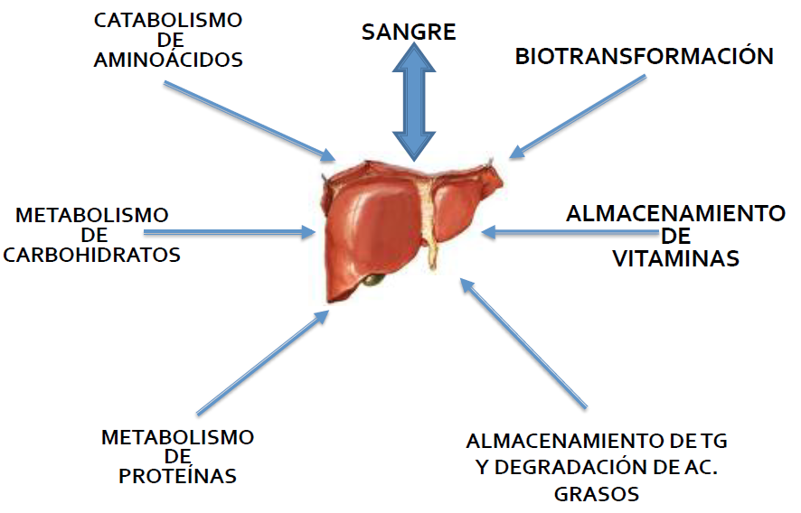
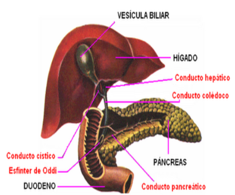
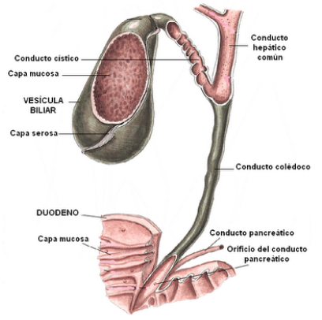

# HIGADO

## Anatomia

Es un órgano glandular de color rojo oscuro. Se sitúa en la parte más craneal (superior) de la cavidad abdominal.

El parénquima (tejido) hepático está compuesto por células epiteliales (hepatocitos) dispuestas en láminas que se interconectan formando una estructura tridimensional.

El hígado está formado por dos lóbulos principales (derecho e izquierdo) que están divididos por un ligamento llamado falciforme, y un tercer lóbulo más pequeño llamado cuadrado.

El hígado es uno de los dos órganos, junto con los pulmones, que recibe aporte de sangre por dos vías.

Recibe la mayor parte de la sangre (85%) por la vena porta que drena casi toda la sangre del intestino.

Esto asegura que todos los nutrientes absorbidos vayan directamente al hígado donde pueden ser almacenados para su utilización cuando sea necesario.

El hígado recibe el otro 15% de la sangre de las arterias hepáticas.

Este segundo suministro de sangre también es importante porque la sangre arterial está muy oxigenada, a diferencia de la sangre venosa que llega a través de la vena porta.

## Funcion de las celulas hepaticas

Hepatocito: transforman y almacenan glucógeno y lípidos.
Células de ito: almacenan vitaminas liposolubles, productoras de factores de crecimiento y colágeno

Células endoteliales: forman capilares hepáticos, acceso de plasma y nutrientes
Células de kupffer: secuestran antígenos solubles, secretan citocinas, activan a células estelares.

## Funciones del Higado

- Producción de bilis (0,5-1 litro diario)
- Síntesis de proteínas plasmáticas
- Eliminación de hormonas
- Transformación de amonio en urea
- Formación de factores coagulantes
- Depósito de glucosa, hierro y vitamina B12
- Desintoxificación de la sangre (medicamentos)

Toda la bilis producida por el hígado es recolectada en los conductos hepáticos derecho e izquierdo

Ambos conductos se unen en un conducto hepático común, que al unirse con el conducto cístico de la vesícula biliar se denomina conducto colédoco.

El colédoco desemboca junto al conducto pancreático en el duodeno.

Ambos conductos se funden y forman la denominada ampolla de Vater.

Alrededor de esta ampolla está el esfínter de Oddi, que regula el tránsito de bilis y jugo pancreático al duodeno.

El esfínter de Oddi es un complejo de fibras musculares lisas que atraviesan las paredes del duodeno.

En el lapso entre comidas, el esfínter de Oddi está contraído, con lo cual previene el reflujo del duodeno hacia el conducto colédoco

Cuando el quimo ingresa al duodeno, el esfínter se relaja permitiendo el paso de bilis y de enzimas pancreáticas.

## Composicion de la bilis

- Posee agua, colesterol, sales biliares y pigmentos biliares.
- Las sales biliares emulsionan las grasas en pequeñas gotitas para que sean desdobladas por las enzimas del páncreas y poder luego ser absorbidas por las células intestinales (enterocitos).
- Los pigmentos biliares son sustancias de desecho como la bilirrubina y la biliverdina, que la bilis envía hacia la luz del intestino delgado para ser eliminadas del organismo por orina y materia fecal.

## Funciones de la bilis
- Neutralizar la acidez del jugo gástrico
- Digestión de las grasas
- Absorción de vitaminas liposolubles: vitaminas A-D-E-K
- Transporte de sustancias de desecho: pigmentos de la hemoglobina, colesterol, derivados de los medicamentos.

## Vesicula biliar

Órgano de forma ovoide y hueco, que se ubica algo oculto por debajo del hígado.

Sus paredes poseen una serosa, una capa muscular y una mucosa con pliegues similares a las del estómago.

La vesícula biliar se comunica con el duodeno a través del conducto colédoco.

Tiene por función acumular toda la bilis producida por el hígado.

