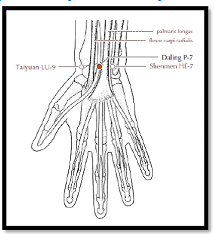

# Calor de Verano

1. Las enfermedas asociadas al calor de verano ( marcar lo correcto ) 
    - [ ] pueden ocurrir en cualquier estación 
    - [ ] ocurren solo en verano
1. Esta patología obedece principalmente a las siguientes causas (marcar lo correcto)
    - [ ] exposición prolongada al sol radiante 
    - [ ] por el   uso de acondicionadores de aire 
    - [ ] salir de la casa muy abrigado
1. Los síntomas y signos principales son (marcar los correctos)
    - [ ] fiebre elevada 
    - [ ] poca sed 
    - [ ] pulso lento 
    - [ ] pulso rápido y amplio
1. El calor del verano perturba al (marcar lo correcto)
    - [ ] riñón 
    - [ ] vejiga
    - [ ] corazon
    - [ ] pericardio
1. Si el calor se asocia a la humedad aparecerán síntomas tales como: (marcar los correctos)
    - [ ] fiebre baja
    - [ ] fiebre alta
    - [ ] nauseas y vómitos 
    - [ ] molestias lumbares
1. En la fitoterapia occidental utilizaríamos para el tratamiento del síndrome de calor de verano: marcar lo correcto)
    - [ ] Angélica 
    - [ ] corteza de sauce 
    - [ ] Diente de león 
    - [ ] boldo
1. el siguiente gráfico corresponde al punto de acupuntura (marcar lo correcto)
    - [ ] MC 6 
    - [ ] C 7 
    - [ ] MC 8 
    - [ ] MC 7
    - 