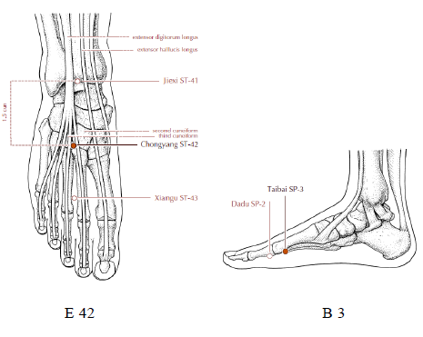

# CALOR DE VERANO (SHU)

> *"La Canícula abre los orificios cutáneos, actives la circulación del Yin (Energía Nutricia) y del Wei (Energía Protectora), esparce el sudor promoviendo la salida del Chi."* Net Ching

Las enfermedades causadas por el Calor de Verano ocurren únicamente durante el verano; en este aspecto es diferente a los otros Factores Patogénicos Externos, ya que estos pueden causar enfermedades en cualquiera de las estaciones del año. El Calor de Verano es un Factor Patogénico Yang y provocara fiebre al invadir el cuerpo. Por lo tanto, las patologías ocasionadas por el Calor de Verano forman parte del conjunto de enfermedades febriles.

En Medicina Tradicional China, "enfermedad febril" es tan solo un término genérico para todas las patologías en las que exista fiebre y que sean causadas por un Factor etiológico Externo. Además del Calor de Verano, todos los otros Factores Externos podrían provocar enfermedades febriles en todas las estaciones del año.

## Causas

Esta patología obedece principalmente a dos causas: exposición prolongada al Sol radiante en días excesivamente calurosos o permanencia en habitaciones muy calurosas, con ventilación insuficiente, durante un largo período de tiempo.

## Características del Calor de Verano

Este es un Factor Patogénico Yang. Cuando invade el cuerpo, usualmente causa un "Síndrome Caliente". Los síntomas y signos principales son: fiebre elevada, sed, transpiración y pulso amplio y rápido.

Tiende a tener una dirección ascendente y consume muchísima cantidad de Fluidos Corporales y de Energía. Los síntomas y signos mas importantes son: mareos, dolor de cabeza, transpiración profusa, sed, labios secos, orina escasa y constipación. Dado que a través de la copiosa transpiración puede perderse también mucha Energía, otro síntoma que se presenta a menudo es la lasitud.

El Calor de Verano perturba el Corazón. Según la clasificaci6n por los Cinco Elementos, el Corazón es un órgano "Fuego" y este es sensible al Calor, El Corazón gobierna la actividad mental y por eso, cuando el Calor en el cuerpo Llega a perturbar el Corazón, puede ocasionar delirio (en casos moderados) o inconsciencia (en casos severos).

A menudo, Calor de Verano se combina con Humedad, para invadir et cuerpo, de modo similar a como la lluvia acompaña la torridez de finales de verano. Las manifestaciones principales de esta patología son: elevada fiebre, malestar general, molestias tanto en el pecho como abdominales, nauseas y vómitos.

## Síntomas y signos

- El daño por color de verano
    - Este es causado por la invasión de Calor de Verano primero y Viento- frio después. Ocurre comúnmente cuando una persona permanece en un lugar ventoso durante un día t6rrido de verano. Sus síntomas y signos característicos son: fiebre, transpiración profusa, sed, dolor de cabeza, molestias en el pecho, lasitud y pulso rápido y amplio.
- La lesión por color de verano (insolación)
    - Ocurre por lo general cuando una persona está trabajando haciendo esfuerzos un día tórrido, bajo los rayos del sol ardiente, o en una habitación donde la temperatura es muy elevada. Sus principales síntomas y signos son:
        - En casos moderados: fiebre, transpiración, sed, nausea y lasitud.
        - En casos severos (aquellos en los que se pierde gran cantidad de Fluidos Corporales: fiebre, transpiración profusa, inquietud, respiración corta y rápida, pulso amplio, seguido por colapso súbito, perdida de la conciencia y enfriamiento de los miembros.
- Síndrome Humedad-Calor
    - Sus manifestaciones características son: fiebre no muy elevada, generalmente durante la tarde, molestias en el pecho, nausea, escaso apetito, lasitud, orina amarillenta, saburra amarillenta y pulso resbaladizo.

## Tratamiento herbológico

La fitoterapia china indicada comprende las siguientes hierbas y productos biológicos:

- Talcum
- Calcitum
- Indigopera
- Tinctoria
- Nitrum
- Moschus
- Cornu Antelopis
- Cornu Rhinoceri
- Lophanthi
- Magnoliae.

En la fitoterapia occidental usaríamos:
- Corteza de sauce (salix alba),
- ulmaria ( spirea ulmaria).

## Acupuntura

Para tratar el daño por Calor de Verano se utiliza:

- VG14: 
    - Por ser el punto de encuentro de Gobernador con seis meridianos Yang, eliminara el Calor de Verano si se lo punza en sedación.
    - Ubicación y Punción: véase la explicación ya dada en "Frío".

- MC7:
    - es el Punto Fuente de Pericardio. El Pericardio es el protector externo del Corazón y tiene como función ser su Guardián. Punzar este punto en sedación eliminara el Calor de Verano del Corazón.
    -  Ubicación: en la depresi6n, en el medio del pliegue transversal de la muñeca, entre los tendones del m. largo palmar y del m. flexor radial del cargo.
    - Punción: perpendicular, 0,3 - 0,5 cun

- IG4 e IGI 11:
    - estos dos puntos son importantes para lograr una acción antipirética, punzándolos en sedación.
    - Ubicación y Punción de IG4: véase la explicación ya dada en Método Diaforético, "Frío".
    - Ubicación de IG11: con el codo flexionado, se halla en la depresi6n del pliegue del codo.
    - Punción: perpendicular , 1 - 1,5 cun.

- V40:
    - sangrando este punto (una gota), se elimina el Calor de Verano. V 40 es el Punto Mar del meridiano de Vejiga. Este meridiano tiene mucha más Energía Yang que cualquiera de los otros meridianos Yang.
    - Ubicación: en el punto medio del pliegue transversal de la zona poplítea, entre los tendones del m. bíceps femoral y el m. semitendinoso. Se localiza con el paciente boca abajo o con la rodilla flexionada.
    - Punción: perpendicular, 0,5 - 1,5 cun, o sangrar con la agua de tres filos *.
    - Precaución: no sangrar en primavera.

Para tratar la Lesión por Calor de Verano se utiliza:

El Canal del Vaso Gobernador es el más importante en el tratamiento de la insolación.

- VG26 y VG20:
    - para promover la resucitación y la claridad mental se aconseja punzarlos en sedac16n.
    - Ubicación. 
        - VG26: por debajo de la nariz, un poco más arriba del punto medio del frenillo.
        - VG20: a siete cun por arriba de la línea posterior de Los cabellos, en el centro de una línea que une los ápex de las orejas
    - Punción.
        - VG26: oblicuamente, 0,2 - 0,3 cun hacia arriba.
        - VG20: horizontalmente, 0,3 - 0,5 cun.

- Shixuan
    - (es un Punto Extraordinario): se utiliza para dispersar el calor, en un caso de emergencia.
    - Ubicación: en la punta de los dedos, 0,1 distal a las uñas.
    - Punción: sangrar con aguja de tres filos.

    
Todos los puntos que se recomiendan para el tratamiento del Dañó por Calor de Verano pueden también aplicarse en el tratamiento de la Lesión por Calor de Verano.

Para tratar el Síndrome Humedad-Calor se utiliza:

Los mismos puntos que se emplean para tratar el Daño por Calor de Verano, adicionando los siguientes puntos para eliminar la Humedad:

- E42 y B3:
    - estos son los Puntos Fuente de los meridianos de Estomago y de Bazo y tienen la propiedad de eliminar la Humedad, expulsándola fuera del cuerpo.
    - Ubicación y Punción de E42: véase la explicación ya dada en Frío, pero usar en punción simple.
    - Ubicación B3: en la parte antero inferior del primer metatarsiano, en la unión de la piel blanca y roja.
    - Punción B3: perpendicularmente, 0,3 cun. Punción simple.

