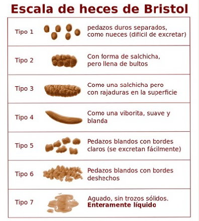

# Diarrea

Definición:
Frecuentes deposiciones de heces líquidas, como síntoma frecuente de disturbios gastrointestinales con el resultado de un incremento peristáltico.  
Cambios en el movimiento normal o regular de la función del intestinal, provocando heces blandas, sin forma y de consistencia líquida.  
Muchos factores pueden dar lugar a esta condición y generalmente son; dietas inadecuadas, inflamación o irritación de la mucosa intestinal, infecciones gastrointestinales.  

Ciertos medicamentos y consecuencias psicogénicas pueden ser su causa.  
En un ataque agudo hay un súbito comienzo, esto usualmente indica una infección o toxinas en el sistema. Heces líquidas o sanguinolentas sugieren una inflamación o enfermedad del tracto gastrointestinal. La terapia de substitución o reemplazo de líquidos y electrólitos puede ser necesaria en casos o condiciones severas, para prevenir la deshidratación y/o que el paciente entre en un estado de shock.  

Existe una escala que valora la consistencia de las evacuaciones (Escala de Bristol), que evalúa 7 tipos de evacuaciones. El tipo 6 (pequeños trozos con bordes mal definidos) y 7 (totalmente liquida) son considerados diarrea independientemente de la frecuencia intestinal.  

# Etiología
La invasión de patógenos Externos, especialmente Humedad y Frío, pueden lastimar el Bazo y el Estómago, conduciendo a la diarrea. Los patógenos Externos pueden también dañar el Yang del Calentador Medio, lo cual genera una condición de Frío - Vacío. Esto deteriora el ascenso y descenso de Chí, conduciendo finalmente a la diarrea.  
Por lo general la la constatación de una toxiinfección alimentaria por estafilococos por salmonella, de una diarrea estival o de un síntoma testimonio de un desequilibrio de la flora intestinal debido a una agresión medicamentosa.   En los lactantes la afección es habitualmente de origen vírica, ( rotavirus, enterovirus, coronavirus) ; raramente es de origen bacteriana y en el caso de serlo es de origen intestinal (colibacilo), o biuen se trata de una infección extradiges tiva (otitis).

La tensión emocional puede dañar el Hígado, lo cual causa Estancamiento de Chí, que a su vez ataca el Calentador Medio, causando el mal funcionamiento del Bazo y el Estómago para transformar y transportar alimentos y líquidos. La preocupación excesiva daña el Bazo directamente, lo cual resulta en el mismo mal funcionamiento previamente mencionado del Calentador Medio, conduciendo a la diarrea.  
Una dieta inapropiada con un consumo excesivo de comidas frías o crudas, alcohol, substancias anormales, o comidas grasosas, picantes y ácidas pueden dañar el Calentador Medio y promover la diarrea.  

## Tratamiento con fitoterapia
Plantas que modifican el grado de hidratación del contenido intes+nal
- Agrimonia: (agrimonia eupatoria) : eupéptica, antidiarréica, ligeramente - antidiabética.  
- Arándano: ( vaccinum mirtillus) : astringente, antidiabético ( hojas), - antidiaréico ( hojas y bayas), las bayas son bactericidas ( bacilo de Eberth y colibacilo).  
- Quina: indicada en las diarreas y dispepsias hiposténicas, emética a fuertes dosis.  

Plantas adsorbentes actúan como fijadores del exceso de líquidos y gases intestinales, asegurando una protección de la mucosa acción posible gracias a la pectina que contienen  
- Algarrobo ( ceratonia siliqua) : la pulpa contiene sustancias amilaseas, azúcar y pectinas, la pepita es un sucedáneo de la goma adragante.  
- Manzano( Pirus malus): diurético y regulador intestinal en caso de diarreas y estreñimiento, emplear el fruto crudo rayado, y el epicarpio en infusión idealmente de una manzana orgánica ( atención al jugo de manzana que es laxante).  
- Zanahoria( Daucus carota): contiene la pectina antidiarréica y carótena ( provitamina A), es reguladora intestinal, antidiarréica, hipoglucemiante, antianémica, antiinfecciosa y cicatrizante gástrico.  
- También se puede usar una cucharada de te de arcilla verde mezclada en una infusión astringente para fortalecer su efecto.
- una cucharada de café de la mezcla en 10cc de una decocción de
hojas de nogal y raíz de consuelda, administrada dos o tres veces
al día en lavativas rectales.  

**plantas con propiedades bactericidas**:
- bistorta,
- consuelda mayor,
- arándano
- nogal
- zarza
- salicaria
a las que se añadirá :
- el marrubio blanco (acción antitifoidea),
-  la pelosilla (contra la brucelosis)
- y la simaruba (antimicrobiano potente),
- así como carbones vegetales.  

**No Fitoterápicos:**
- La arcilla, una vez más, pero por su acción antiinfecciosa y antimicótica.
- Reequilibradores de la flora intestinal (en tomas alejadas de las preparaciones aromáticas): Lactofilus, Lactoliofil, etcétera

