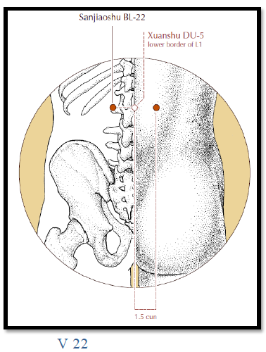
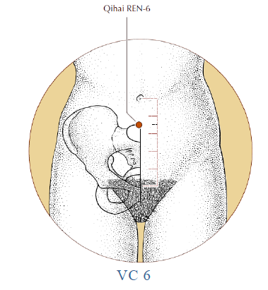
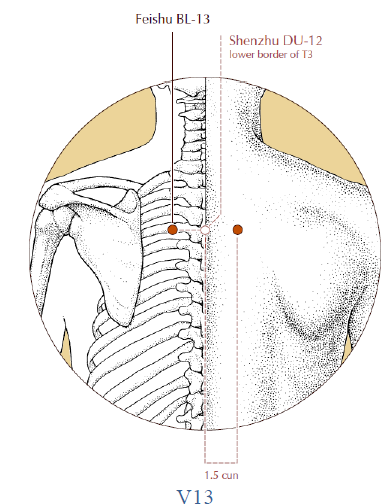
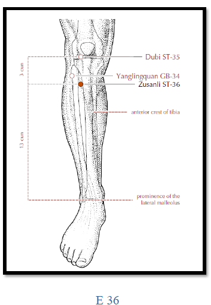

# HUMEDAD (SHI)

>*"La parte inferior del cuerpo es la primera en afectarse por la Humedad "* Nei Ching

La Energía Yang-Calor comienza a descender hacia finales del verano, va-porizando la Humedad e imprimiéndole una dirección ascendente hacia el medio ambiente, por eso es que de todas las épocas del año, el último tramo del verano ofrece el medio ambiente más húmedo.

## Causas

- La estación de las Lluvias durante finales del verano.
- Las condiciones laborales que implican permanecer en un medio acuoso (tales como las de un pescador).
- El permanecer vestido con ropas mojadas y no cambiarlas inmediatamente, luego de sufrir una mojadura o de transpirar profusamente.
- El vivir o permanecer por largo tiempo en lugares húmedos.
- La deficiencia de Energía del Bazo que provoca retencion de humedad en el cuerpo.

## Características de la Humedad

La Humedad es un Factor Patogénico Yin y como tal es capaz de dañar la Energía Yang del cuerpo, así como de obstruir su circulación. El Bazo es uno de los responsables del metabolismo del Agua y le disgusta la Humedad. Si esta invade al cuerpo, el primer órgano interno que resulta afectado es el Bazo. Cuando llega a provocar la obstrucción de la Energía en el Recalentador Medio, aparecen los siguientes síntomas y signos:

- Lo turbio (la Humedad) perjudica lo claro (el Yang), manifestándose como sensac16n de pres16n sobre la cabeza, mareos y tinitus.
- La obstrucción por Humedad en el Recalentador Medio se manifiesta como distensión abdominal y vómitos.
- El flujo descendente de la Humedad se manifiesta a través de borborigmos, diarrea y aparición de edemas.

La Humedad presenta como características la pesadez, la turbidez y a dirección descendente.

- Pesadez
    - En la naturaleza, la humedad es pesada; su sintomatología en el cuerpo es la pesadez,. Esta puede ser descripta como una sensación de presión sobre la cabeza, como si la misma estuviera fuertemente vendada, acompañada .con mareos y tinitus,
- Turbidez
    - Turbio significa “sucio" y esta caracterización se aplica a la Humedad, por el aspecto denso, poluto, viscoso y pegajoso que ella presenta. Sus manifestaciones sintomáticas más representativas son: saburra pegajosa y espejada, orina turbia, heces blandas, leucorrea masiva de naturaleza purulenta y olor hediondo, eczema y ulceración supurante de la piel.
- Dirección descendente
    - La dirección de la humedad es descendente y puede provocar manifestaciones de síntomas en la parte interior del cuerpo, especialmente en las extremidades inferiores, tales como algias y edemas en las piernas y pesadez en la parte inferior del cuerpo.

*En la naturaleza, la humedad tiende a estancarse y es pegajosa.*

Las enfermedades causadas por este Factor Patogénico, generalmente duran un periodo considerablemente prolongado de tiempo.

Por lo común, el paciente no se percata do la invasión de este Factor durante los estadios iniciales, porque los síntomas siempre empiezan a manifestarse en estadios tardíos o avanzados.

Es extremadamente difícil expulsar a este Factor del cuerpo una vez que lo invadió, aun en los primeros estadios de la invasión.

La Humedad causa casi siempre una condición crónica y repite los ataques, tal como en los casos de *Síndrome Humedad-Bi*, de eczemas o de cualquier otra patología **_Humedad-Calor_**.

## Sintonías y Signos

### Humedad Externa

La enfermedad es causada por un Factor humedad proveniente del exterior. En la mayoría de los casos se relaciona con un medio ambiente húmedo.

- El Daño por humedad
    - El resfrío común se combina con un Factor húmedo y su sintomatología se manifiesta con fiebre poco elevada, disgusto por el frío, pesadez en la cabeza o en todo el cuerpo y una saburra pegajosa y blancuzca.
- El Síndrome Humedad-BI
    - Es causado por un relativo exceso del Factor Patogénico Humedad y se caracteriza por manifestar sensación de pesadez, entumecimiento y dolorosa hinchazón de las articulaciones y los músculos. Otro síntoma importante es la rigidez en los movimientos.
- El Síndrome Humedad-Calor
    - Puesto que la Humedad queda estancada internamente, el Calor no puede ser disipado hacia afuera con la suficiente facilidad, lo que lleva a la manifestación de los siguientes síntomas: fiebre moderada (se eleva por la tarde y no desciende luego de transpirar), molestias en el pecho, sed simultáneamente con el rechazo por la bebida, transpiración pegajosa, orina marrón oscura, heces hediondas, saburra blancuzca y pegajosa y pulso rápido y resbaladizo.
- Humedad Interna
    - Los síntomas se deben a la retención de agua y líquidos provocada por la perturbación de las funciones de los Órganos Internos, siendo el Bazo el más importante de Los afectados. La sintomatología comprende: pesadez de la cabeza o de todo el cuerpo, nausea, vómitos, heces blandas, orina escasa, edema en ambas piernas, lengua pálida con los dientes propiamente impresos en ella, saburra blancuzca y pegajosa y pulso resbaladizo.
- Flujo descendente de Humedad-(calor en el Intestino) (Enteritis y Disentería)
    - Presenta como síntomas: dolor abdominal, heces hediondas o heces purulentas y sanguinolentas, tenesmos, sensación quemante en el ano, orina escasa y amarillenta y pulso rápido y resbaladizo,
- Flujo descendente de Humedad-Calor en la Vejiga
    - Su sintomatología comprende: micciones frecuentes y urgencias por orinar; el orinar resulta doloroso, la orina es escasa y de color rojo amarronado, dolor en el bajo vientre, saburra amarillenta y pegajosa y pulso rápido y resbaladizo.
- Tan-Yin ("Mucus")
    - Véase explicación al final de *"Otros Factores"*.

## Tratamiento herbológico

### Humedad Externa:

- Lophanti
- Magnoliae
- Rhizoma atractylodis macrocepltalac.

Tratamiento fitoterapéutico occidental:
- Bardana ( Articum Lappa)
- Roble ( Quercus Robur)
-  Sauce ( Salix alba)

### Humedad Interna

- Coptis
- Radix Scutellarias
- Gentine
- Pulsatilla Chinensis
- Plantaginis
- Alismatis
- Poria
- Atractylis Ovata
- Magnoliae.

Fitoterapia occidental;

- Marrubio (Marrubio vulgaris)
- Arándano (Vaccinium myrtillus)
- Equinacea ( Equinacea purpurea)

## Acupuntura

La Medicina Tradicional China entiende que el metabolismo de los Fluidos del cuerpo está relacionado con el Triple Recalentador. Los Pulmones están ubicados en el Recalentador Superior, el Bazo y el Est6mago están ubicados en el Recalentador Medio, y los Riñones y la Vejiga están ubicados en el Recalentador Inferior. Todos estos están íntimamente ligados con el metabolismo del Agua. Por lo tanto, los tratamientos relacionados con patologías de Humedad involucran los siguientes puntos:

- V22 y VC6: el primero es el punto Shu de la espalda del Triple Recalentador y el segundo es llamado "Océano de Chi" o "Mar de Energía". Se punzan en tonificación.
    - Ubicacion. V22: a 1,5 cun, hacia afuera del borde inferior de la ap6fisis espinosa de la primera vértebra lumbar.
    - Punción. V22: perpendicularmente, 1,0 - 1,5 cun. VC6: perpendicularmente, 0,8 - 1,2 cun.
- VC6: en la línea media del abdomen a 1,5 cun por debajo del ombligo.
- V13: es el Punto Shu de la espalda, perteneciente a Pulmón. Es aconsejable punzar
en tonificacion, con el objeto de fortalecer la función dispersante de los Pulmones, para
promover así la circulacion de los Fluidos Corporales.
    - Ubicación: a 1,5 cun hacia afuera del borde inferior de la apofisis espinosa de la tercera vértebra torácica.
    - Punción: oblicuamente, 0,5 cun.
- E36, B6 y V20: el primero es el Punto Mar del Estómago; el segundo es el Punto de cruce de tres meridianos Yin en la pierna; el tercero es el punto Shu do la espalda, perteneciente al Bazo. Punzar en tonificación es recomendable para el fortalecimiento del bazo y del Estomago, con el objeto de promover sus funciones de transporte.
    - Ubicación. 
        - E36: a 3 cun por debajo de E35 y un dedo transversal hacia afuera del borde anterior do la tibia. B6 a 3 cun por arriba de la punta del maléolo interno, sobre el borde posterior de la tibia. 
        - V20: véase frío Interno.

    - Punción. E36: perpendicularmente, 0,5 – 1,6 cun.
- B6: Perpendicularmente 0,5 - 1,0 cun. 
- V20: véase frío interno.
- VG 4. Es el punto de la energía Yang del Riñón. Se aconseja punzar en tonificación,
porque esto entibiaría la Energía Yang del Riñón, Lo que a su vez vaporizara los Fluidos del Recalentador Inferior hacia el Superior.
    - Ubicación y Punción: véase Frío Interno.
- V 40: (es el Punto Mar Inferior del Triple Recalentador.
    - Ubicación v Punción: véase explicación precedente.
- VC 9: también llamado "Región de Agua", se recomienda moxar este punto para
producir un efecto diurético.
    - Ubicación: está en la línea media del abdomen, a 1 Cun por arriba del ombligo.
    - Punción: perpendicularmente, 0,5 - 1,0 cun.

  