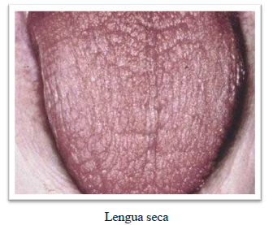
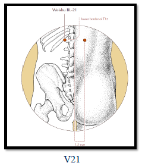
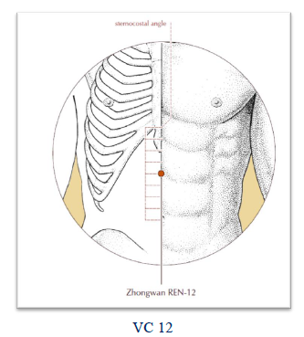
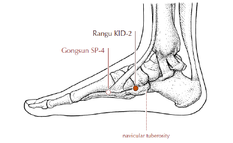
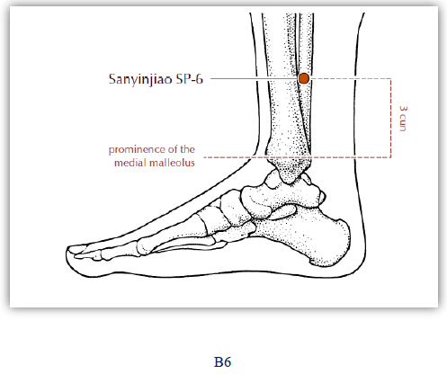

# SEQUEDAD (ZAO)

> Al bazo le agrada la sequedad

Es mayormente durante el otoño que se presenta la Sequedad. Después de un largo periodo de días soleados y sin lluvias, la atmósfera carece de humidificación y la Sequedad puede entonces invadir al cuerpo humano y causar enfermedad.

## Características de la Sequedad

### Consume los líquidos Corporales

Esta característica se manifiesta en signos como los siguientes:

- piel seca, áspera y resquebrajada
- nariz, boca y lengua secas
- orina escasa y constipación

Por ejemplo, una persona que padece un resfrío durante el otoño, además de presentar los síntomas del resfrío común (escalofríos, fiebre y dolor de cabeza) puede presentar también los del síndrome seco (tales como boca y labios secos y dolor de garganta).

### Daña los Pulmones, muy a menudo

Los Pulmones son muy susceptibles a la Sequedad. Esta invade al cuerpo desde las fosas nasales y reseca los fluidos en los Pulmones, perjudicando así la dirección descendente de la Energía de Pulmón. Los síntomas principales son: tos seca, nariz seca, picazón y dolor en la garganta, dolor en el pecho y en la región hipocondríaca y hasta esputos sanguinolentos ocasionales.

Los Pulmones y el Intestino Grueso son órganos Acoplados. Normal-mente, la distribución de los Fluidos Corporales depende de la dirección de la Energía descendente de Pulmón; si los Fluidos Corporales no pueden ser transportados hasta el Intestino Grueso, resulta en constipación.

## Sintomas y signos

### Sequedad Externa

#### Frío-Sequedad

Al finalizar la estación otoñal, clima refresca paulatinamente y las lluvias escasean, por eso es que los Factores Frío-Sequedad se convierten en esta época del ano en los Factores Patogénicos Externos mas importantes. Los principales síntomas que presentan son: dolor de cabeza, fiebre baja, escalofrío, tos seca, garganta y labios secos y saburra blancuzca y seca.

#### Calor-Sequedad

Al comienzo y aun promediando el otoño, cuando el clima todavía se mantiene cálido, los Factores Calor-Sequedad poseen la aptitud de invadir al cuerpo. La sintomatología (comprende: dolor de cabeza, fiebre, escalofrío, nariz seta, tos con esputos densos, dolor de garganta, lengua rojiza y saburra amarillenta.

- Después de un prolongado período de transpiración profusa, de excesivos vómitos, de diarrea crónica o de perdida abundante de sangre.
- Por deficiencia de Sangre o de Esencia causada por una enfermedad crónica.

Sus sintonías y signos mas notables son: piel seca y áspera, boca seca, cabellos quebradizos y opacos, orina escasa, heces secas, lengua rojiza y seta. En casos severos, los síntomas comunes son: picos de fiebre, transpiración nocturna y desasosiego.

## Tratamiento herbológico

Las hierbas comúnmente recomendables son:
- Adenophorra
- Almond
- Fritiliaria
- Asparragus
- Radix Ophiopodonea
- Mortis Alba.
- Fitoterapia occidental
    - Borraja ( Borrago officinalis)
    - Malvavisco ( Althea offcianlis)
    - Equinacea (Equinacea purpurea)

## Acupuntura

- V21 : punto Shu ( asentimiento) de la espalda, perteneciente al estómago . Punzado en tonificaci6n, favorece la transformación del alimento en Fluídos Corporales.
    - Ubicación: 1,5 cun lateral, al borde inferior de la apófisis de espinosa de la duodécima vértebra torácica.
    - Punción: oblicuamente hacia adentro, 0,5 cun.
    - 
- VC, 12: punto Mu (alarma) del Estómago. Ubicación: en la línea medial, a 4 cun por encima del ombligo.
    - Trata el dolor de estómago, colabora en la transformación del alimento, promueve el movimiento descendente de la comida, trata la aerofagia.
    - Punción: oblicuamente, 0,5 cun.
    - 
- R2: punto Manantial del Meridiano de Riñón.
    - Ubicación: anterior e inferior al maléolo interno, en una depresión en el borde inferior de la tuberosidad del hueso navicular.
    - Uso medicinal: regula la función renal, trata la sudoración nocturna, falta de Qi.
    - Punción: perpendicular, 0, 3 cun.
    - 
- R6: punto de Confluencia que comunica con el Canal Yin Chiao (Vaso maravilloso yin del talón).
    - Ubicación: 1 cun por debajo de la línea medial del maléolo interno.
    - Punción: perpendicular, 0,3 cun.
    - Uso medicinal: nutre el yin de riñón, orina frecuente, goteo postmiccional, sangre en la orina y disuria
    - 
- B6: punto de Cruce de los tres Meridianos Yin del pie.
    - Ubicación: 3 cun por encima del maléolo, en el borde posterior de la tibia.
    - Uso medicinal: insuficiencia del estómago y el bazo, borborigmos, diarreas, enuresis, disuria.
    - Punción: perpendicular, 0,5 cun.
    - 

