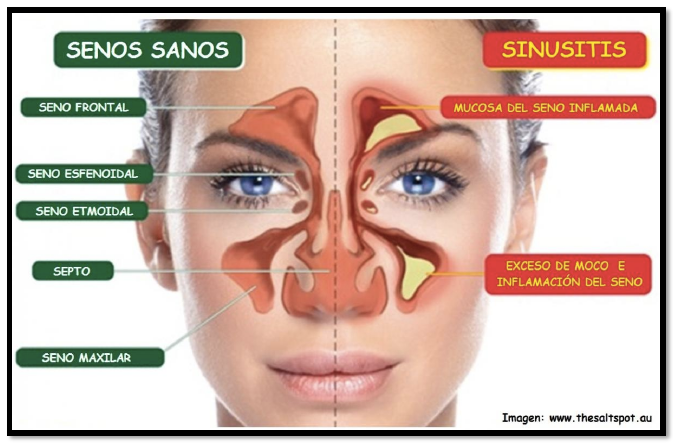

# Material de estudio
## SINUSITIS
Se presenta cuando el tejido que recubre los senos paranasales se hincha o inflama. Ocurre como resultado de una infección por virus, hongos o bacterias.

### Causas
Los senos paranasales son espacios llenos de aire en el cráneo. Están localizados por detrás de la frente, los huesos de la nariz, las mejillas y los ojos.  
Los senos paranasales saludables no contienen bacterias ni otros microorganismos. Por lo general, el moco puede salir y el aire puede circular a través de ellos.

Cuando las aberturas paranasales resultan bloqueadas o se acumula demasiado moco, las bacterias y otros microorganismos pueden crecer más fácilmente.  
La sinusitis se puede presentar por una de las siguientes situaciones:
- Los pequeños vellos (cilios) de los senos paranasales no logran sacar el moco en forma apropiada. Esto puede deberse a algunas afecciones.
- Los resfriados y las alergias pueden provocar la producción de demasiado moco o bloquear la abertura de los senos paranasales.
- Un tabique nasal desviado, un espolón óseo nasal o pólipos nasales pueden bloquear la abertura de los senos paranasales.

### Hay dos tipos de sinusitis:
- La sinusitis aguda es cuando los síntomas están presentes por cuatro semanas o menos. Es causada por bacterias que proliferan en los senos paranasales.
- La sinusitis crónica es cuando la hinchazón de los senos paranasales está presente por más de 3 meses. Puede ser causada por bacterias o un hongo.

Los siguientes factores pueden incrementar el riesgo de que un adulto o un niño presente sinusitis:
- Rinitis alérgica o fiebre del heno
- Fibrosis quística
- Ir a guarderías
- Enfermedades que impiden que los cilios trabajen apropiadamente
- Cambios de altitud (volar o bucear)
- Adenoides grandes
- Tabaquismo
- Sistema inmunitario debilitado por VIH o quimioterapia

### Síntomas

Los síntomas de la sinusitis aguda en adultos muy a menudo se presentan después de un resfriado que no mejora o que empeora después de 5 a 7 días. Los síntomas incluyen:
- Mal aliento o pérdida del sentido del olfato
- Tos que generalmente empeora por la noche
- Fatiga y sensación de malestar general
- Fiebre
- Dolor de cabeza
- Dolor similar a presión, dolor detrás de los ojos, dolor de dientes o sensibilidad facial
- Congestión y secreción nasal
- Dolor de garganta y goteo retronasal

Los síntomas de la sinusitis crónica son los mismos que los de la sinusitis aguda. Sin embargo, los síntomas tienden a ser más leves y a durar más de 12 semanas.  
Los síntomas de la sinusitis en niños abarcan:
- Resfriado o enfermedad respiratoria que ha estado mejorando y luego comienza a empeorar
- Fiebre alta junto con secreción nasal oscura durante al menos 3 días
- Secreción nasal, con o sin tos, durante más de 10 días y no está mejorando

### Tratamiento:
Comprenderá un aspecto local, fundamental para erradicar él o los gérmenes agresores, y un tratamiento de reequilibramiento general. Este último lleva aparejado un aspecto sintomático que asegure la lucha antiinfeccionsa y antiinflamatoria así como el sostén sistémico de los órganos diana especialmente los intestinos.  
En la medicina china decimos que el pulmón y el Intestino grueso son órganos asociados o marido y mujer correspondientes al mismo elemento ( metal) el moco tragado por vías posterior desde los senos promueve infecciones intestinales agregando más sintomatología y agravando el cuadro general de la persona, de aquí la importancia de regular el elemento protegiendo a los intestino también.

Entre las plantas más importantes a tener en cuenta en esta patología encontraremos:
- Cebolla ( allium cepa) antidiabética, antiinfecciosa.
- Alcachofa (Cynara scolymus) drenadora hepática.
- Eufrasia ( Euphrasia officinalis) antiinflamatoria
- Grosellero negro ( Ribes nigrum) antialérgica, estimulante de la corteza suprarrenal
- Llantén ( plantago mayor) antialergénica
- Tratamiento local : similar al usado en rinofaringitis

Nebulizaciones con suero fisiológico y 4 gotas de manganeso-cobre en oligoelemento.  
Se pueden también aplicar sobre los senos frontales y maxilares hojas de repollo habitualmente se colocan tres capas de hojas , lo que generará un alivio.  
En la mayoría de los casos el tratamiento inicial podrá realizarse con la siguiente asociación de tinturas madres:  
- Cynara scolymus TM
- Althea officinalis TM
- Ribes nigrum TM
- Aa: ana-ana ( partes iguales) c.s.p ( cantidad suficiente para) 125 c.c  

La dosis de tintura madre a recomendar es de 1 gota por kilo de peso. Idealmente tomadas lejos de las comidas es decir : si el afectado pesa 70 kg. Se recomendarán 35 gotas en agua dos veces por día.
Es importante eliminar el alcohol de la tintura madre antes de ser tomada colocando las gotas en aproximadamente 1 cm. de agua hirviendo para evaporar el alcohol, esperar 5 minutos y luego agregar agua fría y tomar el preparado..  
Las tinturas madres tienen 65 % de alcohol por lo que no es recomendable tomarlas sin realizar este procedimiento previamente.

### Medidas higiénico dietéticas.
Evitar lácteos , grasas, harinas blancas, glúcidos para evitar al máximo la generación de mucosidades, incrementar las cantidades de cereales integrales y verduras.  
Usar caldos de verduras, zumos de grosellero negro, apio, limón.  
Síndromes Chinos asociados a la sinusitis:
- Viento frío.
- Viento calor.
- Estancamiento del Qi del hígado con estancamiento de calor.
- Fuego en la vesícula o en el hígado.
- Flema calor.
- Deficiencia del Qi de pulmón.
- Deficiencia del Qi de bazo.
- Deficiencia de riñón.
- Estasis de sangre.