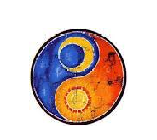
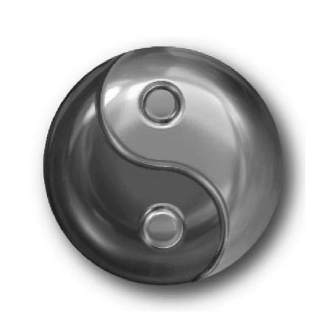
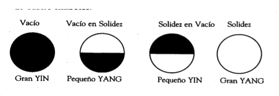
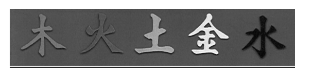
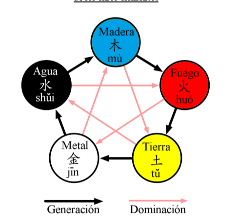
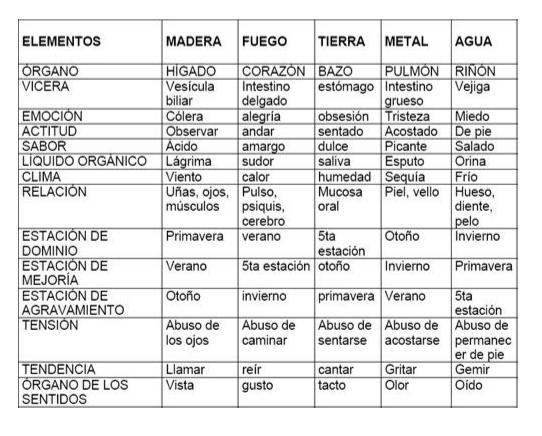
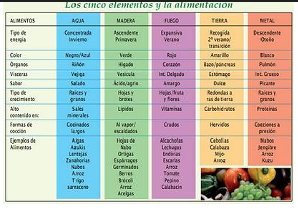

# Medicina  Tradicional China 
# Material teórico de la Fundación Naturopática Argentina 
***

## Bases teóricas de su funcionamiento 

La Medicina tradicional china (MTCH) es un sistema holístico de curación difundido hoy día en casi todo el mundo. Parte de un axioma fundamental que el hombre es un universo un microcosmos, Su existencia individual es inseparable de la manifestación cósmica total y de ésta imbricación dependerá el estado de salud o enfermedad.  
En MTCH se concibe la salud y la enfermedad en términos integrales, comprendiendo que ésta depende del estado de felicidad del individuo. Equilibrando adecuadamente las energías del cuerpo se pueden reducir los procesos de deterioro físico y las enfermedades.  
__La capacidad propia del cuerpo para la autocuración es el concepto básico de esta medicina holística.__  
***
 La enfermedad sólo se manifiesta en un terreno frágil, de forma temporal o prolongada, la duración de esta evolución espontánea es variable según el grado de deterioro del individuo.  
 La actitud terapéutica, excepto en los casos rarísimos en los que el organismo es incapaz de responder por sí mismo, deberá tender sobre todo a no obstaculizar la puesta en movimiento de los sistemas de defensa. De esta manera actuaremos a favor del paciente y no sólo en contra de la enfermedad.  
 El terapeuta que usa MTCH para diagnosticar dirige su atención al estado fisiológico y psicológico del paciente, recoge toda información relevante, la une y entreteje en lo que llamaremos un modelo de desarmonía, éste modelo es la descripción de una situación, un desequilibrio ya sea corpóreo o sutil.  

 El diagnóstico chino no da como resultado una enfermedad o una causa específica, ya que la lógica del sistema es organicista, es decir, ordena síntomas y signos en una configuración comprensible. La configuración total provee el marco para un tratamiento adecuado.  
 Las diferencias entre la percepción alopática y la china pueden ser  ilustrada por un estudio clínico realizado en un hospital chino. En un típico estudio, un médico alópata ayudado por rayos equis y estudios endoscopicos diagnóstica a seis personas con dolores de estómago, que padecen úlcera péptica.  

 En la perspectiva alopática basada en la tendencia analítica, el diagnóstico se limita a una entidad subyacente, idéntica en los seis casos. Estos mismos pacientes son examinados por un médico tradicional chino que arriba a las siguientes conclusiones.
 ***
 Luego de interrogar y examinar al primer paciente, el médico chino encuentra que el dolor aumenta al tacto –palpación- pero decrece con la aplicación de compresas frías. El paciente tiene una constitución robusta, es de tez rojiza, tiene una voz llena y profunda. Se lo nota como nervioso, agresivo. Su lengua presenta una cobertura grasosa y amarilla, su pulso es “lleno y de cuerda”. El médico chino caracteriza a éste paciente con el modelo de desarmonía llamado “humedad-calor afectando al  bazo”.  
 
 La paciente es delgada. Su tez es grisácea aunque sus pómulos son rojizos, tiene sed constante, sus palmas transpiran y tiene una tendencia a la constipación, al insomnio y a la transpiración nocturna, se la nota nerviosa. Su lengua está seca y ligeramente roja, no tiene saburra lingual. Su pulso es “delgado” y también un poco  “rápido”. Esta paciente presenta el modelo patológico llamado “insuficiencia de Inn afectando el estómago”, un modelo muy diferente al anterior y consecuentemente, su tratamiento será distinto.  

Cuando el médico chino examina el segundo paciente, encuentra otro grupo de signos asociados con un modelo patológico distinto. La paciente es delgada. Su tez es grisácea aunque sus pómulos son rojizos, tiene sed constante, sus palmas transpiran y tiene una tendencia a la constipación, al insomnio y a la transpiración nocturna, se la nota nerviosa. Su lengua está seca y ligeramente roja, no tiene saburra lingual. Su pulso es “delgado” y también un poco  “rápido”. Esta paciente presenta el modelo patológico llamado “insuficiencia de Inn afectando el estómago”, un modelo muy diferente al anterior y consecuentemente, su tratamiento será distinto. 

 El tercer paciente manifiesta que el masaje y el calor, de algún modo, alivian su dolor, el cual experimenta como una molestia menor pero persistente. Se siente temporariamente mejor al comer. El paciente le teme al frío, tiene una tez pálida, transpira espontáneamente durante el día y tiene mucho sueño. Su orina es clara y sus micciones frecuentes; a veces presenta nicturia. Es tímido, casi asustadizo, su lengua es húmeda y pálida, su pulso “vacío”. La condición del paciente se diagnostica como “insuficiencia del fuego (chi) en el calentador medio”, también llamado “frío afectando el bazo”  

 El cuarto paciente se queja de severos dolores espasmódicos. Las compresas de agua caliente lo mejoran,  pero los masajes sobre el abdomen lo agravan. El paciente presenta una tez blanca y brillante y una tendencia a producir heces blandas. Su lengua tiene saburra gruesa blanca y húmeda; su pulso es ”tenso” y “resbaladizo”. Estos signos orientan al médico a un diagnóstico de “exceso de frío-humedad afectando al bazo y al estómago”  
 
 

 La quinta paciente experimenta regurgitaciones ácidas y dolores de cabeza. Su dolor es agudo y aunque el masaje abdominal la mejora, la aplicación de calor o frío no lo modifica.  
 Es muy malhumorada. Tiene desequilibrios emocionales orientados hacia el enojo o la melancolía, los que agravan sus crisis de dolor. Éste se intensifica también durante la menstruación. Extrañamente, la paciente tiene una lengua normal pero su pulso es particularmente de “cuerda. El médico concluye que está afectada por el modelo de “desarmonía del hígado invadiendo el bazo”. 

 El sexto paciente siente en dolor punzante sobre el estómago, que a veces viaja hacia la espalda. El dolor es mucho peor después de comer y se agrava sólo de tocarlo. Ha tenido episodios de vómitos sanguinolentos; sus heces son negruzcas, su contextura es delgada y complexión oscura, su lengua es púrpura con erupciones rojizas en los laterales; su pulso es “resquebradizo”. Su diagnóstico es “sangre congelada en el estómago".
 ***
 Vemos así que el médico chino buscando y organizando síntomas, encuentra seis modelos de desarmonía, donde la medicina alopática encuentra una enfermedad. 
 
 Para la medicina alopática, entender una enfermedad significa descubrir una entidad diferente del paciente; para la medicina tradicional china, entenderla significa captar las relaciones entre los signos y síntomas 
del paciente.  
Tal vez el aporte más grande de este método radica en la concepción misma del hombre, el hombre entendido como una totalidad íntimamente relacionada con el universo del que forma parte, sometido a sus variaciones, ciclos y vicisitudes, así como también en haber  esbozado una aproximación holística del proceso de enfermedad que incluya la herencia, en la teoría de las constituciones y los terrenos- las predisposiciones mórbidas y los condicionamientos prenatales y postnatales añadidos a la herencia, así como el aprendizaje de adaptación al medio.

***
## INN-YANG

Los antiguos filósofos chinos llamaban “nadidad” al estado prevaleciente anterior a la creación del universo. Se la conocía con el nombre de Wu-Chi. Nadie sabe con certeza que es esto ni de dónde viene. Esta realidad no puede ser comprendida racionalmente; su existencia es axiomática. Todo en el universo, incluyendo al Inn -Yang, evoluciona de manera continua, de ésta fuente imperceptible.

El Inn y el Yang son opuestos complementarios que se unen para formar un todo A pesar de que son opuestos, mantienen una relación armoniosa entre ellos. Por ejemplo, donde hay día debe haber noche y donde hay noche debe haber día; el día es Yang y la noche es Inn. La relación entre el día y la noche es la de dos opuestos, no obstante lo cual coexisten mutuamente y son inseparables, como las caras de una moneda.  

Las características de **Yang** son el *calor*, el *movimiento*, la *fuerza centrífuga*; mientras que el _frío_, la _quietud_ y la _fuerza centrípeta_ son características del **Inn**. El comienzo de un movimiento es el nacimiento del Yang y el final del mismo es el nacimiento del inn. 

El capítulo 5 del So Wen declara:” El Yang puro es el cielo, el inn turbio es la tierra. El Chi de la tierra sube como nubes, el Chi del Cielo desciende como lluvias.

Todos los fenómenos del universo encierran éstos dos aspectos opuestos. La teoría Inn -Yang permite clasificar a los fenómenos y a sus manifestaciones concretas según varios criterios. 

- Conforme a las características físicas.   
- Conforme a la naturaleza de su manifestación. 
- Conforme a sus movimientos.
- Conforme a su transformación.

Según el primer criterio, todo lo que es *animado*, *exterior*, *ascendente*, *caliente*, *luminoso* y en general todo lo que se corresponde con una **acción** es **Yang**.  
Todo aquello que está en *reposo*, *tranquilo*, *interior*, *descendente*, *frío*, *escondido* o que corresponde a una **sustancia** es **Inn**. 

Conforme a la naturaleza de su manifestación, el cielo es Yang, la tierra está abajo y es inn. El *agua* es **inn**, el *fuego* es **Yang**. El agua es de naturaleza fría y tiende a caer, por eso es inn; el fuego es de naturaleza caliente y su llama se eleva, por eso es Yang. 

De acuerdo con el criterio del movimiento, si *no se mueve* es **inn**, si *se mueve* es **Yang**. 

En correspondencia con el criterio de transformación, el **Yang** *se transforma en Chi* y el **inn** *se transforma en sustancia*. Todas las transformaciones son producidas por la interacción de esos dos principios antitéticos.  
El **inn** y el **Yang** son el origen de la producción y del desenvolvimiento de los fenómenos manifiestos y son también la causa de su destrucción.  

inn y Yang no son valores absolutos sino relativos. El inn contiene al yang y yang contiene al inn.  

Cada evento puede ser fraccionado hasta el infinito en subpartes inn o yang. 

Por ejemplo el mediodía es yang dentro de yang, la tarde es inn dentro de yang, la medianoche es inn dentro de inn y la mañana es Yang dentro de inn.
***

## APLICACIÓN DEL INN-YANG AL DIAGNOSTICO 

La causa fundamental de la aparición de una enfermedad es el desequilibrio del inn y del Yang en el cuerpo humano, que puede ser producido por factores etiológicos climáticos o por insuficiencias orgánicas.  
La categorización de los signos y síntomas en inn o Yang permitirán llegar a un diagnóstico correcto y a una terapéutica adecuada.  

Muy pocas enfermedades pueden ser caracterizadas como puro inn o puro yang. Si el diagnóstico fuese tan sencillo, todo consistiría en hacer un catálogo de síntomas.  

La mayoría de los pacientes presentan una compleja mezcla de signos y síntomas.
Por ejemplo, una persona extrovertida y de personalidad agitada-Yang- puede también ser frágil y nerviosa-o sea inn- puede también ser agresiva y beligerante – o sea yang. 

***
 
 

 ### CUADRO DE SIGNOS Y SÍNTOMAS  EN LOS MODELOS INN Y YANG 

 #### POR LA OBSERVACIÓN DEL PACIENTE 

 **SIGNOS INN**: quieto, introvertido, lento, de maneras frágiles o gestos desvaídos; el paciente está cansado y débil, le agrada acostarse hecho un ovillo; carece de entusiasmo; sus excreciones y secreciones son acuosas y livianas; la lengua se presenta pálida, húmeda y esponjosa; la saburra lingual es delgada y blanca. 
 **SIGNOS YANG**:  agitado, inquieto, de maneras activas o gesticulador, rápido y vehemente en sus movimientos; de tez roja; el paciente gusta de estirarse bien al estar acostado; la lengua es roja o escarlata y seca; la saburra lingual es gruesa y amarilla. 
 
 #### POR ESCUCHAR Y OLER AL PACIENTE 

 **SIGNOS INN**: El paciente siente frío, le ha disminuido el apetito, no siente sabores en la boca; desea calidez y ser tocado; su orina es copiosa y clara; la presión alivia su malestar; en casos de pacientes femeninas, las reglas se presentan escasas y pálidas. 
 **SIGNOS YANG**: sensación de calor; le desagrada el calor y ser tocado; sufre constipación; su orina es escasa y oscura; siente la boca seca y tiene sed. 

 #### POR LA PALPACIÓN DEL PACIENTE 

 **SIGNOS INN**: frágil, pequeño, delgado, vacío o débil su pulso. 
 **SIGNOS YANG**: lleno, rápido, resbaladizo, de cuerda, flotante o fuerte su pulso.

 #### CONCLUSIÓN 

 Puesto que los pacientes no presentan, por lo general, cuadros absolutos de inn o de Yang, sino que ambas fuerzas luchan de manera permanente para mantener la salud, veremos diverso cuadros evolutivos donde hay más inn que Yang o más Yang que inn. 

 

***

## LOS CINCO ELEMENTOS 

Toda cultura ha tratado de captar y comprender al universo que nos rodea y establecer relaciones con él. Ese gran misterio que nos envuelve y nos penetra no deja de producir admiración y asombro a quienes tratan de estudiarlo.  
Así, cada ser humano, en el afán de interpretar la relación que tenemos con el universo y el lugar que nos corresponde, desarrolla un método de análisis y un sistema de identificación para poder rotular y establecer relaciones entre objetos y entes.   
Las culturas, globalmente, atesoran la experiencia de siglos y de millones de seres humanos, que a lo largo de la historia han creado un sistema de decodificación que nos ha permitido acercarnos a la realidad. Los aztecas en América hablaban de cinco elementos constitutivos del universo, 
que se mantenían en equilibrio por el constante sacrificio de los Dioses. Los griegos que manejaban un sistema basado en cuatro elementos generaron a través de ellos las bases de la medicina occidental según Hipócrates, éstos eran : la tierra, el agua, el aire, y el fuego.
Los chinos, a su vez, envasaron esta realidad en cinco elementos que están en constante movimiento, conocidos como: madera, fuego, tierra, metal y agua. Estos cinco nombres no representan elementos concretos sino que simbolizan relaciones que entretejen a las cosas materiales entre sí; son factores de cohesión que por simpatía atraen a otras aparentemente diferentes, pero esencialmente iguales. 
Así se dice que la primavera está vinculada con el viento, el hígado y la vesícula biliar, los ojos, el sabor ácido, el nacimiento, los tendones y la ira. Estos elementos aparentemente diferentes han sido vistos por el empirismo chino como afectándose unos a otros. 

#### CONTENIDO FUNDAMENTAL DE LA TEORIA DE LOS CINCO ELEMENTOS 

>Clasificación de las propiedades de las cosas de acuerdo con los cinco elementos 
 
 
Basándose en la teoría de los cinco elementos, los médicos antiguos estudiaron profundamente los tejidos y órganos del cuerpo, sus fenómenos fisiológicos y patológicos y los aspectos de la naturaleza ligados con la vida humana, catalogando por analogía las cosas con los cinco elementos, de acuerdo con sus distintas características, funciones y formas; explicaron así las complejas relaciones entre los tejidos y órganos del cuerpo en lo referente a sus funciones fisiológicas y cambios  patológicos, como también las relaciones del cuerpo con su ambiente externo. 
Estas relaciones se registran con detalle en el So Wen, en “Las manifestaciones correspondientes de inn y yang” y en “Las verdades inscriptas en el cofre áureo”.  
Se deduce, con éste método de los cinco elementos, que ya no son básicamente la madera, el fuego, la tierra, el metal y el agua en sí; son también las distintas propiedades de las cosas resumidas en forma abstracta.
Por ejemplo, la madera (el árbol) quiere crecer libremente y es suave; por eso, lo que tenga estos atributos es considerado como “madera”. El fuego se caracteriza por el calor y la tendencia a ascender; lo que tenga estas propiedades es considerado como “fuego”. Dos características de la tierra son la fecundidad y la solidez; lo que tiene semejantes propiedades se considera como de “tierra”. 
El metal se caracteriza por la pureza y firmeza; lo que tiene esta característica es considerado como “metal”. El agua se caracteriza por el frío, la lubricidad y la tendencia a descender; lo que tiene semejantes características es considerado como “agua”. Según lo arriba expuesto, los cinco elementos usados en la medicina tradicional china son en realidad una síntesis abstracta de las cinco propiedades distintas de las cosas. 

> Relaciones de intergeneración, interdominancia, exceso en dominancia y contradominancia de los cinco elementos 
 
 

Mediante la teoría de los cinco elementos se explica principalmente la relación de intergeneración e interdominancia entre las cosas. La intergeneración implica el promover el crecimiento; la interdominancia, el control e inhibición mutuos. La intergeneración y la interdominancia son las leyes universales del movimiento, que los antiguos conocieron en forma preliminar. El orden de generación se define de la siguiente manera: la madera genera el fuego, el fuego genera la tierra, la tierra genera el metal, el metal genera el agua y el agua genera la madera, estableciéndose un círculo que se repite en forma indefinida. 

El orden de la dominancia es: la madera domina la tierra, la tierra domina el agua, el agua domina el fuego, el fuego domina el metal y el metal domina la madera, estableciéndose también un círculo repetitivo indefinido. 
En la relación de intergeneración de los cinco elementos, cada elemento es siempre generado (hijo) y a la vez generador (madre) . Esto se conoce como relación “madre-hijo” de los cinco elementos.  

La generación y la dominancia son aspectos inseparables. Sin promoción del crecimiento no habrá nacimiento ni desarrollo; sin dominancia no habrá cambio ni desarrollo normales. 

En el movimiento y cambio de todas las cosas de la naturaleza existe ésta relación de intergeneración e interdominancia y sólo cuando en el proceso de generación actúa el de dominancia y en el de dominancia el de generación y cuando una y otra se complementan, podrán las cosas mantenerse en constante movimiento.  
  
En cuanto al exceso en dominancia y en contradominancia, son fenómenos anormales que aparecen en el proceso de cambio y desarrollo de las cosas.
El exceso en dominancia es como el lanzamiento de un ataque cuando la contraparte está débil y la contradominancia implica que lo fuerte atropella  a lo débil. El exceso en dominancia es dominancia en exceso que sobrepasa los límites permisibles y demuestra que las cosas han roto sus relaciones armoniosas normales.
Por ejemplo, si el Chi de la madera es hiperactivo y el metal no puede controlarlo como es debido, entonces la madera hiperactiva dominará en exceso la tierra, debilitándola aún más. La contradominancia significa dominancia contraria y es otra manifestación de pérdida de las relaciones armoniosas normales de las cosas. Por ejemplo, en una correlación normal de dominancia, si el metal es deficiente o el Chi de la madera hiperactivo, entonces la madera contradominará el metal.

#### APLICACIÓN DE LA TEORIA DE LOS CINCO ELEMENTOS EN MEDICINA TRADICIONAL CHINA 

Para ilustrar el aspecto dinámico de los llamados 5 movimientos en la medicina tradicional china, examinemos la llamada ley de creación y la de restricción mutua. 

En medicina botánica podemos ver como cada planta nutre con su sabor a uno de los cinco órganos y a su meridiano correspondiente como ya fue 
explicado en el clásico “Su Wen “Lo ácido nutre al hígado, lo amargo nutre al corazón, lo dulce nutre al bazo-páncreas, lo picante a los pulmones y lo salado a los riñones.
.El  uso extremo de estos sabores es también perjudicial para los mencionados órganos. Un exceso de sal agrava problemas de hipertensión renal, y un exceso de azúcar agrava la diabetes. Un importante número de alcaloides, que son amargos, pueden afectar notablemente la circulación, la cafeína por ejemplo. La comida picante,  o muchas especias pueden rápidamente agravar un cuadro de asma o de sinusitis crónica. Esta correlación entre sabores y órganos no es estática, podemos observar su dinámica en estas leyes de generación y restricción mutua. En la ley de generación la madera es la madre del fuego.
Para ilustrar el aspecto dinámico de los llamados 5 movimientos en la medicina tradicional china, examinemos la llamada ley de creación y la de restricción mutua. 

El primer [diagrama](#five-elements-relation) muestra como la madera genera el fuego, la madera como elemento inflamable nos permite concebir esta idea. El fuego se convierte en cenizas, habitualmente el suelo volcánico es citado para dar una mejor idea de cómo el fuego deviene en tierra, la tierra produce los metales y los metales generan al agua. Se dice que las fuentes de agua subterránea  se encuentran en las vetas de oro cercano a depósitos minerales. 

El ciclo de mutua restricción en el siguiente diagrama representa con gran claridad como la madera se ancla en la tierra para prevenir erosión, el fuego derrite los metales, la tierra absorbe el agua, el metal corta la madera y el agua extingue el fuego. 

En medicina botánica podemos ver como cada planta nutre con su sabor a uno de los cinco órganos y a su meridiano correspondiente como ya fue explicado en el clásico « Su Wen «
>  Lo ácido nutre al hígado, lo amargo nutre al corazón, lo dulce nutre al bazo-páncreas, lo picante a los pulmones y lo salado a los riñones

El  uso extremo de estos sabores es también perjudicial para los mencionados órganos. 

Un exceso de sal agrava problemas de hipertensión renal, y un exceso de azúcar agrava la diabetes. Un importante número de alcaloides, qué son amargos, pueden afectar notablemente la circulación, la cafeína por ejemplo. La comida picante,  o muchas especias pueden rápidamente agravar un cuadro de asma o de sinusitis crónica. Esta correlación entre sabores y órganos no es estática, podemos observar su dinámica en estas leyes de generación y restricción mutua.

En la ley de generación la madera es la madre del fuego y así el fuego es llamado el hijo de la madera, y siguiendo la secuencia el fuego es la madre de la tierra y así sucesivamente. 

La teoría de los 5 movimientos jugó un  rol importantísimo en el desarrollo de las medicinas asiáticas, cada uno de los movimientos se correlaciona con 
un grupo de fenómenos con los cuales comparte una función o participa de una misma esencia. Estas correspondencias son usadas para reconocer patrones en la naturaleza y en la fisiología humana. 

#### La esencia de los 5 movimientos 

##### MADERA
Para captar el concepto la madera, debemos pensar en la elasticidad de las fibras vegetales. La esencia de la madera es la adaptabilidad, basada en una capacidad plástica y ondulante. La naturaleza de la madera es la persistencia y la organización. En la fisiología humana las funciones del hígado son numerosas. La medicina china lo considera el general de los órganos .Es el órgano de la paciencia y la decisión, es un órgano de la digestión especialmente vinculado al metabolismo de las grasas. Como órgano endocrino, se asocia a la regulación hormonal, particularmente con respecto a los ciclos hormonales femeninos. Se identifica con la sangre venosa, ya que la acumula durante el sueño y desintoxica ésta sangre al final del ciclo. 
Los músculos y los tendones son los más importantes movilizadores de sangre venosa desde la periferia del cuerpo. 
Signos de patología en la madera incluyen, contractura y tensión en los músculos y tendones, nerviosismo, impaciencia, enojo, migrañas, síndrome alérgico, náuseas, venas voluminosas en la zona temporal, hemorroides, y otro tipo de venas varicosas. 
El hígado es un verdadero órgano de desintoxicación, también tiene importantes relaciones con el sistema nervioso y la función tiroidea. Cuando el hígado no es capaz de liberarse de la carga tóxica del sistema venoso, entonces el tejido conectivo, especialmente tendones y la miofacia compensan por esa incapacidad. Los espasmos musculares son un síntoma universal de envenenamiento. La toxicidad crónica crea un cierto grado de rigidez muscular, una especie de coraza de músculos. El hígado manufactura parte de la hormona T3 producida por la tiroides.
Es frecuente que las personas con cuadros de insuficiencia de inn en el hígado según la medicina china tengan grandes dificultades de coordinación y el tai chi chuan les resulte difícil y a primera vista impracticable, en verdad éstas personas son las mas necesitadas de la práctica del Tai Chi Chuan  pues les permitirá mejorar la capacidad de fluir y dispersar la sangre requerida para mejorar las funciones del hígado. 

##### FUEGO
La esencia del fuego es la expansión, rápida y centrífuga engendrado por la agitación que genera el fuego. Este es el más dinámico de los movimientos, es la actividad energética en su pico. En los humanos los elementos que más asociamos con la vida son el latido del corazón y el pulso. Esta energía pletórica a veces se manifiesta con deseos de correr, verborragia, risa, gozo. El corazón es el monarca de los órganos, es el centro de actividad servido por todos los demás órganos. 
También el fuego incluye la circulación de la sangre arterial. Esto es la ¨ explosión ¨ lleva la vitalidad y la nutrición a todas las células del cuerpo, este es el proceso físico más dinámico del cuerpo. 
La nitroglicerina y el pentaeritritoltetranitrato, comúnmente usados en la fabricación de explosivos durante la segunda guerra mundial, son substancias actualmente en uso para el tratamiento de la angina pectoris y la falta de memoria. El uso de estos explosivos para expandir un corazón contraído ilustra el principio energético del fuego y corroboran la metáfora usada en china.  
 

##### TIERRA
La esencia de la tierra es la nutrición y la humectación, se la representa como una madre abrazando y protegiendo a su bebé, la misma palabra griega materia proviene de ¨ mater ¨ madre. 
Es suave, húmeda y promueve el engorde  y la acumulación. El sistema fisiológico asociado a la tierra es el de la digestión y el de la linfa. Las patologías propias de la tierra atacan al sistema digestivo e inmune. Las personas de tierra tienden a ser corpulentas o de constitución frágil, tienen mucha o nada de energía, son habitualmente lentos, tranquilos, e inclinados a la vagancia. Los niveles de azúcar en sangre son en general inestables, habitualmente desarrollan una adicción hacia lo dulce y al estímulo de degustar. Los tierra yang tienen una complexión fuerte son bien humorados y alegres. Los inn tienden a la preocupación. Las personas de tierra tienen una especial aversión a la humedad porque los hace sentir pesados y embotados.
Enfermedades comunes en ellos son la gastritis, las úlceras, la pancreatitis, hernia de hiato, obesidad y un tono muscular muy pobre. 
El bazo es sinónimo del sistema linfático así como de la parte superior del tubo digestivo. Es la central enzimática de todo el cuerpo. La digestión no se realiza solamente en las vísceras, sino de manera periférica a través de los macrófagos (literalmente grandes comedores) y en la reacción antígenoanticuerpo. Muchas de las enzimas usadas en el tracto digestivo se encuentran fuera de éste participando en estas funciones. 
Como la madre tierra, el bazo o el sistema linfático es el mecanismo de nutrición y protección de las células. El bazo es verdaderamente el centro de actividades, nutre a las células y libera al cuerpo de todos los desechos. 

##### METAL
Así como la naturaleza de la tierra en nutrir y humectar, la esencia del metal es secar y atemperar. Tiene propiedades eléctricas superiores. En la medicina asiática, el metal incluye al pulmón, al intestino grueso y a la piel. 
El intestino grueso tiene la función de endurecer y secar los deshechos de comida a través de una compresión mecánica y de la absorción del agua   a través del tejido intestinal .El pulmón también elimina una substancial cantidad de agua en la exhalación y la piel lo hace por la transpiración. 
Las enfermedades de metal incluyen al asma, la bronquitis, el enfisema, la colitis, la sinusitis y algunas enfermedades de la piel. 
A través de la inhalación del oxígeno, el pulmón provee iones cargados negativamente a las células. En la piel encontraremos los canales de acupuntura, que son  corrientes ideales  para  la distribución de iones por el sistema tradicional de acupuntura. Las agujas de metal son consideradas especialmente buenas para corregir problemas funcionales  por sus propiedades de conductoras que mejoran la conductividad en la piel. 
 
##### AGUA
La esencia del agua en enfriar y asentar. Se precipita y absorbe minerales y electrolitos manteniendo la salinidad y alcalinidad para purificar y refinar el medio interno. 
Los órganos de agua más importantes, los riñones, no son primariamente órganos de eliminación de residuos, su función es la de controlar los niveles de PH y simultáneamente regular el metabolismo mineral, incluido en la clasificación de agua está la glándula suprarrenal, los órganos sexuales, los huesos y los dientes. Enfermedades típicas de agua son: nefritis, edema renal, enfermedad de Addison, impotencia, osteoartritis, lumbago, problemas de la médula espinal, osteoporosis y litiasis renal. Entre los elementos corporales que los chinos asociaron al concepto de agua están los huesos y los dientes. Los riñones precipitan los minerales necesarios para estas estructuras sólidas .La medicina asiática enseña que los riñones son las raíces del inn y del yang. Su función principal es la de mantener la integridad de la relación entre los fluidos extracelulares e intracelulares.
La aplicación de la teoría de los cinco elementos en medicina tradicional china conduce a interpretar los fenómenos fisiológicos y patológicos del cuerpo humano, aprovechando la clasificación de las propiedades de las cosas en los cinco elementos correspondientes y las leyes de cambio de las relaciones de intergeneración, interdominancia, exceso en dominancia y contradominancia de los cinco elementos, para guiar de este modo el diagnóstico y tratamiento en la clínica. 
***
 
## Funciones fisiológicas de lo órganos Zang Fu y sus interrelaciones 

La teoría de los cinco elementos clasifica los órganos internos del cuerpo y aprovecha las propiedades de éstos para explicar las características 
de las actividades fisiológicas de los cinco órganos. Por ejemplo, el hígado quiere el libre flujo del Chí y tiene la función de regular la circulación del Chi en los demás órganos: la madera (el árbol) se caracteriza por el libre crecimiento. Por lo tanto, el hígado corresponde a la “madera”. El Yang de corazón tiene la función de calentar el cuerpo. El fuego se caracteriza por el Yang y el calor; por lo tanto, el corazón corresponde al “fuego”. El bazo es la fuente transformación de las sustancias nutritivas, la tierra se caracteriza por promover el crecimiento de los seres; por lo tanto, el bazo corresponde a la “tierra”. El pulmón tiene la función de purificar el aire inspirando y hacerlo descender; como el metal se caracteriza por la pureza y el descenso, el pulmón corresponde al “metal”. El riñón tiene la función de gobernar el agua y almacenar el Jing; como el agua es lubricante y descendente, el riñón corresponde al “agua”  
Además, la teoría de los cinco elementos explica la interconexión entre las funciones fisiológicas de los distintos órganos y tejidos del cuerpo. Por ejemplo, el Jing de riñón nutre el hígado (madera), el hígado almacena la sangre para nutrir el corazón (fuego), el calor del corazón calienta el bazo (tierra), el bazo produce las esencias sustanciales del agua y los cereales para fortalecer el pulmón (metal) y el pulmón purifica el Chi inspirado y hace descender los líquidos para reforzar el Jing de riñón.  Esta es la relación de intergeneración entre los cinco elementos. Cuando el Chi pulmón (metal) se purifica y desciende, puede contener el ascenso del Yang de hígado.  
El libre flujo del Chi de hígado (madera) permite dispersar el estancamiento del Chi de bazo (tierra). La transformación y  el transporte del bazo pueden detener el desbordamiento del agua de riñón (agua). La lubricación del agua de riñón puede prevenir el ascenso del fuego de corazón (fuego). El calor del Yang de corazón puede impedir una purificación y descenso excesivos del pulmón (metal). Esta es la relación de dominancia entre los cinco elementos.  
La teoría de los cinco elementos también explica la relación del cuerpo con el medio ambiente externo, por ejemplo,  con las estaciones y los cinco sabores. Por eso la teoría se aplica a la fisiología, precisamente con el objetivo de explicar la unidad entre los órganos y tejidos del cuerpo y entre éstos y el medio ambiente exterior. 
 
#### Influencia patológica entre los órganos 

La teoría de los cinco elementos puede explicar no sólo la relación mutua entre los órganos en  las condiciones fisiológicas. Por ejemplo, la enfermedad del hígado puede transmitirse al bazo y esto significa que la madera domina en exceso la tierra, Asimismo, la enfermedad del bazo puede afectar al hígado, lo cual significa que la tierra contradominancia la madera. 
Cuando el hígado y el bazo están afectados al mismo tiempo influye uno sobre el otro, esto es, la depresión de la madera provoca deficiencia de la tierra, o asimismo el estancamiento de la tierra provoca depresión de la madera. Además, la enfermedad del hígado puede afectar el corazón, o sea, las enfermedades de la madre afectan al hijo. Si afecta al riñón, esto significa que la enfermedad del hijo afecta  a la madre. Ello ocurre con la enfermedad del hígado y lo mismo con afecciones de otros órganos. Tal influencia mutua patológica puede explicarse según la relación de generación, dominancia, exceso en dominancia y contradominancia. 

#### Aplicación en el diagnóstico y tratamiento

Los cambios anormales de las actividades funcionales de los órganos y de su relación mutua pueden reflejarse en el tinte de la cara, en la voz, el gusto y el pulso.
Precisamente en  el   “Nan King ” (*Canon de las dificultades*) se señala, en la dificultad 61: 
> “Conocer la enfermedad por inspección es observar los cinco tintes para identificarla. Conocer la enfermedad por la auscultación es percibir las cinco notas para discernirla. Conocer la enfermedad por el interrogatorio es preguntar al paciente cuál de los cinco sabores prefiere, para determinar la causa de su enfermedad y sus manifestaciones. Conocer la enfermedad por la palpación es examinar el Cunkou ( toma de pulso ) percibiendo su vacío o plenitud para saber cuál órgano o víscera está afectado

En lo que se refiere a la pertenencia de los cinco elementos, guardan cierta relación los cinco órganos con los cinco tintes, los cinco tonos de voz, los cinco sabores y los cambios de los pulsos correspondientes. Por lo tanto, al hacer diagnóstico en la clínica hay que sintetizar los datos obtenidos a través de la observación, auscultación, olfacción y practicar el interrogatorio y la palpación para deducir la enfermedad conforme a la pertenencia a los cinco elementos y  la ley de los cambios de generación, dominancia, exceso en dominancia y contradominancia. Por ejemplo, si el paciente presenta tinte verde, prefiere sabores ácidos y tiene pulso de cuerda, puede decirse que padece de una enfermedad del hígado. Si presenta tinte rojo, tiene sabor amargo en la boca y pulso amplio, puede afirmarse que presenta hiperactividad del fuego de corazón. Si el paciente cuyo bazo es débil presenta tinte verde, significa que la madera domina en exceso la tierra. Si un paciente de corazón tiene tinte negro es porque el agua domina en exceso al fuego.  

El origen y evolución de las enfermedades tiene que ver  con las relaciones anormales de generación y dominancia entre los órganos internos. Por lo tanto, al tratar el órgano afectado hay que considerar otros órganos relacionados con él, reajustar su relación y controlar la evolución de la enfermedad, para alcanzar el objetivo del tratamiento.
El Nan King dice en la dificultad 77:
> “Si se observa una afección de hígado hay que tener presente que se transmitirá al bazo; por lo tanto, hay que reforzar e Chi de bazo
Esta es una demostración concreta de cómo orientar el tratamiento considerando las relaciones de generación y dominancia entre los cinco elementos.  

Aplicando las leyes de generación y dominancia, exceso en dominancia y contradominancia, los médicos antiguos elaboraron muchos métodos terapéuticos aún más concretos; entre ellos, los de reforzar la función del bazo para contener la hiperactividad del hígado y de tonificar el inn para controlar el Yang.  

Por todo lo arriba expuesto se puede ver cómo las teorías de inn-Yang y los cinco elementos son parte de la concepción filosófica de la China antigua y corresponden al materialismo sencillo y a la dialéctica espontánea. La teoría del inn-Yang explica el cambio y desarrollo de las cosas desde el punto de vista de la oposición y lucha entre los dos aspectos contrarios de todas las cosas y de su interdependencia, crecimiento y decrecimiento y transformación mutua. La teoría de los cinco elementos, en cambio, explica las características de las cosas y sus interrelaciones, partiendo de la clasificación de las propiedades de las cosas conforme a ellos y de las leyes de la generación, dominancia, exceso de dominancia y contradominancia de dichos elementos. Al ser aplicadas al terreno médico tomando como base objetiva los órganos Zang Fu, los canales y colaterales –y mediante los cambios de los fenómenos naturales- inducen y explican las actividades funcionales y los cambios patológicos del cuerpo y de este modo orientan el diagnóstico y tratamiento clínicos. En su aplicación práctica, las teorías de Yin-Yang y de los cinco elementos están relacionadas estrechamente y son inseparables una de otra. Por ejemplo, cuando hablamos de las funciones de los órganos Zang Fu, podemos decir en síntesis que los órganos Zang pertenecen al inn y los Fu al Yang. Pero cuando analizamos concretamente las funciones de cada uno de los órganos Zang Fu, encontramos que además cada órgano Zang o Fu tiene su propio inn y Yang, existiendo entre ellos una relación de generación, dominancia, exceso de dominancia y contradominancia. De ahí los cambios de inn o Yang del órgano Zang o Fu relacionado con él. Por ejemplo, la deficiencia del inn de riñón suele provocar hiperactividad del Yang de hígado, evidenciando una relación entre agua y madera (el agua no nutre la madera). La combinación de las teorías del inn-yang y de los cinco elementos no sólo permite explicar las relaciones generales entre los dos aspectos contradictorios de las cosas, sino también las relaciones concretas complejas de interconexión y control mutuo entre las distintas cosas. De este modo, es muy fácil aclarar los fenómenos fisiológicos y los procesos patológicos complicados. 

