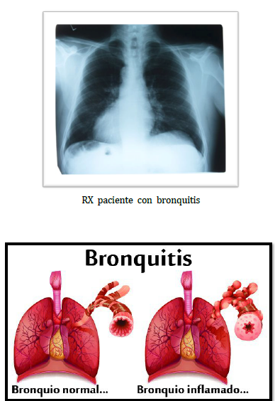

# BRONQUITIS
Inflamación aguda o crónica de la mucosa de los bronquios  
Entre las afecciones respiratorias la más habitual como objeto de consulta, y frente a la cual la fitoterapia ha demostrado claramente su acción terapéutica, es la bronquitis que cursa con tos. La bronquitis aguda es una afección inflamatoria que afecta al árbol bronquial. Se produce por la inflamación de la mucosa bronquial, que provoca una resistencia al flujo del aire, tanto por la acción de agentes infecciosos (Mycoplasma pneumoniae, Bordetella pertussis), como por la de agentes irritativos (polvo, humos, tabaco). Durante la bronquitis aparecen un edema de la mucosa y un exudado mucopurulento que causa la aparición de la tos. La tos es un síntoma asociado a multitud de patologías respiratorias. Se trata de un mecanismo de defensa del organismo que consiste en expulsar, de forma violenta, el aire contenido en las vías respiratorias con la finalidad de eliminar las mucosidades y sustancias extrañas que obstruyen estas vías.  
Puede tratarse de una tos productiva, con eliminación de esputo, o improductiva, sin Existe una multitud de enfermedades respiratorias acompañadas (en mayor o menor grado) de tos, aunque las más habituales suelen cursar con bronquitis aguda. Para su tratamiento, la fitoterapia dispone de plantas medicinales con actividad antitusiva, expectorante y antiséptica de las vías respiratorias, que han demostrado ser claramente eficaces eliminación de éste. La tos productiva no debe nunca eliminarse, ya que es una tos útil y esencial porque ayuda a eliminar las secreciones acumuladas evitando que se produzca una obstrucción bronquial que, a su vez, favorezca el desarrollo microbiano. Únicamente estará indicada su supresión durante períodos cortos y en circunstancias especialmente molestas para el enfermo (tos nocturna) o cuando pueda ser un riesgo, como es el caso de ciertos enfermos cardiópatas. Para favorecer la expectoración se pueden utilizar plantas expectorantes y mucolíticas y se debe proporcionar al tracto respiratorio la humedad necesaria. La tos improductiva se produce por irritación bronquial, suele ser una tos seca y molesta y, además, irrita la garganta. Como no tiene interés fisiológico, la tos improductiva puede ser eliminada para lo cual será de gran utilidad el uso de plantas medicinales de acción antitusiva y emoliente. Se deberá ser cuidadoso si la tos persiste, puede ser consecuencia de una afección más grave. Si en este caso se suprime la tos, podría dificultar el diagnóstico de la verdadera causa ya que en ocaciones la bronquitis aguda puede ser secundaria a una infección de las vías respiratorias altas.  
La bronquitis se considerará crónica cuando inflamación difusa de los bronquios y la secreción excesiva de mucus dura al menos tres meses cada año durante más de tres años. 

## Sintomatología.
Los síntomas que se pueden presentar son:
- Tos al inicio seca e irritante a medida que la infección empeora, pude presentar tos con flema; puede ser transparente o color amarillento.
- Fiebre moderada.
- Malestar general.
- Dificultad respiratoria.
- Sibilancias (chillido de pecho)
## Tratamiento
- Plantas de acción antialergénica
    - Llantén (Plantago mayor)
    - Sauco ( sambacus nigra)
    - Plantas antiinflamatorios
    - Grosellero negro ( Ribes nigrum)
    - Malva ( malva rotundifolia)
    - Malvavisco (Althea officianlis)
- Plantas a la vez antiinflamatorias y antialérgicas 
    - grosellero negro
    - lavanda 
    - hisopo
- Plantas antiinfecciosas pulmonares
    - marrubio ( marrubium vulgaris)
    - coclearia (cochlearia officinalis).
- Plantas expectorantes:
    - cebolla ( allium cepa)
    - antiséptico pulmonar, rica en vitamina C
    - eucaliptus. (eucaliptus globulus) potente antiséptico y antidiabético, tomillo ( thymus vulgaris) antiséptico pulmonar..