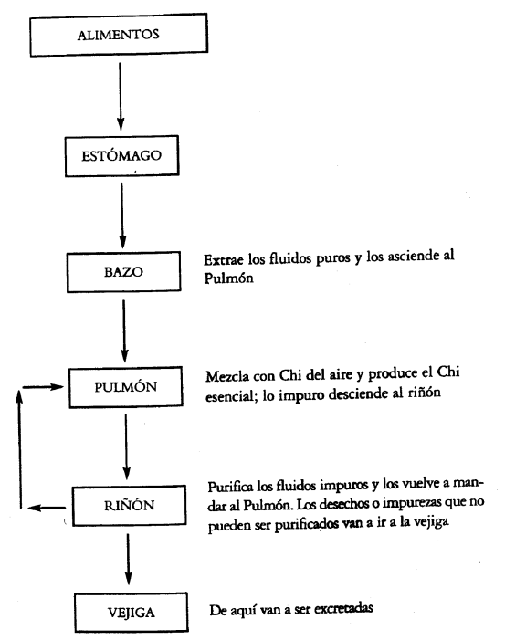

# Semiología patológica de los cinco órganos yin
# Extraído del libro Medicina Tradicional China de
# Mario Schwarz editorial Errepar
## HÍGADO (GAN)
> "El hígado regula el fluir y el dispersar (Ling Shu)

El hígado o su Chi es el responsable del suave movimiento de las sustancias y de la regularidad de las actividades corporales. Mueve el Chi y la Sangre en todas direcciones, mandándolos a cada parte del cuerpo. El Nei Ching llama al hígado, metafóricamente, "el general de un ejército", porque mantiene la suavidad y armonía de los movimientos en el cuerpo. Un cuerpo ágil, suave, liviano, elástico, muestra el estado deseable del hígado.

Es un órgano extremadamente sensible al estancamiento o atrapamiento, considerando estancamiento a la falta de Chi como para mover la Sangre. Atrapamiento o compresión del Chi del hígado por obstrucción.

Fluir y esparcir

Esta primera actividad "ajusta y suaviza". El suave fluir del Chi a través del cuerpo depende del fluir y esparcir del hígado. Toda actividad que depende del Chi, el movimiento mismo del Chi, de la sangre y del Chi circulante por los meridianos y la actividad de todos los órganos dependen del hígado.

Cualquier problema afectando la función del hígado puede influir en la circulación del Chi y de la sangre y llevar al estancamiento del Chi o sangre congelada.

El propio Chi del hígado puede estancarse en su propio meridiano, manifestando síntomas como dolor en los flancos, pechos y genitales hinchados o dolores abdominales.

La actividad de "ajuste" del hígado es especialmente importante en la digestión. Si el hígado pierde su movimiento armonioso, puede equivocar su camino e invadir el estómago y el bazo, con síntomas como dolores abdominales, náuseas, borborigmos, diarrea, etc.

### Controlar la secreción biliar

La bilis es necesaria para la digestión de la comida y los fluidos. Si el hígado no realiza bien su función de fluir y dispersar, la producción de bilis puede ser interrumpida, provocando: ictericia, sabor amargo en la boca, vómito con fluido amarillo, dolor en los flancos y pérdida del apetito.

### Armonizar las emociones
Su característica suavizante es responsable por la creación de un medio ambiente interno relajado y alegre. Cualquier camio violento emocional puede afectar el fluir y el dispersar (esparcir). Las funciones del hígado son realizadas normalmente si el estado es sereno psíquicamente, puesto que la emoción perturba la energía, la cólera hace subir la energía hacia lo alto, pero la alegría la hace armoniosa.

Estos tres aspectos pueden separarse sólo con el objetivo de estudiarlos, mas en el cuerpo se encuentran interrelacionados.

En lo que se refiere al psiquismo, tanto éste puede afectar al cuerpo, como el cuerpo al psiquismo. La Medicina China tiende a explicar que no existe una división real entre lo sustancial (cuerpo) y lo insustancial (mente).

Otros aspectos del hígado son: atesorar la sangre, controlar los tendones y ligamentos, reflejarse en los ojos, manifestarse en las uñas.

### Atesorar la sangre

Se refiere al almacenamiento y la regulación de la sangre. Cuando el cuerpo está en reposo, la sangre es atesorada por el hígado; por ello, una de las causas del insomnio puede ser producida por el mal funcionamiento del hígado. Cuando hay mayor movimiento o actividad, la sangre es despedida del hígado para mantener una nutrición constante de los órganos y meridianos.

### Controlar los tendones y ligamentos

Esta función es la de mantener la relajación y contracción normales, haciendo que las articulaciones puedan moverse libremente. La sangre insuficiente del hígado puede producir el adormecimiento de los miembros la falta de equilibrio, la torpeza de los movimientos o el calambre de la mano y el pie. Puede ser el causante también de trastornos genitales, como ser falta de erección.

### Reflejarse en los ojos
Los ojos están relacionados con todos los órganos internos. Estructuralmente, el canal del hígado se comunica con los ojos y fisiológicamente los materiales del ojo se relacionan con la función del hígado de atesorar sangre.

La vista es suministrada por la sangre del hígado. La deficiencia de sangre produce la disminución visual.

Vista nublada, sequedad y ardor en los ojos.

El exceso de fuego del hígado se nota por la oftalmia. El exceso de calor húmedo en hígado y vesícula biliar se presenta por los ojos amarillos.

### Manifestarse en las uñas

Esto guarda una estrecha relación con la función de controlar los músculos y tendones.

Cualquier anomalía de la energía del hígado se refleja en las uñas, puesto que éstas son el último lugar al que la energía del hígado llega, por lo cual cualquier anomalía de éste se verá en las uñas, en su color, forma y consistencia.

El hígado es un órgano muy fuerte, fácil de ser afectado pero difícil de destruir. Es muy resistente al calor y es el único órgano que en su aspecto ''Yang" tiene tres estadios de afecciones:

1. Hueco Yang o deficiencia del Yin:
    - Palmas y pies calientes, leve fiebre en las tardes, dolor de cabeza suave, puntos negros en la visión, ojos secos, mareos leves, nerviosismo, irritabilidad, depresión, pulso delgado, rápido y de cuerda.
1. Fuego arrogante atacando hígado:
    - Calores periódicos en cara y cabeza. Dolor punzante en la cabeza (zona temporal), ojos rojos y ardientes, mareos moderados, enojo y depresión, pulso rápido y de cuerda.
1. Fuego ascendente incendiando:
    - El cuerpo está constantemente caliente, dolores de cabeza severos y partientes, ojos rojos e hinchados y dolorosos, mareos severos, emociones violentas, mucho enojo, pulso rápido, lleno y de cuerda.

La sintomatología de las afecciones del hígado puede dividirse, para su estudio y comparación, en dos grandes grupos: Y¡n y Yang.

1. Grupo Yin
    - Dolor en hipocondrio e hipogastrio.
    - Distensión mamaria. Opresión en el pecho.
    - Irregularidad menstrual. Eructo. Mareos.
    - Amenorrea.
    - Lentitud y torpeza de los movimientos.
    - Adormecimiento de miembros.
    - Pesadez de miembros.
    - Calambres. Dolor abdominal.
    - Distensión en los testículos, con dolor.
    - Escroto contraído, Lengua pálida, saburra blanca.
    - Desmayos. Hematemesis. Melena. Epistaxis. Rigidez de
    - nuca. Calambres. Contractura muscular. Lengua
    - colorada. Saburra amarilla. Pulso de cuerda, rápido.
1. Grupo Yang
    - Fotofobia. Nerviosismo, Irritabilidad. Impaciencia.
    - Confusión. Fiebre. Dolor de cabeza. Puntos negros en
    - la visión. Ojos rojos, hinchazón, sequedad. Dolor de
    - ojos, vista borrosa. Vista fija hacia arriba. Dolor en
    - hipocondrio. Ictericia. Inapetencia. Boca amarga y seca.
    - Orina amarilla o colorada. Constipación. Marco.
    - Insomnio. Tinitus. Ciclotimia. Calor Facial.
    - Metrorragia. Pies livianos. Hiperquinesis. Coma.
    - Temblores. Opistónomos. Masetero contraído.
    - Mucho sueño.
    - Pulso de cuerda, lento y profundo.

Esta sintomatología es muy general y corresponde a dos grupos grandes que pueden ser subdivididos a su vez, cada uno, en dos o más subgrupos.

### CASOS CLÍNICOS
Determinar si es Y¡n 0 Yang, exceso o deficiencia, Frío o Calor, meridianos afectados, conducta terapéutica.
#### Caso Nº 1
- Pérdida de la agudeza visual
- Uñas resquebrajadas
- Amenorrea
- Dolor de cabeza
- Pulso de cuerda
#### Caso Nº 2
- Mareos
- Vértigo
- Colérico
- Ojos rojos
- Dolores hipocondríacos
- Orina amarilla y oscura
- Pulso lleno y de cuerda

## TIPOLOGÍAS DEL HIGADO

### Exceso de hígado 

Por lo general, los individuos pertenecientes a este biotipo tienen sangre de tipo 0 (cero). Tienden a ser obcecados y toman sus propias decisiones. Sus músculos son fuertes y tensos y su constitución es fuerte. Son muy trabajadores y gozan de buen apetito. Son susceptibles a padecer apoplejía y enfermedades intestinales.

### Deficiencia de hígado

En general, el tipo prevaleciente de sangre en estos individuos es el A. Son calmos, inteligentes y muy sensibles, pero con muy pocas energías. Sus músculos no se desarrollan bien. El estómago y el intestino suelen ser débiles. Son susceptibles de padecer problemas emocionales y nerviosos. Todo su cuerpo tiende a ser débil, mas si practican ejercicios asociados con una respiración adecuada, pueden ser longevos.

# CORAZÓN (XIN)

> "El corazón regula los vasos sanguíneos" (So Wen)

Cuando el corazón funciona normalmente, la sangre fluye suavemente. Si la sangre del corazón y el Chi del corazón (que son mutuamente dependientes) son abundantes y normales, el pulso va a ser parejo y regular.

> "El corazón atesora el Shen'' (Ling Shu)

También se dice que el corazón regula el Shen. Cuando la sangre del corazón y su Chi circulan correctamente, el Shen es nutrido y el individuo responde apropiadamente a su medio ambiente. Cuando el atesoramiento del Shen es incompleto, aparecen síntomas como: insomnio, soñar excesivamente u olvido. Desórdenes más serios en esta función derivan en histeria, conducta irracional y delirio.

> "El corazón se abre en la lengua" (So Wen)

> "El brillo del corazón se manifiesta en la cara" (Ling Shu)

Tradicionalmente, se dice que la lengua es la germinación del corazón. La lengua está ligada con el Chi del corazón y con la sangre del corazón, de manera tal que desarmonías en el corazón a veces son detectables en la lengua. Una lengua pálida puede indicar deficiencias de sangre en el corazón; una lengua púrpura (cianótica) puede indicar estancamiento de la sangre en el corazón. La conexión entre el corazón y la lengua también significa que muchos cambios patológicos en la lengua tales como inflamaciones o ulceraciones, pueden a menudo ser tratados con acupuntura o herboristería dirigidas al corazón. Si la sangre del corazón es abundante, la tez va a tomar una coloración rojiza, normal, humectada y brillante; si la sangre fuese insuficiente, la tez será pálida y sin lustre; si hay estancamiento, la tez será púrpura.

## Funciones del corazón

### Regular los vasos sanguíneos

Se refiere esta función a la propiedad del corazón de regular la contracción y dilatación de los vasos sanguíneos, modulando de esta manera la fuerza con que la sangre llega a las diversas partes del cuerpo, principalmente a los órganos, lo cual se refleja en la cara y el pulso. Se constituyen así dos microsistemas, que son utilizados corno medios de diagnóstico.

La fuerza con la que circula la sangre va a depender del Chi del corazón, que en este aspecto va a formar parte del Chi del pecho, el cual es el encargado de impulsar la sangre y la respiración (zong chi).

- El corazón regula o impulsa la sangre.
- El hígado la atesora.
- El bazo la gobierna.

### Atesorar el Shen

De las tres sustancias fundamentales, el origen del Shen es análogo al origen del Jing: cada padre contribuye a la creación del Shen resultante, pero aun así, el Shen es continua y materialmente nutrido. Este aspecto material del Shen es lo que llamamos Shen adquirido

Según la escuela española de acupuntura: “Toda la esfera de sentimientos pasa por el tapiz regulador del corazón. Él es el depositario para recibir las sensaciones psíquicas de los demás órganos” .

El Shen adquirido es el formado y elaborado por los demás órganos, pero éste, antes de ser expresado o enviado al exterior, es supervisado por el Shen ancestral atesorado en el corazón.

Las energías esenciales wei, yong y ching poseen un ir y un devenir, de adentro hacia afuera, de arriba abajo y viceversa. Cuando estos ritmos de entrada y salida, ascenso y descenso, profundización y superficialización de las energías se interrumpe, también se interfieren las tendencias psíquicas naturales, provenientes de una buena relación entre los cinco elementos y gobernados esencialmente por el corazón.

En síntesis, el Shen adquirido es el puente de contacto entre el Shen ancestral y la vida cotidiana. La función de atesorar el Shen tiene estrecha relación con la facultad del corazón de generalizar las funciones fisiológicas del cerebro.

Las anomalías características de la función del corazón de atesorar el Shen están principalmente radicadas en tres aspectos de éste:

1. Sueño: "El insomnio se produce cuando el Shen no tiene paz".
2. Memoria: las alteraciones de la memoria son propias de una deficiencia del Yín de corazón; falta de memoria, deficiencia de sangre en el corazón, olvido fácil, poca retención de datos; deficiencia del Yang, tendencia a vivir en el pasado.
3. Coherencia: falta de relación armónica entre el individuo y el medio ambiente, locura, delirio, histeria, conductas irracionales, incoherencia

Las características del corazón son:
1. Abrirse en la lengua.
1. Manifestarse en la cara.

## Sintomatología general
Dolor precordial, palpitaciones, insomnio, sudor nocturno, sequedad en la garganta, sed, rubor facial, calor en las palmas, dolor en la parte media del brazo.

### YANG
Febrícula, sudor nocturno, boca seca y amarga,
sed, palpitaciones, insomnio, memoria pobre,
neurosis, sofocación, dolor en la punta de la
palidez, astenia, laxitud, disnea, vértigo, síncope,
edemas, extremidades frías, sudoración profusa,
inconsciencia, escalofríos, etc.

### YIN
Trastorno mental, catatonia, apatía, cianosis en la
cara, labios y uñas, dolor a lo largo del brazo
izquierdo, dolor precordial, opresión torácica,
lengua, úlcera bucal, rubor facial, hematemesis,
epistaxis, hematuria, trastorno mental, histeria,
epilepsia, esquizofrenia, coma por accidente
cerebrovascular, pesadillas, habla incoherente,
llanto o risa inmotivados, etc.

## Cuadro funcional

### Regular los vasos sanguíneos

Su deficiencia conduce a la deficiencia del Chi y de la circulación sanguínea.
Esto producirá probablemente un cuadro de deficiencia general: disnea, palidez,
astenia, cansancio general, suspiros, disnea que aumenta con la actividad.
En caso de exceso tendremos una sintomatología de calor e hiperactividad
orgánica: palpitaciones, diversas hemorragias, rubor facial, sed, irritabilidad, coma

### Atesorar el Shen
Insomnio, falta de memoria, incoherencia, somnolencia excesiva, histeria,
esquizofrenia, trastorno mental, pesadillas y llanto inmotivados, agresividad,
actitudes maníacas.

### Abrirse en la lengua
Inflamaciones, hinchazón, úlceras linguales, sequedad de lengua

### Manifestarse en la cara
Palidez, cara roja, rubor facial, etc.

Las características del corazón de abrirse en la lengua y manifestarse en la cara son utilizadas como método de diagnóstico, puesto que en cada una de ellas (cara y lengua) se ve también reflejado el funcionamiento de los diversos órganos; por ello omitimos más datos, los cuales van a ser explayados en otros niveles, bajo el título de: "Examen de la cara y glosodiagnosis".

## TÍPOLOGÍAS DEL CORAZÓN

### Corazón en exceso:

Inteligentes, metódicos, siempre en busca de mayor claridad mental. Cara rojiza, flacos, nariz en punta, cabeza en forma de pera invertida. Gozan de buena salud, son mejores en trabajos no manuales. Problemas respiratorios. Agilidad mental.

### Deficiencia de corazón:

Tendencia al enrojecimiento. Si la deficiencia es grande, son pálidos, delgados y con cabeza en forma de pera invertida.
Inteligentes, pero mentalmente no son ágiles. Nerviosismo. Hipersensitivos, egoístas. De gran voluntad. Huraños, no son sociables. Enfermedades nerviosas y problemas digestivos.

### CASOS CLÍNICOS:
Determinar si es Yin o Yang, exceso o deficiencia, frío o calor, meridianos afectados, conducta terapéutica.
##### Caso Nº 1
- Insomnio
- Memoria pobre
- Cara roja
- Una cierta incoherencia al hablar
- Lengua material rojo
- Pulso rápido y fuerte
##### Caso Nº 2
- Palidez
- Anorexia
- Coloración pálida en labios, uñas y cara
- Disnea que aumenta con la actividad
- Lengua material pálido, saburra blanca y delgada
- Pulso débil y profundo

## BAZO (PI)

> "El bazo regula la transformación y la transportación" (Nei-Ching)

El bazo es un elemento crucial para el proceso a través del cual la comida es transformada en Chi y sangre. Para los chinos, es el órgano principal de la digestión. Este extrae las esencias nutrientes puras de la comida y las bebidas ingeridas y las transforma en Chi y sangre.

Dado que el bazo es la fuente de la sangre y la energía, se lo menciona tradicionalmente corno "el fundamento de la energía postnatal'' (libro de lecturas esenciales de la medicina Tai Pei, 1637). El bazo, o mejor dicho, su Chi es también responsable por el transporte del Chi cereal, derivado de la comida y de las "esencias puras" que devendrán en sangre, para ser luego dirigidas a los pulmones, donde finalmente se sintetizan el Chi y la sangre. El bazo dirige "el movimiento de ascenso". También está asociado con el movimiento y transformación del agua en el cuerpo. Un texto moderno sintetiza estos aspectos del bazo diciendo "regula el ascenso de lo puro" (Instituto de Pekín).

Si las funciones de transporte y transformación son armoniosas, el Chi y la sangre son abundantes y la digestión es buena. Si el bazo se desarmoniza, todo el cuerpo o parte del mismo tendrán poco Chi o poca sangre. Si la digestión es afectada, habrá síntomas como:

Distensión o dolor abdominal, diarrea o anorexia.
> "El bazo gobierna la sangre

No solamente el bazo ayuda a crear la sangre, sino que la gobierna, en el sentido de que la mantiene en su cauce correcto. En general, el Chi comanda la sangre, pero es el Chi del bazo en particular el que la mantiene en su lugar. Si esto no sucediese, la sangre escaparía de sus canales normales y se movería 11 sin destino"; esto llevaría a síntomas como: vómitos con sangre, sangre en la defecación, hematomas, hemorragias uterinas.

> "El bazo regula los músculos'' (So-Wen)
> "Y también a los cuatro miembros" (So-Wen).

No solamente el bazo es el origen del Chi y de la sangre, sino que también transporta sustancias a los músculos y a la carne; la tonicidad muscular depende del bazo.

> "El bazo se abre en la boca" (Ling-Shu)
> "El brillo del bazo se manifiesta en los labios" (So-Wen).

Si el bazo está en armonía, la boca estará en condiciones de distinguir los cinco sabores (Ling-Shu) y los labios estarán rosados y humectados.

### Sintomatología

##### YANG
Dolor en el hipogastrio, hipoanorexia,
artralgias, ictericia, febrícula,
hipoinsulinismo, aftas,
leucorrea amarilla,
hemiplejia, forúnculos,
hipertensión arteria¡,
hernia diafragrnática,
púrpura.

##### YIN
Fatiga, cuerpo cansado, frío en miembros,
náuseas, diarrea, poliuria clara,
edema generalizado,
leucorrea clara, blanca, parasitaria,
lengua pálida, con impresiones dentarias,
bradicardia,
cáncer gástrico, pancreático, intestinal,
parasitosis, leucemia

Cabe aclarar que esta sintomatología es general y que puede ser utilizada como guía para distinguir qué síntomas son propios de una anomalía del meridiano del bazo, mas no la causa, puesto que para ello se debe considerar la relación de éste con los cinco elementos, si es hueco o sólido, factor etiológico externo o interno y especialmente qué síntomas presenta el paciente, que son propios de otros elementos.

Como se expresó al principio, al bazo está asociado el aspecto psicológico de reflexión o concentración de la mente en un problema.

La plenitud en bazo está asociada, por lo general, a la obsesión, vuelta al pasado, ideas fijas, celos, angustia.

La deficiencia o falta de memoria o preferentemente memoria asociativa, que es propia del bazo: olvidos, distracción, astenia mental.

Entre otras cosas, el bazo se ocupa o concierne especialmente a las glándulas salivales, al útero, a la fecundación, al testículo en el papel de formación de espermatozoides y en algunos casos, puede ser la causa de esterilidad.

Aparte, el meridiano de bazo nutre las zonas que atraviesa, por medio del meridiano y por una serie de canales secundarios y pequeños vasitos que él gobierna.

### TIPOLOGÍAS DE BAZO

##### Bazo en exceso:

Por lo general son gordos, aman comer, son muy exigentes con la comida, cara rojiza, ligeramente amarilla, hablan mucho, simpáticos, no son rencorosos, poca voluntad, problemas artríticos y neurálgicos por humedad en bazo. Deben ser cuidadosos con las enfermedades del hígado y del bazo.

##### Deficiencia de bazo:

Cara amarilla. Estómago e intestino grueso débiles, con mucho apetito; tienen que tratar de controlar su apetito por este problema mencionado. Mucho deseo sexual; si no frenan un poco sus deseos pueden llegar a tener una vida corta. Si desarrollan un hígado Yang alto, van a ser seres generalmente irritables. Pocas decisiones propias. Si tienen alguna característica de exceso de hígado, pueden llegar a ser rencorosos.

Estos cuadros que se expresan a continuación se han armado para sintetizar lo dicho anteriormente y para una mejor comparación y elaboración:

|FUNCIONES|SÍNTOMAS EXCESO-DEFICIENCIAS|
|---|---|
|Regular al asc. de lo puro|Mala digestión y absorción, diarrea pastosa, distensión abdominal, anorexia, astenia, decaimiento, anemia edemas, hemorragias, prolapso anal.|
|Controlar la sangre|Hematuria, metrorragias, enterorragias, hematomas subcutáneos, melena, úlceras, deficiencia de sangre o anemia|
|Controlar los músculos|Desgarros repetitivos, piernas cansadas, párpados cansados, astenia general, distensión abdominal.|
|Elevar el Chi|Grandes distensiones, hemorroides, prolapso uterino.|
|Se abre en la boca|Poco sentido del sabor, boca insensible, adormecimiento de labios, hinchazón, gusto anormal.|
|Psiquismo (Reflexión)|Obsesión, vuelta al pasado, ideas fijas, celos, angustia, falta de memoria asociativa, olvidos, distracción.|

|CAUSAS|SIGNOS|ABDOMEN|ALIMENT.|HECESYORINA|PULSO|LENGUA|
|---|---|---|---|---|---|---|
|Frio o deficiencia de yang|Labios descoloridos, miembros frios, icticeria, edema|dolores continuos|dispepsia|diarrea, liquido claro y frio|Profundo lento|blanca, delgada, humeda|
|Calor o defi-ciencia de Yin|Labios rojos,ictericia|Dolores intermitentes| Come poco|Orina rojo ama-rillo|Rápido|Delgada y Amarilla|
|Vacío o deficiente|Cara amarilla. Labios secos. Adelgazamiento o edema generalizado.|Miembros fríos|Le gusta que le masajeen el vientre|Dispepsia|Diarrea|Vacío Retardado|Descolorida y Húmeda|
|Plenitud o exceso|Sensación de cuerpo pesado. Pecho oprimido, dolores generalizados|Hinchazón y dolores epigástricos|Sensación de hambre|Dificultad para defecar|Profundo Resbaladizo|Seca y Amarilla|

### CASOS CLÍNICOS:
Determinar si es Yín o Yang, exceso o deficiencia, meridianos afectados y conducta terapéutica (Sedar-tonificar).

##### Caso Nº 1
- Defecación acuosa crónica, con materiales sin digerir
- Falta de apetito
- Aversión al frío
- Letargia
- Edema abdominal
- Lengua con saburra blanca y grasosa
- Pulso frágil y profundo
- Determinar también las funciones del órgano afectado
##### Caso Nº 2
- Palidez facial
- Palidez labios y uñas
- Vértigo. Fatiga
- Palpitaciones. Tinitus
- Anorexia
- Heces acuosas
- Menstruación tardía con sangre pálida
- Lengua pálida con saburra blanca
- Pulso vacío, frágil o delgado

### TIPOLOGÍAS DE PULMÓN

##### Exceso de pulmón

Gordos, estómago muy fuerte e intestino grueso muy fuerte. Aunque a veces pueden tener desórdenes en estómago e intestino grueso. No tienen mucha energía sexual, pero son muy sociables. Problemas cardíacos, coronarios, nerviosos, de carácter débil.

##### Deficiencia de pulmón:

Flacos, tez blanca, estómago e intestino grueso débiles. Fácilmente contraen enfermedades respiratorias, susceptibles a resfríos y gripes. Mucha voluntad y fuertes para tomar decisiones. Si son afectados por un exceso de hí- gado se ponen irritables, cuidadosos con E e IG. Si en invierno se lavan con agua fría pueden desarrollar hemorroides.

## RIÑONES (SHEN)

> "Los riñones atesoran el Jing'' y regulan el nacimiento y la maduración

El Jing es la sustancia más cercanamente relacionada al concepto de la vida misma. Es la sustancia que le da a la vida orgánica su carácter específico, contiene la posibilidad del nacimiento, maduración, envejecimiento y muerte. Jing es la sustancia indiferenciada, neutra, que precede a la vida misma, a través de la cual se nos hace posible diferenciar el Yin del Yang. Esta fuerza se encarna en el mismo momento de la concepción, a partir de la cual las células comienzan un proceso de diferenciación cada vez mayor, hasta la extinción del organismo creado. El cuerpo entero y todos sus órganos necesitan el Jing para cumplir con sus funciones específicas.

En otras palabras, las ramas Yin y Yang de cada meridiano dependen del Jing atesorado en los riñones, de ahí la expresión: "Los riñones son la raíz de la vida"; también se dice Ios riñones son la mansión del fuego y del agua, la residencia del Yín-Yang... el canal de la vida y la muerte".

Todos los órganos son caracterizados corno Yin o Yang. Pero cada uno de los órganos posee un aspecto Yin, que sirve de soporte y nutrición, y otro aspecto Yang, asociado con la actividad. Por ejemplo: el atesoramiento del Shen por el corazón es su aspecto Yin, mientras que regular los vasos sanguíneos y la sangre es su aspecto Yang. El atesoramiento de sangre por parte del hígado es su aspecto Yin, mientras que la dispersión del Chi en todas direcciones es su aspecto Yang.

> "Los riñones regulan el agua» (So Wen)

Mientras que los pulmones "mueven y ajustan los canales del agua" y Iicuifican el vapor", el bazo "asciende lo puro", incluyendo los fluidos puros, pero los riñones son el eje sobre el que todo este proceso de movimiento y transformación del agua se sostiene. Las palabras agua y fluidos a menudo son usadas como sinónimos. Aunque la palabra agua tiene una connotación más general que la de fluidos. Fluidos se refiere a un aspecto particular del agua (sudor, orina); agua se refiere a la humectación del cuerpo. Agua también es el principio opuesto al fuego. Los riñones regulan el agua a través de su aspecto Yang. Su fuego o calor (ming men) transforma el agua en una especie de "vaho" que constituye el primer paso, antes de que los fluidos puedan ascender o circular. El bazo también vaporiza fluidos, puesto que a través de él asciende lo más puro de las esencias extraídas de las comidas y de los fluidos, pero su capacidad de vaporización es dependiente de la del fuego del riñón que actúa como una especie de piloto automático.

El sistema conocido como "el movimiento del agua" puede ser resumido de la siguiente manera: los fluidos son recibidos primero por el estómago, que comienza el proceso de separación, a través del cual porciones de comida no útiles pasan a los intestinos como desperdicio y "el agua pura es extraída". Este proceso es continuado por el bazo, que vaporiza los fluidos puros hacia los pulmones, que a su vez separan estas sustancias haciendo circular las partes más claras de las mismas a través del cuerpo y todo aquello que deviene impuro es enviado hacia abajo, hacia los riñones, donde un nuevo proceso de filtración se desarrolla. Aquí el fluido impuro es separado, relativamente, en "limpio" y "turbio"; la sustancia relativamente limpia es transformada en un vapor y reciclada hacia los pulmones. Y finalmente los fluidos turbios van hacia la vejiga, donde son guardados y subsecuentemente excretados. "Los riñones regulan los huesos" (So Wen), “los riñones producen la médula (ósea)" (So Wen). Se dice que el Jing atesorado en los riñones crea la médula ósea, de aquí que se considera al riñón responsable de sostener los huesos. El desarrollo y la reparación ósea dependen del Jing del riñón. Los signos típicos, en los niños, de insuficiencia del Jing de riñón son: huesos blandos e incompletos cerramientos de los huesos del cráneo; en los adultos se presentan signos como: piernas y rodillas débiles, huesos frágiles, endurecimiento de la columna.

Se considera que la vitalidad de los dientes proviene del exceso de energía nutriente de los huesos. De ahí que se los considere asociados con los riñones. Cuando los dientes de los niños se desarrollan pobremente o cuando el adulto constantemente padece caries, el médico chino insistirá en la insuficiencia del Jing del riñón para sostenerlos.

> "Los riñones se abren en el oído" (Ling Shu)
> "Los riñones se manifiestan en el cabello" (So Wen)

El Nei Ching dice "el Chi de los riñones viaja a través de los oídos"; "si los riñones están armonizados, el oído puede oír los cinco sonidos" (Líng Shu). La hipoacusia tan común en los ancianos es considerada como un debilitamiento del Jing.

La relativa humectación y vitalidad del cabello también están relacionadas con el Jing del riñón.

> "El riñón regula la captación del chi'' (Lin Pei-Qin)

Mientras que los pulmones administran la respiración, éstos necesitan de la asistencia de los riñones para que el Chi del aire natural penetre profundamente, completando el proceso de inhalación que también es llamado "captación del Chi". Si la asistencia del riñón hacia el pulmón es débil, se producen comúnmente casos de asma crónica.

## SISTEMA DE AGUA

### Funciones:
1. Atesorar el Jing
2. Regular el agua
3. Regular la captación del Chi

### Características:
1. Regular los huesos
2. Manifestarse en el cabello
3. Se abre en los oídos

### Sintomatologia general:
Enuresis, orina frecuente, oliguria, poliuria, espermatorrea, impotencia, exceso de deseo sexual, menstruación irregular, asma, hemoptisis, sequedad de la lengua, inflamación y dolor de garganta, edema, lumbago, dolor a lo largo de la columna vertebral y en la parte interna del muslo, debilidad de los miembros inferiores, calor en la planta del pie, zumbidos auriculares, dolores de oídos, hipoacusia.

El riñón, por su función principal de atesoramiento del jing, presenta cuadros de plenitud o exceso, puesto que el jing heredado de los padres no puede ser incrementado, pero sí disminuido, por factores externos o internos. Por lo cual la escuela de Pekín propone tres patologías clásicas:

##### Deficiencia del jing

|DEFICIENCIA DEL JING|HUECO O DEFICIENCIA YANG|HUECO YANG O DEFICIENCIA YIN|
|---|---|---|
|Dolor y debilidad de la región lumbar, articulaciones y en las rodillas.|Dolor y frío en la región lumbar, en las articulaciones y rodillas.|Debilidad de la región lumbar.|
|Poliuria, orina frecuente, goteo terminal enuresis, incontinencia de orina.|Oliguria, poca orina.|Orina caliente y de color amarillo.|
|Eyaculación nocturna o prematura, infertilidad o esterilidad.|Palidez, impotencia.|Marco, vértigo, visión borrosa, tos con esputos, tinitus, sensación de calor de palmas y plantas, rubor malar, sudoración nocturna, fría. Lengua roja, pulso rápido y fino.|
|Respiración superficial agitada, asmatiforme. Pulso fino y débil, profuntinnitus, hipoacusia.|Malestar o temor al frío, edema de los miembros inferiores, hincha- zón, lengua pálida, pulso profundo y fino, lento, cara y ojo negruzcos.|Idem anterior.|

|FUNCIONES|ANOMALIAS|
|---|---|
|Atesorar el Jing|Falta de maduración disfunción sexual, esterilidad, envejecimiento, envejecimiento prematuro, pocas ganas de vivir, dolor lumbar, azoospermia, anemia|
|Regular el agua|Oliguria, poliuria, edemás en los miembros inferiores, sequedad en boca, ojos y labios.|
|Captar el Chi|Asma, respiración superficial, problemas de índole respiratoria.|
|Regular los huesos|Debilidad y fatiga de la columna, dolor del tipo óseo, astenia fisica y mental, caries dentales.|
|Manifestarse en los cabello|Calvicie, caída del pelo, sequedad del pelo y florecimiento de éste.|
|Se abre en los oídos|Hipoacusia, zumbido auricular, latidos del tímpano.|

### TIPOLOGÍA GENERAL DEL RIÑÓN

Como los riñones no tienen fenómenos de plenitud o exceso, se presentan dos tipologías de deficiencia, lo cual demarca la propensión.

##### Riñón Yang (Deficiencia de Yín)

No tienden a la gordura; van a tener músculos duros pero elásticos. Complexión oscura y negruzca, aspecto severo, fuertes, sociables, cálidos, autoritarios, exceso de deseo sexual. Trabajan mucho y duramente, vida corta pero fructífera, susceptibles a apoplejía y enfermedades hepáticas

##### Riñón Yín (Deficiencia de Yang)

Reducida capacidad sexual, tamaño pequeño de órganos genitales. Si el hígado es fuerte van a lograr tener una vida sexual normal; delgados e inteligentes; pueden desarrollar problemas pulmonares. Si trabajan demasiado, pueden tener serios problemas de salud. Tienen que estar atentos a problemas circulatorios y urinarios.

Cabe aclarar que estas tipologías son de carácter general y que es muy raro encontrarlas reflejadas en un ser humano[^1]; mas no es difícil hallarlas con las diversas combinaciones de tipologías correspondientes a otros elementos

### CASOS CLÍNICOS:
##### Mujer 38 años
##### Caso Nº 1:
- Dolores de espalda y de rodillas
- Falta de fuerza en las piernas
- Vértigo
- Acufenos
- Insomnio
- Taquicardia
- Aversión al calor
- Lengua con saburra blanca y delgada
- Orina poco frecuente
- Palmas calientes
- Pulso rápido pero débil
##### Caso Nº 2
- Dolor abdominal epigástrico
- Dolor migratorio hacia atrás
- Náuseas, vómitos
- Sabor amargo en la boca
- Garganta seca
- Lengua material rojo, saburra amarilla
- Constipación
- Orina poca y oscura
- Pulso flotante, rápido, lleno, de cuerda
##### Caso Nº 3
- Vértigo
- Tinitus
- Ira
- Vómitos
- Garganta seca
- Lengua material rojo, poca cobertura
- Desvanecimiento
##### Caso Nº 4
- Dolor en flancos, ictericia
- Anorexia
- Abdomen distendido
- Repele las comidas grasas
- Poca orina, oscura
- Fiebre, a veces
- Saburra lengua grasosa
- Pulso resbaladizo y rápido

[^1]:Entiéndase, en su forma pura.