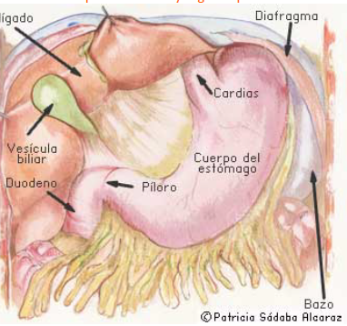
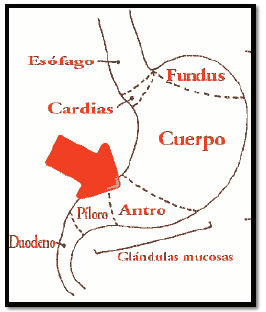
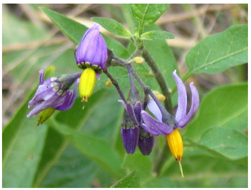

# Elemento Tierra
## Qué es la gastritis?
La gastritis es una inflamación del revestimiento del estómago.  
Aunque el revestimiento del estómago es bastante fuerte y puede resistir
ácidos fuertes, beber demasiado alcohol, comer alimentos picantes,
abusar del consumo de antiinflamatorios o fumar puede causar que el
revestimiento se inflame y se irrite.  
La gastritis puede durar sólo por un corto tiempo (gastritis aguda)
Y se presenta como una inflamación súbita del revestimiento del
estómago. También puede perdurar durante meses o años (gastritis
crónica). Que aparece como una inflamación del revestimiento del
estómago que se presenta gradualmente y que persiste durante un
tiempo prolongado.

## Anatomía
El estómago es una porción dilatada del tubo digestivo con forma de jota
que varía de una persona a otra y según la postura.  

Los alimentos una vez deglutidos, pasan al esófago (tubo largo y delgado
que transporta los alimentos) y de éste al estómago. Tras éste empieza el
largo intestino delgado, seguido del intestino grueso, recto y finalmente,
el ano.  
El estómago se sitúa en la parte alta del abdomen. Por su localización
tiene unas relaciones anatómicas muy complejas e importantes en el
hígado, con la vía biliar, con el colon transverso y con el páncreas, órgano
que se sitúa por detrás del estómago.  
Las partes que se consideran en el estómago son:  
- FUNDUS: inmediatamente después del cardias o zona de unión con el esófago.
- CUERPO
- ANTRO: antes del final del estómago (el píloro).

El estómago posee dos esfínteres:
- El cardias: que separa el estómago del esófago. Impide que el contenido del estómago vuelva al esófago (reflujo gastroesofágico).
- El píloro: separa el estómago de la primera porción del intestino delgado, el duodeno.
El estómago presenta dos curvaturas, una mayor dirigida hacia la
izquierda y otra menor dirigida hacia la derecha.  
El interior del estómago está cubierto por una mucosa con muchos
pliegues. Esta mucosa contiene multitud de glándulas que se encargan de
producir una serie de sustancias (enzimas) que continúan el proceso de la
digestión que se inició con la masticación.  
Rodeando a esta capa se encuentra la submucosa. 
 
## CAUSAS
La gastritis puede ser causada por:
- Beber demasiado alcohol.
- Comer alimentos picantes y/o con mucho condimento.
- Fumar.
- Usar por tiempo prolongado medicamentos antiinflamatorios no esteroideos (AINE's)
- Infecciones por bacterias como E. coli, Salmonella o Helicobacter pylori.
- Cirugía mayor.
- Lesiones traumáticas o quemaduras.
- Infección grave.
- Ciertas enfermedades como la anemia megaloblástica (perniciosa), enfermedades autoinmunológicas y el reflujo biliar crónico.
- Estrés extremo.
- Infección viral, como citomegalovirus y el virus del herpes simple (ocurre con más frecuencia en personas con un sistema inmunitario débil).
Helicobacter Pilori
## SÍNTOMAS
A continuación se enumeran los síntomas más comunes de la gastritis.  
Sin embargo, cada individuo puede experimentarlos de una forma diferente.  
Los síntomas pueden incluir:
- Malestar o dolor de estómago.
- Eructos.
- Hemorragia abdominal.
- Náuseas.
- Vómitos.
- Sensación de estar lleno o de ardor en el estómago.
- Sangre en el vómito o en las heces (una señal de que el revestimiento del estómago puede estar sangrando).

Los síntomas de la gastritis pueden parecerse a los de otras condiciones o
problemas y debe ser diferenciado adecudamente.  
## DIAGNÓSTICO
Además del examen y la historia de vida completa, los procedimientos
para el diagnóstico de la gastritis pueden incluir los siguientes:
- Gastroscopia - durante el procedimiento, el médico introduce un tubo delgado con una cámara, llamado gastroscopio, a través de la boca del paciente y hasta el estómago para examinar su revestimiento. El médico busca indicios de inflamación en el revestimiento y puede tomar una muestra diminuta del revestimiento para exámenes (se conoce como biopsia).
- Exámenes de sangre (para medir el recuento de glóbulos rojos de la sangre y posiblemente detectar anemia, una condición en la cual no hay glóbulos rojos suficientes, lo cual puede causar gastritis).
- Cultivo de heces - busca indicios de la presencia de bacterias anormales en el tracto digestivo que pueden causar diarrea y otros problemas. Se recolecta una pequeña cantidad de heces y se envía al laboratorio por medio del consultorio del médico. En dos o tres días, el examen muestra si hay bacterias anormales; la presencia de sangre en las heces puede ser un signo de gastritis.

## TRATAMIENTO DE MEDICINA OCCIDENTAL
El tratamiento específico de la gastritis será determinado
basándose en lo siguiente:  
- Su edad, su estado general de salud y su historia médica.
- Qué tan avanzada está la condición.
- Su tolerancia a determinados medicamentos, procedimientos o terapias.
- Sus expectativas para la trayectoria de la condición.
- Su opinión o preferencia.
Generalmente, el tratamiento de la gastritis incluye antiácidos y
otros medicamentos que ayudan a disminuir la acidez estomacal, a
aliviar los síntomas y a estimular la curación del revestimiento del
estómago, puesto que el ácido irrita al tejido inflamado.  
Si la gastritis está relacionada con una enfermedad o una infección,
también se tratará ese problema.  
Estos medicamentos incluyen:
- Antiácidos, como el Alka-Seltzer, Maalox, Mylanta, Rolaids, y Río pan-. Muchas marcas en el mercado utilizan diferentes combinaciones de tres sales básicas de magnesio, calcio y aluminio con iones de hidróxido o bicarbonato para neutralizar el ácido en el estómago. Estos fármacos pueden producir efectos secundarios tales como diarrea o estreñimiento.
- Bloqueadores de histamina 2 (H2), como la famotidina (Pepcid AC) y ranitidina (Zantac 75). Los bloqueadores H2 disminuyen la producción de ácido. Están disponibles tanto de venta libre y con receta médica.
- Inhibidores de la bomba de protones (IBP), como el omeprazol (Prilosec, Zegerid), lansoprazol (Prevacid), pantoprazol (Protonix) rabeprazol (Aciphex), esomeprazol (Nexium), y dexlansoprazole (Kapidex).
Todos estos medicamentos son de venta bajo receta y algunos
también están disponibles en el mostrador (sin receta). La
disminución en la producción de ácido que producen los
bloqueadores de la bomba de protones es más eficaz que la
producida por los bloqueadores H2.  
A los pacientes también se les recomienda cambios en la
dieta evitando comidas, bebidas o medicamentos que causan
síntomas o irritan el revestimiento del estómago.  
Si la gastritis está relacionada con el fumado, se recomienda que
deje de hacerlo.  

## Tratamiento con Hierbas medicinales
Plantas antiácidas por la neutraización del CIH: ( ácido clorhídrico) secretado: en primera línea se sitúa la batata ( solanum tuberosum) gracias a su almidón y al poder de sus sales.
Se debe usar el zumo recién extraído, medio vaso antes del almuerzo y
cena. Se le puede añadir zumo de limón y zanahoria.  
Por su accón antisecretora de CIH: La dulcamara ( solanum dulcamara)  
Por su acción antiespasmodicamódica: canela ( cinammonum
ceylanicum), melisa ( melisa offciinalis), celedonia (Chelidonium majus).  
Por su acción eupéptica ( que favorece la digestión): cilantro ( coriandrum
sativum), limón ( citrus limonum), lúpulo ( humulus lupulus), milenrama (
achilea millefolium, romero ( rosmarinus officinalis).  

Solanum dulcamara