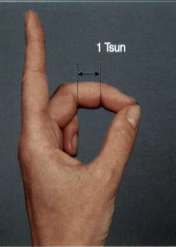
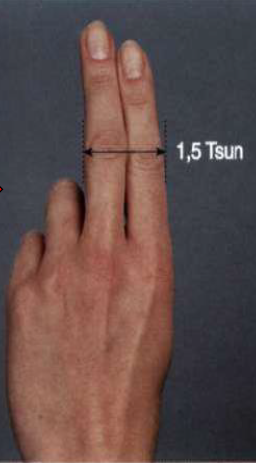
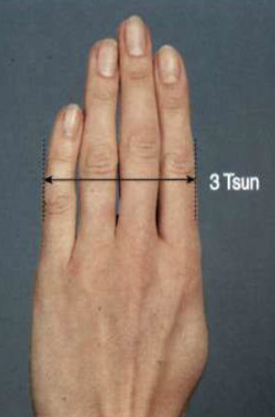
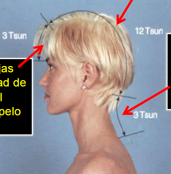
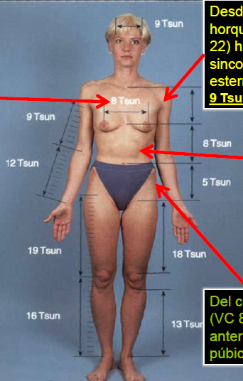
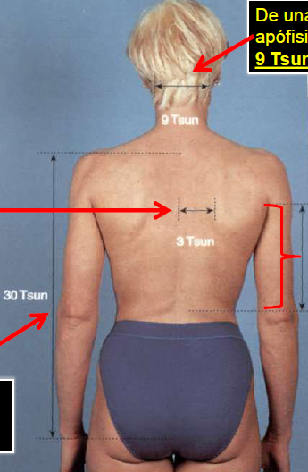

# Los Meridianos

## Unidades de medida en Medicina Tradicional China

### Medida del dedo corazón

Si se coloca la punta del dedo corazón sobre la punta del pulgar (ligeramente flexionado), la distancia entre los dos pliegues de flexión de ambas articulaciones interfalángicas del dedo corazón corresponde a **1 Tsun**

#### 1,5 Tsun

El ancho del dedo índice y el dedo corazón al nivel de la primera articulación interfalángica.

#### 3 Tsun

Tomando los dedos índice, corazón, anular y meñique en su parte más ancha.

### Medidas corporales

En el caso de las medidas corporales, que pueden diferir de las medidas de los dedos, son válidas las siguientes distancias:

#### Distancias Cabeza/cuello 

- En el centro de la línea ideal anterior del pelo hasta el centro de la línea ideal posterior del pelo 12 Tsun
- Entre las cejas hasta la mitad de la línea ideal anterior del pelo 3 Tsun
- En el centro de la línea ideal posterior del pelo hasta debajo de la apófisis espinosa de C7 (VG 14)
3 Tsun

#### Distancias Tronco

- De uno a otro centro del pezón (E 17) 8 Tsun
- Desde el centro de la horquilla esternal (VC 22) hasta la sincondrosis esternoxifoidea (VC16) 9 Tsun
- Sincondrosis esternoxifoidea (VC 16) hasta el centro del ombligo (VC 8) 8 Tsun
- Del centro del ombligo (VC 8) hasta el borde anterior de la sínfisis púbica 5 Tsun

- De una a otra apófisis mastoides 9 Tsun
- En posición neutra, desde el borde interno de la escápula hasta la línea de las apófisis espinosas 3 Tsun
- En la línea axilar media, desde el centro de la axila hasta el extremo inferior libre de la costilla 11 (H 13) 12 Tsun
- Apófisis espinosa de D 1 hasta la punta del hueso cóccix 30 Tsun

#### Distancias Mienbro Superior

- Con el brazo en abducción, desde el extremo superior del pliegue axilar proximal hasta la línea articular del codo 9 Tsun
- Desde la línea articular del codo hasta la línea articular de la muñeca 12 Tsun
> ver imagen distancias tronco

#### Distancias Mienbro Inferior
- Vértice del trocánter mayor del fémur hasta la línea articular de la rodilla 19 Tsun
- Línea articular de la rodilla hasta el vértice del maleólo externo 16 Tsun
- Desde el borde superior de la sínfisis púbica hasta el borde superior de la rótula 18 Tsun
- Cóndilo interno de la tibia hasta el vértice del maleólo interno 13 Tsun
> ver imagen distancias tronco

## Ritmos horarios y meridianos

El ritmo circadiano nos explica el movimiento de la energía en los meridianos en las diferentes horas del día, de ahí que el libre flujo de ella está influenciado por su recorrer incesante durante las 24 horas.

El mismo se establece con un intervalo de 2 horas, por lo que le corresponde 12 horas a los meridianos Yin y 12 horas a los meridianos a los Yang, aspecto este de gran importancia en el diagnóstico y la práctica terapéutica.

Esto quiere decir que a cada meridiano le corresponde un intervalo de 2 horas de mayor predominio energético, pero 12 horas después el flujo energético en el meridiano estará disminuido.

