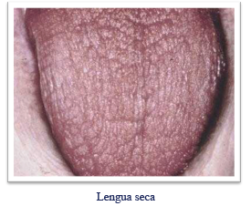
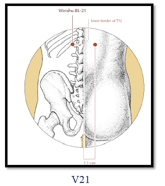
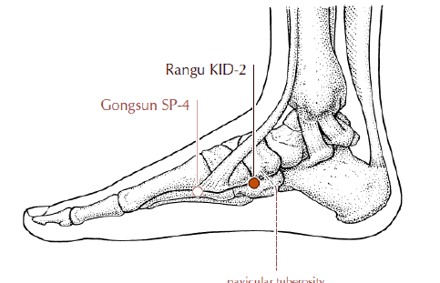
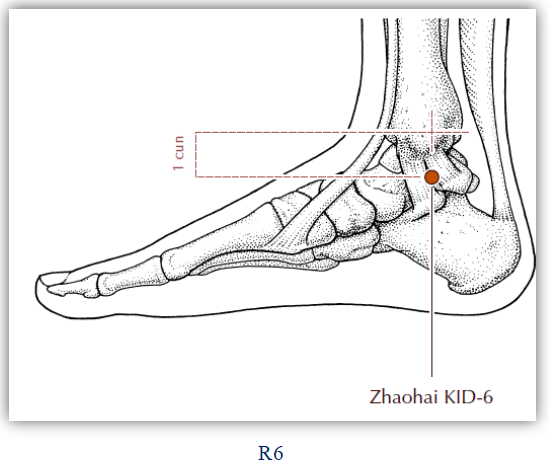
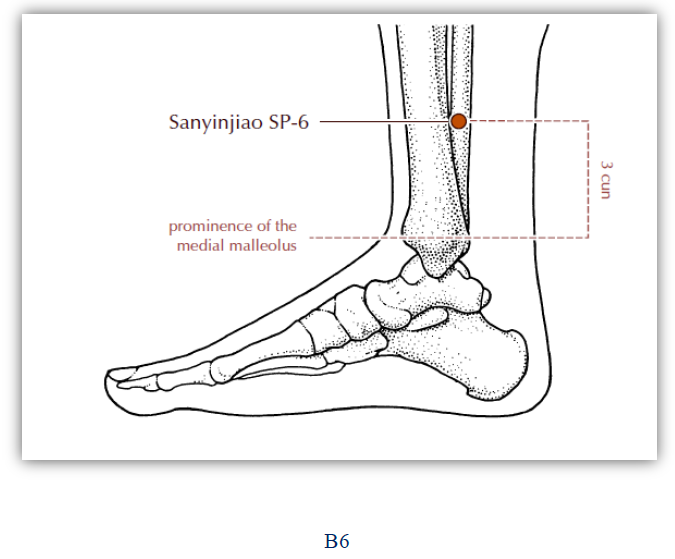

# SEQUEDAD (ZAO)

> *Al bazo le agrada la sequedad*
 Refran popular chino

Es mayormente durante el otoño que se presenta la Sequedad. Después de
un largo periodo de días soleados y sin lluvias, la atmósfera carece de
humidificación y la Sequedad puede entonces invadir al cuerpo humano y
causar enfermedad.

## Características

#### Consume los líquidos Corporales

Esta característica se manifiesta en signos como los siguientes:
- piel seca, áspera y resquebrajada
- nariz, boca y lengua secas
- orina escasa y constipación.

Por ejemplo, una persona que padece un resfrío durante el otoño,
además de presentar los síntomas del resfrío común (escalofríos, fiebre y
dolor de cabeza) puede presentar también los del síndrome seco (tales
como boca y labios secos y dolor de garganta).

#### Daña los Pulmones, muy a menudo
Los Pulmones son muy susceptibles a la Sequedad. Esta invade al
cuerpo desde las fosas nasales y reseca los fluidos en los Pulmones,
perjudicando así la dirección descendente de la Energía de Pulmón. Los
síntomas principales son: tos seca, nariz seca, picazón y dolor en la
garganta, dolor en el pecho y en la región hipocondríaca y hasta esputos
sanguinolentos ocasionales.

Los Pulmones y el Intestino Grueso son órganos Acoplados. Normalmente,
la distribución de los Fluidos Corporales depende de la dirección de
la Energía descendente de Pulmón; si los Fluidos Corporales no pueden
ser transportados hasta el Intestino Grueso, resulta en constipación.

## Síntomas y Signos

### Sequedad Externa

#### Frío-Sequedad

Al finalizar la estación otoñal, clima refresca paulatinamente y las lluvias
escasean, por eso es que los Factores Frío-Sequedad se convierten en esta
época del ano en los Factores Patogénicos Externos mas importantes. Los
principales síntomas que presentan son: dolor de cabeza, fiebre baja,
escalofrío, tos seca, garganta y labios secos y saburra blancuzca y seca.

#### Calor-Sequedad

Al comienzo y aun promediando el otoño, cuando el clima todavía se
mantiene cálido, los Factores Calor-Sequedad poseen la aptitud de invadir
al cuerpo. La sintomatología (comprende: dolor de cabeza, fiebre,
escalofrío, nariz seta, tos con esputos densos, dolor de garganta, lengua
rojiza y saburra amarillenta.

Después de un prolongado período de transpiración profusa, de
excesivos vómitos, de diarrea crónica o de perdida abundante de sangre.

Por deficiencia de Sangre o de Esencia causada por una enfermedad
crónica.

Sus sintonías y signos mas notables son: piel seca y áspera, boca
seca, cabellos quebradizos y opacos, orina escasa, heces secas, lengua
rojiza y seta. En casos severos, los síntomas comunes son: picos de fiebre,
transpiración nocturna y desasosiego.

## Tratamiento herbológico

Tratamiento herbológico
Las hierbas comúnmente recomendables son:
- Adenophorra
- Almond
- Fritiliaria
- Asparragus
- Radix Ophiopodonea
- Mortis Alba.

Fitoterapia occidental
- Borraja ( Borrago officinalis)
- Malvavisco ( Althea offcianlis)
- Equinacea (Equinacea purpurea)

## Acupuntura

- V21:
    - punto Shu ( asentimiento) de la espalda, perteneciente al estómago . Punzado en tonificaci6n, favorece la transformación del alimento en Fluídos Corporales.
    - Ubicación: 1,5 cun lateral, al borde inferior de la apófisis de espinosa de la duodécima vértebra torácica.
    - Punción: oblicuamente hacia adentro, 0,5 cun.

- VC, 12:
    - punto Mu (alarma) del Estómago. Ubicación: en la línea medial, a 4 cun por encima del ombligo.
    - Trata el dolor de estómago, colabora en la transformación del alimento, promueve el movimiento descendente de la comida, trata la aerofagia.
    - Punción: oblicuamente, 0,5 cun.

- R2:
    - punto Manantial del Meridiano de Riñón. Ubicación:
    - Uso medicinal: regula la función renal, trata la sudoración nocturna, falta de Qi.
    - anterior e inferior al maléolo interno, en una depresión en el borde inferior de la tuberosidad del hueso navicular.
    - Punción: perpendicular, 0, 3 cun.

- R6:
    - punto de Confluencia que comunica con el Canal Yin Chiao (Vaso maravilloso yin del talón).
    -  Ubicación: 1 cun por debajo de la línea medial del maléolo interno.
    - Punción: perpendicular, 0,3 cun.
    - Uso medicinal: nutre el yin de riñón, orina frecuente, goteo postmiccional, sangre en la orina y disuria.

- B6:
    - punto de Cruce de los tres Meridianos Yin del pie.
    - Ubicación: 3 cun por encima del maléolo, en el borde posterior de la tibia.
    - Uso medicinal: insuficiencia del estómago y el bazo, borborigmos, diarreas, enuresis, disuria.
    - Punción: perpendicular, 0,5 cun.

