#ETIOLOGIA
##las causas de la enfermedad según la Medicina Tradicional China
##Parte 1

>"Administrar medicinas luego de enfermar es como moldear las armas después que la batalla ha comenzado."
*Nei Ching*
>>*El Nei Ching es el más antiguo libro de medicina interna china.*

### ¿Por que enfermamos?
En el cuerpo humano hay tres tipos diferentes de factores importantes que causan las enfermedades, según la Medicina Tradicional China. En condiciones normales, las energías Yin y Yang del cuerpo están balanceadas, pero si algún factor patogénico destruye este balance, esto será causal de una enfermedad. Estos factores que son causales de enfermedades pueden ser dividíos en tres categorías basadas en sus orígenes, a saber:

#### Seis Factores Externos

Los seis factores externos tienen su origen fuera del cuerpo y son principalmente factores climáticos. Se los denomina:

- Viento,
- Frío,
- Calor,
- Humedad,
- Sequedad
- y Fuego-Calor (enfermedades infecciosas, malignas)

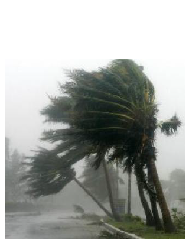
>El viento *(feng)* vehículo de los patógenos externos.

#### Siete Factores Internos

Los siete factores internos se originan dentro del cuerpo mismo y son principalmente factores emocionales. Se los denomina:
- Alegría,
- Ira,
- Preocupación,
- Pesar,
- Tristeza,
- Miedo 
- y Pánico.

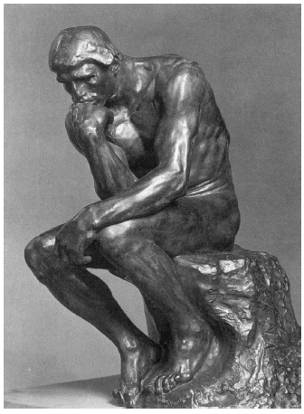
>El pensador de Rodin

#### Seis Factores "No externos - No internos"

Estos factores que no son ni externos ni internos son los otros factores causales de enfermedades y se los denomina:
- Forma de Vida,
- Dieta,
- Actividad Física,
- Actividad Sexual,
- Accidentes
- y "Tan-Yin" (Estancamiento de Sangre y "Mucus")

Los Factores Etiológicos pueden ser causales de enfermedades, pero el poder defensivo del cuerpo juega un rol muy importante en la determinación de la incidencia que aquellos tienen en cada caso particular, o sea que para determinar como influyen en el cuerpo los Factores Patogénicos, hay que tener en cuenta dos aspectos:

##### Aspecto Interno
Cada persona tiene un poder defensivo *(Wei-Chi)* individual y diferente, por lo cual, bajo las mismas condiciones etiológicas, una puede enfermarse mientras que otra no.
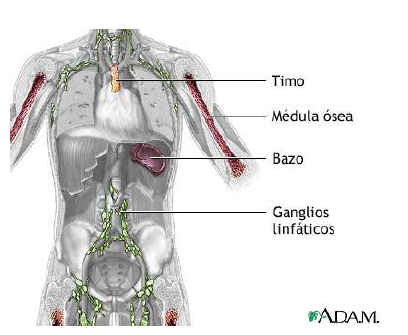

##### Aspecto Externo
Los Factores Etiológicos que son causales de enfermedades pueden ser débiles o poderosos y el modo en que afectan puede variar:

1. La persona que posee un poder defensivo fuerte puede no enfermar ante el ataque de un Factor Etiológico poderoso.
1. La persona que posee un poder defensivo débil puede enfermar ante la invasión de un Factor Etiológico débil.
1. La persona que tiene un poder defensivo fuerte puede enfermar ante la invasión de un Factor Etiológico extremadamente poderoso, tal como elevada temperatura, químicos de alta toxicidad, enfermedades infecciosas malignas agudas, etc.
***
#### ETIOPATOGENIA

Dependerá siempre de dos aspectos:
1. la fortaleza o debilidad personal, conjugada con
1. la fortaleza o moderación de la causal patogénica.
***
### Los seis Factores Etiológicos Externos

El cuerpo sano es un balance de Yin y Yang; esta sostenido por una red de actividad de fuerzas complementarias que se generan y limitan las unas a las otras. Así, el Chi mueve la Sangre, pero también la mantiene en su lugar; el Corazón atesora el Shen (Conciencia) y también mueve la Sangre; el Bazo gobierna lo ascendente, el Estómago gobierna lo descendente, el Hígado gobierna la difusión o distribución y los Riñones gobiernan el atesoramiento; los Pulmones rigen el Chi circulante y descendente; los Riñones rigen la absorción del Chi. Cuando se altera el balance, el Yin y el Yang se desajustan, el cuerpo puede entonces ser susceptible a los efectos nocivos de una Influencia Perniciosa.

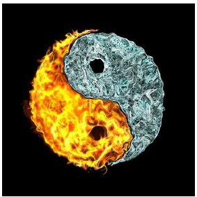
>*Los seis Factores Etiológicos Externos son denominados también Factores climáticos.*

El clima, normalmente, esta constituido por seis elementos de la naturaleza, a los que se los denomina: Viento, Frío, Calor, Humedad, Sequedad y Calor de Verano.

Cuando estos seis Factores se presentan en forma moderada son promotores de bienestar y sana calidad de villa, pero cuando se presentan en forma exagerada no solamente son destructivos para el bienestar físico y mental, sino que también causan enfermedades. Por ejemplo:

- Un viento muy fuerte (como un tifón) no solo incomoda a las personas sino que hasta puede poner en peligro la vida.
- Exponerse al intenso calor en verano puede causar insolación.
- La humedad externa puede ser la raíz de muchas enfermedades y a menudo agrava los dolores en casos de artritis y reumatismo.
- La sequedad afecta la piel y las membranas mucosas.

Estos seis Factores climáticos que causan enfermedades en el cuerpo humano son llamados en chino *Lui Yin*, que significa "Las Seis energías Perversas" del medio ambiente.

#### Características

##### Aspecto Direccional
Los Seis Factores Etiológicos Externos siempre invaden el cuerpo humano desde el exterior hacia el interior. En otras palabras, lo invaden desde la piel, la membrana mucosa de la nariz, la boca, y luego van penetrando más profundamente hacia Los órganos Internos.
##### Aspecto Estacional
Cada Factor Climático juega un rol diferente, en la estación del año en que se presente.

- El Viento es un Factor Etiológico importancia durante la primavera.
- La Humedad es un Factor importante durante el fin del verano.
- La Sequedad es un Factor importante durante el otoño.
- El Frío es un Factor preponderante durante el invierno.

##### Condiciones Excepcionales

Siempre hay que tener presente que existen condiciones excepcionales, como por ejemplo:

- Un cambio de clima, de una estación a la siguiente, es usualmente gradual. Si un cambio climático ocurre de manera súbita o diferente de los patrones habituales, el cuerpo es entonces incapaz de ajustarse con la suficiente rapidez y se produce una enfermedad.
- Un cambio de medio, ambiente (por ejemplo, una mudanza) sin haber previamente aclimatado apropiadamente el cuerpo, puede así resultar en causa de enfermedad.

##### Aspecto Cuantitativo
Es posible que más de un Factor Etiológico Externo invada el cuerpo al mismo tiempo.

##### Aspecto Dinámico
Los Factores Etiológicos Externos pueden transformarse unos en otros, bajo ciertas condiciones dadas; por ejemplo:

- Cuando el Factor Frío penetra un (órgano Interno, se convierte en Factor Calor.
- El Factor Humedad-Calor puede convertirse, bajo condiciones crónicas, en un Factor Sequedad, lo cual daña la energía Yin. 
- En la práctica clínica, las características de Viento, Calor, Frío, Humedad, Sequedad y Calor de Verano se presentan causadas no solo por Factores Etiológicos Externos que invaden el cuerpo, sino que también aparecen por la disfunción de órganos Internos, en cuyo caso se los denomina Viento Interno, Calor Interno, Frío Interno, Humedad Interna, Sequedad Interna y Calor de Verano Interno.

El cuerpo humano es un microcosmos, y como tal, manifiesta de manera interna las cinco estaciones. Cada órgano mimetiza en el interior del cuerpo estos cambios, de acuerdo con sus relaciones con el gran cosmos. Por ejemplo, una enfermedad hepática promoverá el "Viento Interno", cuyas manifestaciones clínicas serán mareos, pérdida del equilibrio, temblores, etc.; y un desequilibrio del bazo traerá "humedad Interna" con estancamiento de comidas (Ej: indigestión), distensión abdominal, etc.

Es importante reconocer en el paciente la "La situación Interna" en la que se encuentra. Si durante el invierno un individuo sufre un cuadro típico de verano, con sensación de calor, fiebre, constipación y pulso rápido, su prognosis no será buena; si su patología coincide con la estación, su prognosis será buena. El conocer la "Estación Interna" nos permite saber que ajuste biológico es necesario para restaurar su salud y ubicarlo en la estación adecuada

Mientras que las **Influencias Perniciosas Externas** suelen ser la causa de enfermedades agudas súbitas, las **Influencias Perniciosas Internas** están relacionadas más a menudo con las enfermedades crónicas.

***

### VIENTO (FENG)
>*"El Viento es adepto al movimiento y a los muchos cambios."* Nei Ching.

El Viento está presente en todas las estaciones, pero principalmente en primavera. Un individuo que se expone al Viento luego de haber transpirado o que duerme en un lugar donde hay corrientes de aire, facilita las condiciones para sufrir una invasión de Viento en su cuerpo. Las características del Viento son "movilidad", "cambio", "abruptez" y "tendencia ascendente", todo lo cual analizaremos a continuación.

#### Características de los síntomas de Viento
> El Viento se caracteriza por el movimiento constante.

La movilidad del Viento es de tipo oscilante o temblorosa. Sus manifestaciones clínicas son: convulsión, espasmo y temblor de los miembros y endurecimiento del cuello. Los opistótonos, como en el tétanos, la desviación de los ojos y de la boca en la parálisis facial y las convulsiones causadas por altas fiebres están relacionados con estas característica del Viento Patogénico.

> El Viento es un Factor Patogénico Yang y tiene una Dirección Ascendente

El Viento patogénico tiende a invadir el cuerpo humano desde el exterior (la piel y las membranas mucosas) y ataca la porción superior del cuerpo. Sus manifestaciones clínicas son: dolores de cabeza, dolor de garganta, tos transpiración, desagrado por el frío, fiebre y picazón en la piel.

> El Viento se caracteriza por el cambio rápido y el movimiento indeterminable.

Las enfermedades causadas por el Viento patogénico están señalada por cambiar rápidamente y de modo impredecible. Los síntomas aparecen y desaparecen velozmente. El comienzo es abrupto y la desaparición súbita.
Por ejemplo, en el caso de la urticaria o de las erupciones eritematosas, que duran horas y son reiterativas (en la MTCH, a la urticaria se la llama *“Erupción de Viento"*, o en el caso del reumatismo, donde se da una poliartritis migratoria en la que el dolor y la inflamación se mueven de una a otra articulación (en la MTCH, la artritis reumática con dolores erráticos recibe el nombre de *"Artritis de Viento-Húmedo"*.

> El Viento es el Factor Patogénico por excelencia.

Corno Factor Patogénico, el Viento ocupa el primer lugar y es de suma importancia corno causal de una gran variedad de enfermedades. Pose una peculiar aptitud para asociarse con otros Factores, como el Frío, la Humedad, la Sequedad y formar así Factores Patogénicos Complejos del tipo Viento-Frío, Viento-Humedad, Viento-Sequedad y Viento-Calor. Por lo tanto, el Viento puede invadir al cuerpo en todas las estaciones del año; y mas aún, en general todos los demás Factores Etiológicos Externos tienen que depende del Viento para poder invadir al cuerpo (usándolo como "vehículo"). Por ejemplo en la asociación patogénica del viento con la Flema, se genera el síndrome Viento-Flema. Por ejemplo, el sincope, el ataque cardíaco y la epilepsia son típicos síndromes de Viento-Flema.

#### Los síntomas de Viento

Analizaremos los síntomas del Viento Externo, los del Viento Interno y el tratamiento herbológico para cada tipo. El Nei Ching dice que las Cien enfermedades se desarrollan por el Viento porque el Viento es liviano y aéreo, y dice asimismo que los daños por Viento afectan primero el miembro superior. Así, se piensa que el Viento inicialmente se muestra en las porciones superiores y externas del cuerpo, especialmente el rostro, la piel, las glándulas sudoríparas y los pulmones.

##### Los Síntomas del Viento Externo:

Estos síntomas son fácilmente observables en el resfrío común y al comienzo de las enfermedades infecciosas agudas, ya que como hemos dicho, el Viento, usualmente, invade el cuerpo junto con algún otro Factor Etiológico.

1. Viento (lesión por Viento o resfrío común)
    - Es causado por la invasión del Viento a través de la piel o de las membranas mucosas, entrando en el sistema de Meridianos. Sus síntomas y signos son: fiebre moderada, dolor de cabeza, estornudos, tos, desagrado por el viento, picazón en la garganta, saburra blancuzca y delgada, pulso superficial.
2. Viento-Frío
    - Fiebre moderada, escalofríos, dolores de cabeza, algias en todo el cuerpo, estornudos, tos, ausencia de transpiración, saburra blancuzca, pulso superficial y tenso.

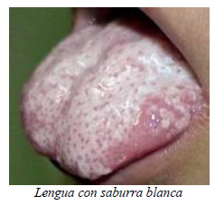

3. Viento-Calor
    - Fiebre elevada, sensación de ligeros escalofríos, poca red, dolor de garganta, tos con esputos amarillentos y espesos, lengua rojiza con saburra amarillenta, pulso superficial y rápido.

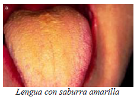

4. Viento-Humedad
    - En el resfrío común: fiebre, escalofríos, sensación de pesadez en la cabeza, laxitud, escasa orina y diarrea.
    - En el síndrome "Bi" *(síndrome doloroso que genera inmovilidad)*, por Viento-Húmedo (dolor en los huesos y las articulaciones, dolores migratorios, fiebre, escalofríos, pulso superficial (este síndrome puede set causado tanto por un Factor Externo como Interno).
5. Edema-Ventoso
    - La función de los Pulmones de transportar el Agua hacia el miembro superior es dañada por la invasión del Viento desde la piel. El edema aparece usualmente en el rostro y sus síntomas y signos principales son la fiebre, los escalofríos y el pulso superficial.
 
##### Los síntomas del Viento Interno:

El síndrome de Viento Interno esta caracterizado por la naturaleza misma del Viento, es decir, lo "móvil", "cambiante" y " súbito". Es causado por una disfunción de los órganos Internos afectando al Hígado, o una enfermedad propia de este órgano; su presencia siempre significa que la enfermedad está en una condición seria.

El Viento Interno se relaciona principalmente con las enfermedades del Hígado, cuyas disfunciones se muestran generalmente en los tendones, los ojos y la actividad mental. Por lo tanto, sus síntomas principales son: mareos, convulsiones, temblores, opistotónos, pérdida del equilibrio, desmayos, desviación de la boca y hemiplejía. Se lo compara al "Viento Fuerte".

#### Causas
1. Deficiencia, del Yin (Sangre) del Hígado
    - Deficiencia del Yin del Hígado: tez enrojecida, palmas de las manos y plantas de los pies calientes, ojos secos, insomnio, temblor o convulsión, lengua rojo oscuro y pulso débil y rápido.
    - Deficiencia de Sangre del Hígado: temblor de manos y pies, entumecimiento, mareos, laxitud, ojos y boca seca, visión nublada y pulso pequeño y rápido.
1. Llamaradas en el Fuego de Hígado
    - (Convulsiones, opistótonos, rigidez del cuello, desmayo, lengua roja con saburra amarillenta, pulso de cuerda (es el pulso propio de las afecciones hepáticas según la MTC), rápido.
1. Ascenso Excesivo del Yang del Hígado
    - Mareos, desviación de la boca, entumecimiento de los miembros, rigidez de la lengua, delirio o aun sincope y convulsión.
 
***

### Tratamiento Herbológico (introducción):
Las hierbas medicinales pueden ser colocadas sobre los puntos de acupuntura en su forma de tintura madre o esencia.

Estudie atentamente la ubicación anatómica de los puntos clave de tratamiento de los síndromes asociados con los factores etiológicos

#### Viento Externo
Cuando el Viento Patogénico Externo está presente en la piel, los meridianos, los músculos y las articulaciones, debe aplicarse el método "Eliminación del Viento", para lo cual se usan comúnmente los siguientes remedios herbológicos: herba ephedrin (efedra), rarnulus cinamoni, asari (asaro), schizonepetae (ezquisanto) y sileris (silaseas).
En la fitoterapia occidental usaríamos jengibre ( Zingiber officinalis), Borraja
( Borrago officinalis) éstas dos últimas son plantas diaforéticas, es decir promueven la transpiración y así eliminan al viento hacia el exterior.

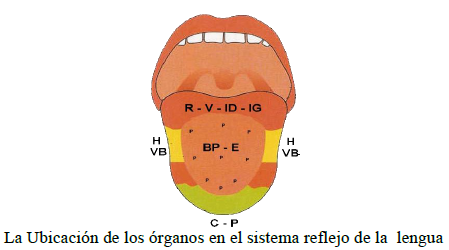

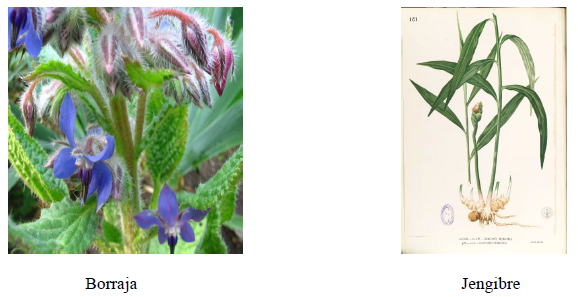

#### Viento Interno
Para calmar este Viento son de aplicación los siguientes métodos:

- Se puede calmar el Viento a través de nutrir el Yin o enriquecer la Sangre; para ello se utiliza la fitoterapia adecuada, ya Sean hierbas que nutran el Yin o hierbas que tonifiquen la Sangre.
- Se puede purgar el Fuego y calmar el Viento, usando las hierbas adecuadas para dispersar el Calor.
- Se puede controlar el Hígado y calmar el Viento con la fitoterapia apropiada para esto.

La siguiente fitoterapia es la usualmente empleada para calmar el Viento Interno en la medicina china:
> *Semen cassiae torae Cornu antelopis Gastrodiae Rhynchophylla.*

En la fitoterapia occidental tenemos al lúpulo *(Humulus Lupulus)* para tonificar a la sangre, el Cardo Mariano *(Silybum Marianum)* para nutrir el Yin del hígado y así aplacar al viento, también podemos usar según el caso Alcachofa *(Cynara Scolymus)* para apagar el exceso de calor que afecta al hígado.

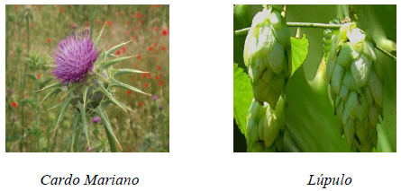
***
### Acupuntura

En el sistema de Meridianos existen cinco puntos relacionados con el tratamiento de la invasión de Viento en el cuerpo humano. El "Viento" se Ilama Feng, en chino, y estos cinco puntos se llaman:

|Nombre Chino|Denominacion|
|---|---:|
|Fengfu|VG16|
|Fengmen|V12|
|Fengchi|VB20|
|Fengshi|VB31|
|Yifeng|TR17|

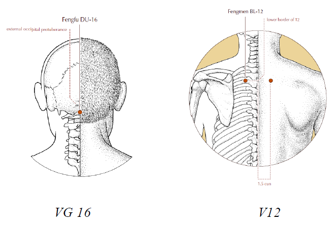
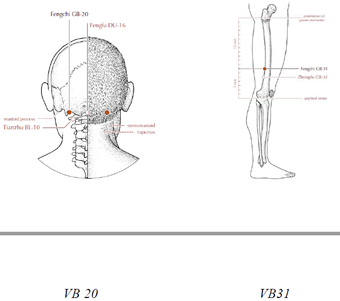
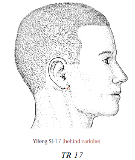

Existen también puntos extraordinarios (*puntos que no se encuentran en los meridanos convencionales*) llamados "Ocho Puntos Viento" (Bafeng) y "Cien Tipos de Viento".

#####Fengfu (Vaso Gobernador 16, "La Casa del Viento")
- Ubicación: directamente debajo de la protuberancia occipital externa, en la
depresión entre los músculos del trapecio.
- Indicación: frío, dolor de cabeza y desordenes mentales.
- Puntura: perpendicularmente 0,5 - 0,8 cun. Es desaconsejada la puntura profunda.
Fengshi (Vesícula Biliar 20, "La Alberca o el Reservorio del Viento")
- Ubicación: en la parte posterior de la nuca, debajo del hueso occipital, en la depresión entre la porción superior del músculo esternocleidomastoideo y el trapecio.
- Indicación: frío, dolor de cabeza, mareos, hipertensión*
- Puntura: perpendicularmente, 0,5 - 0,8 cun hacia la punta de la nariz.

#####Fengshi (Vesícula Biliar 31, "El Mercado del Viento")

- Ubicación: en la línea media de la parte externa del muslo, 7 cun por encima del pliegue poplíteo. Cuando el paciente está parado, con el brazo extendido a lo largo de su costado, el punto se halla donde se toca la pierna con la punta del dedo medio. (Nota: en la parte externa del muslo, la distancia desde el trocánter mayor hasta el pliegue trasversal poplíteo se considera de, una longitud de 19 cun.)
- Indicación: parálisis de las extremidades inferiores, dolor en la región lumbar o en las piernas.
- Puntura: perpendicularmente, 0,7 - 1,2 cun. La moxibustión también
es aplicable.

##### Fengmen (Vejiga 12, "La Puerta del Viento")
- Ubicación: a 1,5 cun fuera del borde inferior de la apófisis espinosa de
la 2da. vértebra toracica.
- Indicación: frío, dolor de cabeza y dolor de hombros.
- Puntura: oblicuamente, 0,5 cun. La moxibustión es aplicable.
Yifeng (Triple Recalentador 17, "La Cura del Viento")
- Ubicación: detrás del lóbulo de la oreja, en la depresión entre el ángulo de la mandíbula y la apófisis mastoidea.
- Indicación: parálisis facial, espasmo facial y tinitus.
- Puntura: perpendicularmente, 0,5 - 1,0 cun. La moxibustión también es aplicable.

#####Los Puntos Extraordinarios:
#####Bafeng (Ocho Puntos Viento)
- Ubicación: sobre el dorso del pie, a 0,5 cun entre las comisuras de los dedos del pie. Son cuatro en cada pie y por lo tanto son ocho puntos en total.
- Indicación: enrojecimiento, hinchazón, entumecimiento y dolor de los dedos del pie o del empeine.
- Puntura: 0,5 - 0,8 pulgadas, oblicuamente hacia arriba.

##### Cien tipos de Viento
- Ubicación: a 3 cun externo al borde inferior de la apófisis espinosa de la 7 ma. vertebra cervical.
- Indicación: urticaria, hemiplejia y dolor en el hombro o en la parte superior de la espalda.
- Puntura: Oblicua, 0,5 - 1,0 pulgadas
***
### Frio (HAN)

>*"El Frío entra en los meridianos y los movimientos se lentifican... el Chi no puede Penetrar y finalmente hay dolor. El Frío es acuoso, transparente, claro y fresco."*
 Nei Ching

Las enfermedades causadas por Frío ocurren principalmente en invierno. La naturaleza del Frío se caracteriza por:

- La sensación de frio,
- La contracción y
- El estancamiento.

Cuando el Factor Frío invade el cuerpo humano y daña la Energía Yang se genera el "Síndrome de Frío".

#### Causas

##### Frío Externo:

Cuando la persona no toma las debidas precauciones para mantener el cuerpo cálido y/o seco luego de un abrupto descenso de la temperatura o al exponerse a corrientes de aire, o cuando sus ropas se humedecen luego de transpirar profusamente, favorece las condiciones para que un Factor Frío lo invada desde el exterior.

##### Frío Interno:
El "Síndrome de Frío se produce por defectos funcionales del Corazón, el Bazo y los Riñones, lo cual causa el debilitamiento de la Energía Yang. Su origen proviene del interior del cuerpo, en vez de provenir de una invasión directa del Factor Frío Externo.

> El Frío se caracteriza por el estancamiento

La circulación de la Energía y de la Sangre en el cuerpo dependen de la fuerza propulsora de la Energía Yang; esta, al ser dañada por el Frío, disminuye, lentificando así la circulación de la Sangre y la Energía, lo cual resulta en su estancamiento. El signo más importante del estancamiento de Sangre y Energía es el dolor. Este puede sentirse en la superficie del cuerpo, en los tendones, en los huesos y en los órganos Internos, manifestándose como algias generalizadas, artritis, dolor abdominal, etc

>El Frío causa contracción

Después de invadir al cuerpo, el Frío puede estacionarse en los músculos, en los tendones o en las articulaciones. El Frío lleva a una contracción de los vasos sanguíneos y de los meridianos, provocando un suministro deficiente de Sangre y Energía en los músculos, tendones y huesos, lo que a su vez resulta en espasmos musculares y rigidez de las articulaciones. También puede causar que se cierren los poros de la piel, con manifestaciones de escalofrío y falta de transpiración.

#### Síntomas y signos

##### Frío Externo
1. Viento-Frío
    - Remitimos a lo ya explicado al tratar el Factor Viento.
1. Frío Humedad
    - Estos Factores invaden el Bazo y el Estomago, pudiendo causar distensión, enfriamiento y dolor en el epigastrio, vómitos, anorexia y borborigmos.
1. Síndrome Frío-Bi
    - La invasión simultanea de los Factores Externos Viento, Frío y Humedad provocan el estancamiento de la Sangre y la Energía con manifestaciones de dolor, rigidez y entumecimiento de los músculos, tendones y articulaciones. Recibe el nombre de "Síndrome Bi", pero si el Factor predominante es el Frío, se lo denomina "Síndrome Frío Bi". El dolor (muy intenso) y la rigidez de las articulaciones se alivian con la aplicación de compresas caliente se agravan con el frío.

##### Frío Interno

El Frío Interno es causado principalmente por la disminución de la Energía Yang y el hipofuncionamiento del Corazón, del Bazo y en especial de los Riñones. Sus principales síntomas son: palidez, cansancio, miembros fríos, escalofríos, orina clara y copiosa y heces blandas.

#### Características del Síndrome de Frío
> El Frío es un factor etiológico Yin

Tiene la capacidad de dañar la Energía Yang del cuerpo y causar una pérdida de su función normal, que es la de mantener la temperatura del cuerpo en nivel adecuado:

- El Frío Externo siempre causa escalofríos, hace tiritar, enfría los miembros, provoca palidez y falta de transpiración.
- Si el Frío Externo llega a dañar el Bazo y el Estomago, causará distensión, enfriamiento y dolor en el epigastrio, anorexia y heces blandas.
- Si el Síndrome de Frío es causado por un Factor Frío Interno, entonces sus principales características serán: miembros fríos, cansancio, falta de sed, con preferencia por las bebidas calientes, orina clara y copiosa y heces blandas.

#### Interrelación de ambos fríos
A pesar de que el Frío Interno es diferente del Externo, ambos están íntimamente relacionados. Por ejemplo, un paciente que sufre de Frío Interno, usualmente es muy propenso a resfriarse, porque la deficiente Energía Yang no puede proteger al cuerpo de la invasión del Factor Frío Externo. Por otro lado, luego de una prolongada invasión del Factor Frío Externo, el paciente puede desarrollar un síndrome de Frío Interno, ya que la Energía Yang puede quedar muy deteriorada por el Factor Frío Externo.

#### Tratamiento herbológico

##### Frío Externo

El Frío Externo, a menudo se combina con el Viento, para invadir el cuerpo y causar el resfrío común del tipo Viento-Frío. La fitoterapia adecuada es la siguiente:

- Cinnamoni
- Herba Ephedrae
- Sileris
- Rhizoma Zingiberis
- Asari.

En la fitoterapia occidental: podemos usar la canela ( Cinamonum ceylanicum) para calendar el cuerpo y el clavo de olor ( Eugenia cariophillata)
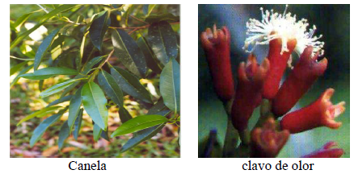

#### Acupuntura

##### Frio en la piel

Los escalofríos son un importante síntoma de enfriamiento.

1. VG 14
    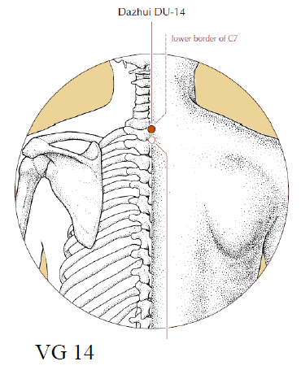
    - Punzar en tonificación. Es aconsejable moxar (aplicar calor al punto de acupuntura).
    - Orientación Terapéutica: VG14 es el punto de encuentro de seis meridianos Yang y el Canal Vaso Gobernador. La tonificación de este punto incrementar la Energía Yang y drenara el Frío hacia afuera del cuerpo.
    - Ubicación: entre la séptima vértebra cervical y la apófisis espinosa de la primera vértebra torácica.
    - Punción: perpendicularmente 0,5 - 1,5 cun oblicuamente hacia arriba con una ligera inclinación. No se aconseja la punción profunda.

1. E42, VB40 y V64:
    - Punzar en tonificación. La moxibustión es aconsejable.
    - Orientación Terapéutica: los meridianos de Estomago, Vesícula Biliar y Vejiga son Yang y afectan la circulación de la Energía Yang por el cuerpo. E42, VB40 y V64 son los "Puntos Fuente" de los respectivos meridianos; tonificarlos fortalece la Energía Yang en
    todo el cuerpo.
    - Ubicación.
        - E42: distal de E41, en el punto mas alto del dorso del pie, en la
    depresión entre el segundo y el tercer hueso metatarsiano y el hueso cuneiforme.
        - VB40: en la parte antero inferior del maléolo externo, en la depresión del lado  externo del tendón del músculo extensor largo digital.
        - V64: en el lado externo del dorso del pie, en la parte postero-inferior de la cabeza del quinto metatarsiano, donde se reúnen la piel Blanca y roja.
    - Punción
        - V 64: perpendicularmente, 0,3 - 0,5 cun, evitando la arteria dorsal del pie. VB40: perpendicularmente, 0,5 - 1,0 cun. V64: perpendicularmente, 0,3 - 0,5 cun.

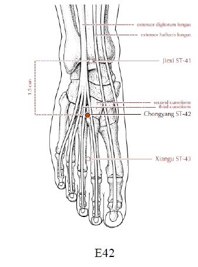
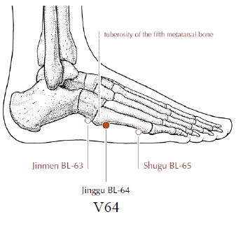
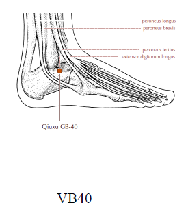

##### Frio Interno

En la práctica terapéutica se usa este método para expulsar los Factores Patogénicos, especialmente cuando estos se encuentran en el nivel de la piel, cuando el cuerpo ha sido recientemente invadido por Factores Viento-Frío.

Punzar R7 en sedación e IG4 en tonificación.

- Orientación Terapéutica:
    - Riñón 7: la frialdad que invade al cuerpo causa exceso de Energía Yin y deficiencia de Energía Yang, lo cual afecta directamente a los Riñones. La aplicación de sedación al meridiano de Riñón dispersa la frialdad. R7 es el "Punto Río" de su meridiano; los Puntos Ríos son comúnmente utilizados en tratamientos para el sistema respiratorio, ya que los Pulmones gobiernan la Energía Defensiva (Wei Qi) y ésta, a su vez, controla los poros de la piel.
    - Intestino Grueso 4: el meridiano de IG es Yang y su acoplado es el Meridiano de Pulmón. Dado que en el presente caso hay deficiencia de Energía Yang y exceso de
    energía Yin, debe tonificarse la primera, para que la segunda disminuya. Fortalecer la
    Energía Yang en el IG hará decrecer la Energía Yin en Pulmón.
- Ubicación:
    - R7, dos cun mas arriba que R3, en el borde anterior del tendón calcáneo.
    - R3 está ubicado a mitad de camino entre la punta del maléolo medial y el tendón calcáneo.
    - IG4: entre el primero y el segundo metacarpiano, a nivel de la mitad del segundo metacarpiano en su borde radial.
- Punción:
    - R7, perpendicularmente, 0,5 - 1,0 cun. IG4, perpendicularmente, 0,5 - 0,8 cun.
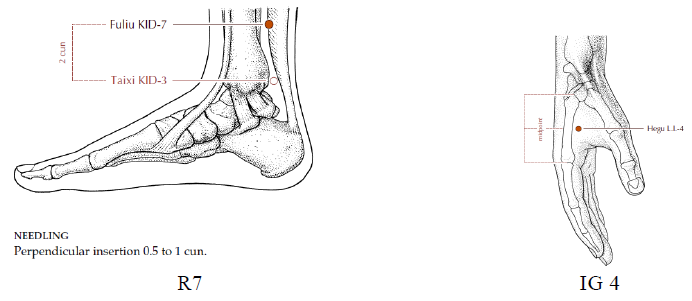
- Factores Viento-Frío
    - V 12: este punto, también llamado ` La Puerta del Viento", debe ser punzado en sedación.
    El objetivo que se logra es expulsar hacia afuera al Viento.
        - Ubicación: lateralmente a 1,5 cun del borde de la apófisis espinosa de la segunda vértebra torácica.
        - Punción: perpendicularmente, 0, 3 - 0, 5 cun. 
    - P7: este punto es también llamado "Lo" o punto de transporte; debe ser punzado en sedación, para lograr un fortalecimiento de la Energía de Pulmón y contrarrestar al Factor Frío.
        - Ubicación: encima de la apófisis estiloides del radio, a 1,5 cun por encima del primer pliegue de la muñeca.
        - Punción: oblicuamente hacia arriba, 0,5 - 0,7 cun.

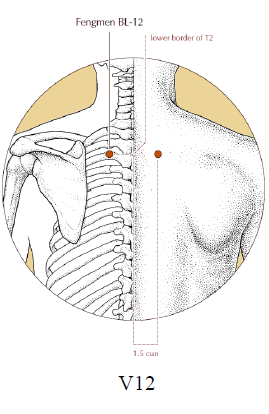  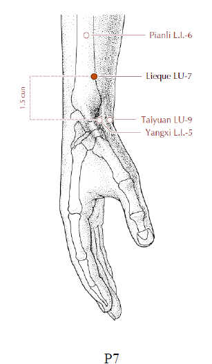

##### Frío interno

El Frío Interno es causado por una deficiencia de la Energía Yang en el Riñón y el Bazo.

1. V20 (o "Punto Shu de asentimiento" de la espalda del meridiano de Bazo) y E 36 (o "Punto Mar" del meridiano de Estomago. El meridiano de Estomago es el acoplado del meridiano de Bazo). Punzar en tonificación. La moxibustión es aconsejable.
    - Orientación Terapéutica: la acupuntura en tonificación en los dos puntos referidos fortalecerá la Energía Yang del Bazo y promoverá su función de transportar.
    - Ubicación:
        - V20: a 1,5 cun hacia afuera del borde inferior de la apófisis espinosa de la undécima vértebra torácica.

2. E36: 3 cun por debajo de E35 y un dedo transversal hacia afuera del borde anterior
de la tibia.
    - Punción: 
        - V20, perpendicularmente, 0,3 - 0,5 cun. E36, perpendicularmente, 0,5 - 1,3 cun.

3. b) VG4 (es el Punto Yang de Riñón) y R3 (es el "Punto Fuente" del meridiano de
Riñón). Punzar en tonificación.
    - Orientación Terapéutica: aplicar acupuntura en los puntos mencionados, en  tonificación, fortalecerá la Energía Yang del Riñón. VG4 es también llamado "Mingmen" 
    que en chino significa "La Puerta De la Vida"; si is puerta de la vida es abierta, entonces el Fuego (la Energía Yang) del Riñón puede entibiar a todo el cuerpo.
    - Ubicación. 
        - VG4: se encuentra en la línea media entre la apófisis espinosa de la segunda y tercera vértebras lumbares.
4. R3: se halla en la depresión entre el maléalo interno y el tendón del calcáneo, a nivel de la punta del maléolo interno.
    - Punción: VG4, perpendicularmente, 0,5 - 1,0 cun. R3, perpendicularmente, 0,3 cun.

 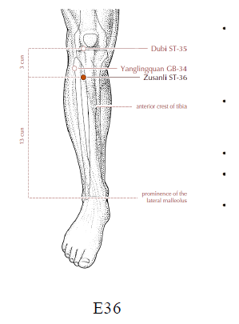 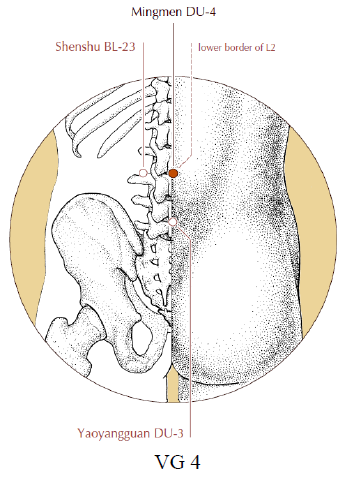 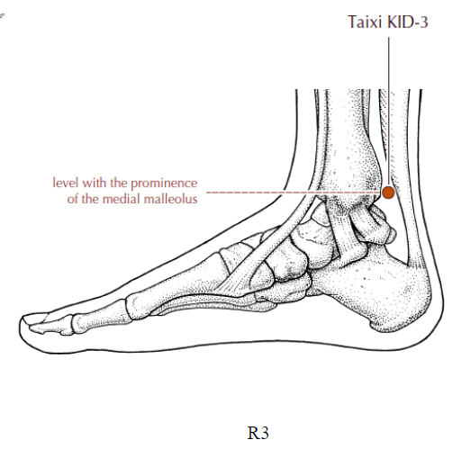 