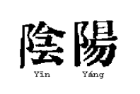

# Módulo 1 –  Yin - Yang
### Evaluacion

#### Instrucciones 

- Complete con sus datos personales.
- Envíe éste test  terminado por Email.
- El mismo será corregido y contestado. Luego le serán enviados los siguientes módulos para usar como guía de estudios.

#### Datos personales

##### Apellido y Nombre:

##### Documento de Identidad Nro:

#### Test

1. Marcar los correctos:
    - Yin es:
        - [ ] inmóvil
        - [ ] fuego
        - [ ] denso
        - [ ] agua
        - [ ] calor
        - [ ] arriba
    - Yang es:
        - [ ] movil
        - [ ] cielo
        - [ ] sutil
        - [ ] denso
        - [ ] inmovil
        - [ ] abajo

2. Marcar la respuesta correcta
    Un paciente con características de
    - Introversión
    - Actitudes abruptas
    - Cansancio crónico
    - Secreciones acuosas

    tendrá una tendencia:
    - [ ] Yin
    - [ ] Yang

3. Marcar la respuesta correcta: *La mañana representa*
    - [ ] Yin dentro de Yin
    - [ ] Yang dentro de Yang
    - [ ] Yang dentro de Yin
    - [ ] Yin dentro de Yang

4. Marca la respuesta correcta:
    Sensación de calor, hiperactividad, orina escasa y oscura
    - [ ] Signos yin
    - [ ] Signos yang

5. El Wu Chi en la cosmología china representa:
    - [ ] Una fuerza yin
    - [ ] Una fuerza yang
    - [ ] Ninguna de las dos

6. En la Medicina China ( marcar la respuesta correcta)
    *La mayoría de las enfermedades son:*
    - [ ] Una mezcla compleja de signos y síntomas Yin y Yang
    - [ ] Son de tendencia al yang
    - [ ] Son de tendencia al yin

> Aclaración : No olvide que puede consultar sus dudas a su Tutor por Email o Correo

