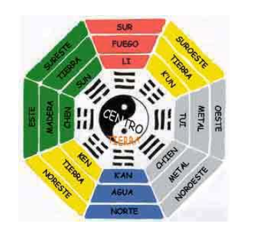
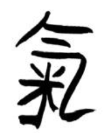

# Fundación Naturopática Argentina
# Afiliado  a la Universidad de Nanjing  - China -

#### Instrucciones 

- Complete con sus datos personales
- Envíe éste test  terminado por Email.
- El mismo será corregido y contestado. Luego le serán enviados los siguientes módulos para usar como guía de estudios.

#### Datos personales

##### Apellido y Nombre:

##### Documento de Identidad Nro:

#### Modulo 3.1
#### Test

***

#### IDEOGRAMA DEL CHI

1. Explicar el concepto de Microcosmos y Macrocosmos.
1. Unir con flechas lo correcto
    |&nbsp;|&nbsp;&nbsp;&nbsp;&nbsp;&nbsp;&nbsp;&nbsp;&nbsp;&nbsp;&nbsp;&nbsp;&nbsp;&nbsp;&nbsp;&nbsp;&nbsp;&nbsp;&nbsp;&nbsp;&nbsp;&nbsp;&nbsp;&nbsp;&nbsp;&nbsp;&nbsp;&nbsp;&nbsp;&nbsp;&nbsp;&nbsp;&nbsp;&nbsp;&nbsp;&nbsp;&nbsp;&nbsp;|&nbsp;|
    |---|---|---:|
    |Chi de la tierra||no se modifica|
    |Chi del cielo||dieta|
    |Chi ancestral||tecnicas de respiracion|
    |&nbsp;|||
1. Enumerar las funciones del Chi.
1.  ¿Qué es el yang chi y que el yin chi? 
1. ¿Qué es el Qing chi?
1. ¿Qué es el yuan chi?
1. ¿Qué es el Zhong chi?
1.  ¿Qué es el Wei chi?
1.  ¿Qué es el ying chi?
1. Indicar el  recorrido de la energía que circula por los 12 meridianos principales a partir de las 3 am.
1. Relaciones asociadas al Wei chi  (marcar lo correcto)
    - [ ] mantiene caliente a los órganos
    - [ ] da brillo a la piel y al pelo
    - [ ] parte del punto v 7
    - [ ] parte del punto vc 6
    - [ ] ninguna de las anteriores es correcta
1.  Escribir 10 correspondencias Yang y 10 Yin.

