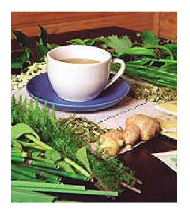
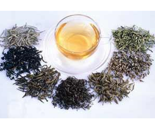

# FARMACIA GALENICA
#### Es el arte y la manera de transformar una sustancia en un medicamento cómodamente utilizable.

Adaptado lo mejor posible: 
-  Al diagnóstico. 
-  Al tratamiento. 
-  A la prevención de una enfermedad.

#### Las materias primas de la fitoterapia

Con la misma planta o la misma parte de una planta, se puede fabricar toda una serie de derivados :
1. Productos obtenidos por tratamiento mecánico: Plantas utilizadas al natural 
    - Polvos vegetales 
    - Pulpas
    - Productos líquidos obtenidos por expresión  (sumos , aceites)
1. Productos obtenidos por la acción del calor: 
    - Por destilación: aceites esenciales, aguas destiladas, alcoholes destilados 
    - Por pirolisis (= destilación seca ): alquitranes, carbón vegetal.
1.  Productos obtenidos utilizando la acción de uno o varios disolventes: 
    - Alcohol > *alcoholados*:  tintura, tinturas madre. 
    - Agua >  *hidrolados*:  tisanas.  
    -  Soluciones azucaradas >  *sacarolados*:   jarabes. 
    - Disolventes diversos:
        - Vino
        - Cerveza
        - Vinagre
        - Aceite
1.  Productos obtenidos por concentración de las soluciones extractivas anteriores: 
    - Extractos fluidos 
    - Extractos blandos 
    - Extractos secos 
    -  Nebulizados
 *** 
#### INFUSIÓN
 

Siempre que determinada receta venga indicada en infusión tenemos que tener en cuenta que nunca debe de hervirse. La infusión se prepara de la siguiente manera: 

-  Se pone a hervir la cantidad de agua señalada en la receta en una olla que no sea de aluminio, según las tazas que se vayan a tomar al día. 
- Cuando el agua arranca el hervor, se apaga el fuego.
- Inmediatamente se echa la dosis de la receta o de la planta,  por cada taza o vaso. 
-  Se remueve bien. 
- Se tapa. 
-  Se deja reposar el tiempo que se indique en la receta. 
-  Se filtra o cuela todo. 
-  Se guarda tapada y a la hora de tomarla se calienta ligeramente sin que llegue nunca a hervir. 

####  Decocción

Este tipo de preparación consiste en hervir por unos minutos las partes de la planta que se utilizarán (raíces, flores, hojas, etc), de esta manera, al concentrarlos se obtiene el máximo de principios activos.

####  MACERACIÓN

Las maceraciones consisten en extraer los principios activos de las plantas en un líquido frío o caliente según sea el caso.
Se utilizan con el fin de extraer todos los principios medicamentosos de una o varias plantas. Para ello se vierten las plantas en agua fría, vinagre, alcohol o vino según indicaciones de la receta dejando un proceso de maceración de varias horas o días. 
Las maceraciones en frío suelen durar entre 12 y 24 horas. Las maceraciones en vino ó alcohol duran entre 10 y 15 días.

####  EXTRACTO ALCOHÓLICO

Hay dos formas de obtenerlo:
-  Exprimiendo el zumo o jugo de la planta y añadiéndole la misma cantidad de alcohol de 96º (alcohol de uso interno). Luego se deja reposar unos días, se filtra y se guarda en una botella oscura con cuentagotas en lugar protegido de la luz.
- Durante una semana se maceran la misma cantidad de plantas frescas y alcohol de 95º puro. Luego se cuela, se filtra y se guarda en una botella oscura con cuentagotas.

####  EXTRACTO FLUIDO

El extracto fluido consiste en disolver en alcohol los principios activos de una droga manteniendo constante la relación de peso entre la droga y el extracto (1 gr. de extracto fluido corresponde a 1 gr. de la planta. Es 10 veces más concentrado que una tintura madre) 

####  ACEITES MEDICINALES
Estas preparaciones se llevan a cabo mediante maceraciones en las que se extraen los aceites esenciales de las plantas. **No se deben de confundir con las destilaciones de aceite esencial por medio de alambiques y otros métodos más complejos.** Generalmente se utilizan aceites de base para la maceración como el aceite de oliva. Algunos ejemplos los tenemos en el aceite de caléndula, Existen otros tipos de aceite extraídos de plantas como la onagra o prímula, borraja, bacalao, etc., presentados comercialmente en forma de cápsulas. 

#### TINTURA

Son soluciones obtenidas en maceraciones durante un determinado tiempo de plantas medicinales en un líquido, que puede ser agua, alcohol, éter, vino o vinagre. 
Según sea el líquido utilizado se obtendrán tinturas acuosas, alcohólicas. etéreas, vínicas o acéticas. Las tinturas alcohólicas son las de más interés y se elaboran con determinadas partes de las plantas secas en proporciones adecuadas. La graduación varía según el tipo de tintura existiendo tablas proporcionales de agua destilada y alcohol puro de 96º para obtener la graduación adecuada. Dichas tablas pueden solicitarse en las farmacias.

#### A. E. o ACEITE ESENCIAL

 El aceite esencial puro se obtiene de la destilación de diversas partes de las plantas, por medio de procesos de destilación con sofisticados aparatos. 
  Los aceites esenciales puros son utilizados terapéuticamente en aromaterapia y suelen ser incoloros.

***

## LA VÍA ORAL

I. las formas líquidas 

 Son esencialmente: 
 - Líquidos a tomar en pequeñas cantidades (gotas). 
 - Líquidos a absorber en cantidades más importantes, generalmente en cuchara, en vaso (pociones y soluciones diversas, jarabes, vinos, elixires, ampollas bebibles) 
 -  Tisanas.

 1. **Líquidos a tomar por gota**: tinturas madres, aceites esenciales, extractos fluidos  y macerados glicerinados.
     - Ventajas
         - Facilidad de empleo.
         - Facilidad de conservación
         - Facilidad de preparación en el laboratorio farmacéutico. 
         - Activos en pequeña cantidad.
         - Toma simplificada del medicamento,  de una relativa exactitud y fácilmente reproducible.
1.  **Líquidos a emplear en cantidades importantes**: Son esencialmente las pociones o soluciones preparadas para un enfermo particular. 
    -  Tradicionalmente contienen uno o varios principios activos, un edulcorante y el vehículo. 
    -  Ejemplo: 
        - jarabe simple -- 40g 
        - agua de flor de naranjo (azahar) -- 20g 
        - agua destilada c.s.p. -- 150 cm^3^ 
    - Se administran a cucharadas: 
        - soperas (15 ml) 
        - postre (10 ml) 
        - café  (5 ml).
1.  **Las tisanas**: son preparaciones elaboradas a partir de una planta o de una mezcla de plantas, empleando el agua como líquido extractivo; en ellas, las sustancias medicamentosas vehiculizadas por el agua quedan a disposición inmediata del organismo enfermo.     

    

