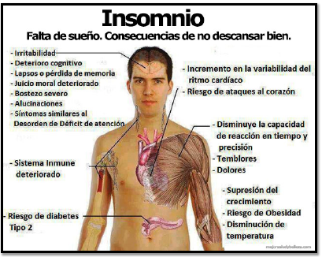

# Material de estudio
# Elemento fuego
# Fisiología del sueño

El sueño es una situación fisiológica y natural del organismo, en la que se produce una
pérdida reversible de la consciencia y de la actividad motora. El individuo, cuando está
dormido, presenta una pérdida total o parcial de la capacidad de responder a estímulos
externos, en función de que el sueño sea profundo o no. Por su parte, la vigilia es lo contrario
al sueño, y corresponde a cuando el individuo está despierto.  

Durante el sueño, la cantidad de estímulos que procesa la corteza cerebral es mínima, por lo
que va a actuar como un mecanismo reparador y de descanso neuronal de la fase de vigilia.
El sueño es, por tanto, una función básica del organismo, y esto queda patente en el hecho
de que un ser vivo puede aguantar más tiempo sin comer que sin dormir.  

El sueño fisiológico no es un proceso homogéneo, sino que se divide en una serie de etapas
que se pueden diferenciar por la actividad mostrada en el electroencefalograma (EEG), y por
los movimientos oculares y musculares.  

- Sueño lento o no REM. Se divide a su vez en 4 escalones, I a IV, de mayor a menor consciencia. En
este sueño se va produciendo un enlentecimiento progresivo del EEG, aunque persiste el tono
muscular. No se aprecian movimientos oculares.  
- Sueño rápido, REM (Rapid Eyes Movements) o paradójico. Es la forma más profunda del sueño,
aunque paradójicamente presenta un EEG con una actividad similar a la del estado de vigilia. Se
caracteriza además por una hipotonía muscular y por movimientos oculares rápidos, que le dan su
nombre. Es en esta etapa en la que tienen lugar los sueños.  

El sueño nocturno suele organizarse en 4 ó 5 ciclos de 90 a 120 minutos de duración, donde
se va pasando desde la fase I del sueño lento hasta el sueño REM (fase V) y vuelta a
empezar. Se estima que la fase REM del sueño ocupa de media en una persona adulta y
sana, un 25% del total del sueño.

Las necesidades de sueño dependen de la edad. Un recién nacido está dormido casi todo el
día (14-16 horas diarias), y según va creciendo, aumentan sus períodos de vigilia. De esta
manera, los niños a partir de los 4 años y hasta la adolescencia se vuelven hipervigilantes, y
no precisan de la siesta, aunque por las noches pueden dormir fácilmente 10 horas. Los
adultos presentan grandes variaciones, pudiendo dormir de 5 a 9 horas diarias, aunque
suelen necesitar de una pequeña siesta, sobre todo a primeras horas de la tarde. Finalmente,
los ancianos tienen un sueño más ligero, lo que les lleva a despertarse varias veces durante
la noche, de modo que el sueño nocturno no suele sobrepasar las 6 horas. Sin embargo,
estos individuos suelen dormitar a lo largo del día.

## Definición del insomnio
El insomnio es la alteración del sueño más común. Es uno de los síntomas más frecuentes
que afectan a la población, precedido sólo por el dolor. Cerca del 10% de la misma lo
presenta de manera crónica, y casi el 50% lo padece en algún momento de su vida. El
insomnio afecta en gran medida a la población anciana, y sobre todo a mujeres
postmenopáusicas.
Se caracteriza por al menos uno de los siguientes síntomas:
- Incapacidad por parte del individuo para conciliar el sueño.
- Aumento del número de despertares nocturnos.
- Disminución del tiempo de sueño, despertándose el individuo demasiado temprano.
- Sensación de que el sueño ha sido insuficiente.  

La duración de un sueño nocturno inferior a 8 horas diarias, no significa que el individuo tenga
insomnio, ya que como hemos comentado anteriormente, cada persona tiene unas
necesidades diarias de sueño, que son muy variables y dependientes de la edad.
El insomnio puede dar lugar a fatiga, ansiedad, astenia y disminución del nivel de alerta.  

Normalmente aparece somnolencia diurna, que puede desembocar en accidentes domésticos
o laborales. Además puede suponer una gran carga personal, social y económica.
Existen distintos tipos de insomnio, y cada uno de ellos presenta un tratamiento distinto, por lo
que es necesario conocer cuál es el que sufre el paciente para poner un tratamiento
individualizado.  

El insomnio puede dar lugar a fatiga, ansiedad, astenia y disminución del nivel de alerta.
Normalmente aparece somnolencia diurna, que puede desembocar en accidentes domésticos
o laborales. Además puede suponer una gran carga personal, social y económica.
Existen distintos tipos de insomnio, y cada uno de ellos presenta un tratamiento distinto, por lo
que es necesario conocer cuál es el que sufre el paciente para poner un tratamiento
individualizado.  

Según su duración, podemos clasificarlo en:
- Transitorio. Dura sólo unos pocos días y a continuación desaparece. Se da en individuos que no han
tenido nunca problemas de insomnio, pero que por situaciones concretas y transitorias se encuentran
hiperexcitados, como en el caso de estrés por trabajo o por exámenes, en fechas especiales como en
los días previos a una operación quirúrgica o a una boda, por ejemplo. También es común en caso
de jet lag o por dormir en ambientes extraños. No es recomendable ningún tratamiento, ya que este
tipo de insomnio desaparece a los pocos días. Lo mejor que se puede hacer es intentar eliminar la
causa que origina el estrés.  
- De corta duración. Dura un máximo de 4 semanas, y suele ser causado por situaciones estresantes
más graves que las anteriores, como el insomnio que se produce en caso del fallecimiento de un
familiar, problemas económicos, etc.  
- De larga duración. Permanecen durante un período superior a un mes. Sus causas son múltiples y
muchas veces no están claras. En este caso sí se puede instaurar un tratamiento con fármacos
hipnóticos.  

También se puede clasificar en función de cómo se produzca en:
- Inicial. Al individuo le cuesta mucho trabajo conciliar el sueño, aunque cuando lo hace no suele
despertar en toda la noche.  
- Medio. El individuo no le cuesta empezar a dormir, pero sufre numerosos despertares a lo largo de la
noche, que pueden hacer incluso que no vuelva a dormirse.  
- Terminal. El individuo duerme bien, pero se despierta antes de lo normal.  

## Causas del insomnio
El insomnio puede estar ocasionado por multitud de causas. Conocer su etiología es vital, ya
que el tratamiento dependerá de dicha causa y del tipo de insomnio.
- Causas fisiológicas. Suelen ser las más fáciles de evitar o de tratar. Destaca el dormir en
ambientes con temperatura, ruidos o luces desagradables, enfermedades respiratorias o que
cursen con dolor, situaciones fisiológicas como menopausia o embarazo, consumo de alcohol,
tabaco o bebidas estimulantes y la realización de ejercicio físico o mental justo antes de
acostarse. También se da en personas con cambios de horario, como trabajadores nocturnos,
o en viajeros que vuelan a zonas horarias distintas, fenómeno conocido como “ jet lag ”.  
- Causas psicológicas. Las emociones, como estrés y otros acontecimientos afectivos o
laborales, actúan como estimulantes de la corteza cerebral.  
- Causas psiquiátricas. Son las más difíciles de tratar. La depresión, ansiedad, anorexia
nerviosa o crisis psicóticas pueden dar lugar a insomnio.  
- Uso de medicamentos. El insomnio puede ser inducido por fármacos estimulantes como
anfetaminas, agonistas adrenérgicos, antidepresivos, corticoides o teofilina. Paradójicamente,
también los fármacos hipnóticos pueden generar insomnio cuando se retiran bruscamente.
Esta suspensión pueden generar insomnio y pesadillas, dando lugar a dependencia psíquica.  

## Prevención del insomnio
En caso de insomnio, es siempre preferible seguir unas medidas preventivas que instaurar un
tratamiento farmacológico. Entre estas medidas podemos destacar:
- Acostarse y levantarse más o menos a la misma hora. El sueño presenta un ciclo rítmico, y
la hora de acostarse y levantarse determina que el individuo pueda tener sueño o no.  
- Evitar dormir la siesta. Puede ocasionar que el individuo no tenga sueño por la noche.  
- No acostarse con hambre o con el estómago demasiado lleno.  
- Evitar el consumo de alimentos estimulantes como el café.  
- Realizar ejercicio físico. El ejercicio físico origina un cansancio que puede estimular al
individuo a dormir. Sin embargo, se debe evitar hacerlo 3 horas antes de acostarse, ya que se
puede producir una estimulación de la corteza cerebral que empeore el insomnio.  
- Seguir un ritual antes de acostarse. Ponerse el pijama, lavarse los dientes, cepillarse el pelo
o tomar un baño antes de acostarse, puede dar a entender al organismo que se acerca la
hora de dormir.  
- Hacer técnicas de relajación. No tiene sentido intentar dormirse cuando se está
hiperexcitado.  
- Conseguir un ambiente adecuado para dormir. Se debe controlar la iluminación,
temperatura y nivel de ruidos.  

En ocasiones se recomienda no ver la televisión por la noche o no leer, ya que ambas
actividades pueden ser estimulantes de la corteza cerebral. Sin embargo, existen personas
que sólo logran dormirse con un libro o la televisión.  

## Tratamiento FARMACOLÓGICO CLÁSICO
Los fármacos hipnóticos constituyen el tratamiento de elección del insomnio.
Dentro de los hipnóticos, fueron muy utilizados los barbitúricos, pero debido a su toxicidad,sus efectos inductores enzimáticos, a su síndrome de dependencia y a la tolerancia que
generan, se ha abandonado su uso. Actualmente sólo se utiliza el fenobarbital y el tiopentapara el tratamiento de epilepsia y como inductores de anestesia.  

Actualmente se utilizan más los fármacos que actúan sobre receptores benzodiazepínicos,
como las benzodiazepinas, la ciclopirrolonas (zopiclona) o las imidazopiridinas (zolpidem).
Todos estimulan la transmisión GABAérgica al unirse al receptor benzodiazepínico.  

En caso de insomnio inicial, se utilizarán fármacos de absorción rápida y efectos poco
duraderos. Si es un insomnio medio o terminal, se podrán utilizar otros de absorción más
lenta y efectos más prolongados.  

También se utilizan mucho los antihistamínicos H1 de primera generación (doxilamina,
difenhidramina). Son fármacos antialérgicos o antieméticos que atraviesan la barrera
hematoencefálica, dando lugar a sedación como efecto secundario. Estas sustancias
presentan por lo general, efectos secundarios leves y transitorios, y no generan dependencni tolerancia. Se pueden utilizar para el tratamiento del insomnio de corta duración y del
insomnio crónico, y muchos de ellos forman parte de especialidades publicitarias.  

## TRATAMIENTO FITOTERAPÉUTICO DEL INSOMNIO
Las plantas medicinales pueden ser muy útiles para el tratamiento del insomnio leve o
moderado. Debido a la ausencia casi total de reacciones adversas, permiten tratamientos a
largo plazo. Entre las plantas medicinales utilizadas para el insomnio, las más conocidas son
la valeriana, la melisa, el tilo, el azahar, la pasiflora y el espino blanco.  

Presentan unos efectos hipnóticos ligeros, por lo que suelen utilizarse combinadas. Existen
multitud de ensayos in vitro e in vivo que demuestran ciertos efectos sedantes para los
extractos de estas especies, pero todavía no se dispone apenas de ensayos clínicos. De igual
manera, sus mecanismos de acción apenas están esclarecidos.  

Una de las principales ventajas del tratamiento del insomnio mediante la fitoterapia es que las
plantas medicinales no alteran la arquitectura del sueño, consiguiendo que el individuo
recupere el sueño adecuadamente, y sin aparecer efectos rebote.  

Aunque el tratamiento con plantas medicinales puede ser efectivo, se recomienda no abusar
de su utilización, y si el insomnio se prolonga más de 1-2 semanas, será importante descartar
otras patologías de base como la apnea de sueño.  

A pesar de la seguridad de las especies antes mencionadas, estas plantas medicinales
pueden presentar algunos problemas. En primer lugar, cabe esperar que puedan potenciar los
efectos de otros fármacos sedantes como las benzodiazepinas o los antihistamínicos H 1 ,
aumentando la duración del sueño. Ésto puede dar lugar a somnolencia diurna, por lo que no
es aconsejable mezclar ambos tipos de medicamentos. No hay datos que avalen la existencia
de dicha interacción, pero debido a sus efectos es más que posible que aparezca. De igual
manera, el consumo de alcohol puede potenciar los efectos de estas plantas, por lo que por
norma general se desaconseja ingerir alcohol durante el tratamiento.  

Por otra parte, es muy importante tener precaución cuando se usa una planta sedante y se
tiene que conducir o realizar una actividad considerada como peligrosa. Todos los hipnóticos,
incluidas las plantas medicinales pueden producir cierta sedación durante el día, haciendo
que aparezca una pérdida de concentración que puede desencadenar importantes accidentes
de tráfico o laborales. El paciente debe asegurarse que su tratamiento no le afecta durante el
día antes de realizar dichas acciones.  

### Especies utilizadas en insomnio
Espino blanco _(Crataegus monogyna Jacq.)_. Es un arbusto que puede alcanzar un porte
arbóreo, con espinas en las ramas. Pertenece a la familia de las Rosaceae. En terapéutica se
utilizan las sumidades floridas, con inflorescencias en corimbo. Las flores son muy
aromáticas, y presentan una corola dialipétala con 5 pétalos de color blanco, aunque en
ocasiones pueden ser rosados.  

Las sumidades floridas de espino blanco son ricas en flavonoides, con concentraciones entre
el 1-2%. Entre ellos, el principal es el hiperósido (0.28%), aunque en menor medida pueden
aparecer otros como vitexina y orientina (alrededor del 0.2%).  

El espino blanco ha demostrado en ensayos con animales tener unos efectos hipnóticos,
como siempre al utilizar los extractos, pero con la droga como tal no se han realizado
ensayos. Se han estudiado también mucho los efectos sobre el corazón, en los que se ha
observado una actividad cardiotónica, antiarrítmica y vasodilatadora antianginosa. Los efectos
vasodilatadores parecen ser debidos a los flavonoides. Por su parte, la capacidad inótropa
que presenta podría ser debida a un bloqueo de la ATPasa Na+/K+, aunque no se han
descubierto aún los principios activos responsables.  

Debido a sus efectos, actúa como sedante nervioso y cardiaco, siendo de gran utilidad en
caso de insomnio y nerviosismo asociado a taquicardias y palpitaciones.  

El uso de espino blanco podría resultar peligroso en pacientes en tratamiento con digoxina, ya
que podría potenciar los efectos de ésta, dando lugar a fenómenos de toxicidad. Por otra
parte, se debe evitar su uso en caso de cardiopatías. Si bien es cierto que se ha utilizado
tradicionalmente en caso de insuficiencia cardiaca, hay que tener en cuenta que la
composición y los efectos de esta planta son muy variables, lo que podría dar lugar a un mal
control de la patología, con el consiguiente empeoramiento y el riesgo para la vida del
paciente. Además, se desconoce exactamente a qué principio activo se deben dichos efectos
cardiacos. El uso del espino blanco en caso de cardiopatías se debe realizar sólo bajo
prescripción facultativa y con preparados con un contenido estandarizado.  

Por otra parte, se desaconseja utilizarlo durante el embarazo, debido a que su uso se ha
asociado al síndrome de Pierre Robin, caracterizado por distrés respiratorio, hipotonía,
displasia de los dedos, uñas y cadera y alteraciones en los ruidos cardiacos. Sin embargo no
hay datos que demuestren estos efectos. De igual manera, no debe utilizarse en madres
lactantes y niños menores de 18 años, debido a la ausencia de datos que avalen su eficacia y
seguridad.  

En ocasiones ha dado lugar a reacciones adversas, sobre todo de índole digestiva, como
náuseas, vómitos, dolor abdominal o diarrea. También es común al aparición de sedación.
Más rara es la presencia de hipotensión y arritmias cardiacas.  

Lúpulo _(Humulus lupulus L.)_ de las Cannabaceae. Es una planta trepadora que se utiliza
fundamentalmente en la fabricación de cerveza, dándole el sabor amargo característico. En
Fitoterapia se pueden utilizar los estróbilos, que son las inflorescencias femeninas, con forma
de cono, y formadas por multitud de brácteas ovales y sésiles, que protegen a las florecillas.
Estos estróbilos se agrupan en racimos.  

En estas inflorescencias aparece un aceite esencial (0.3-1.0%) con sesquiterpenos como alfa-
humuleno y beta-cariofileno. También es característica la presencia de floroglucinoles
amargos, con estructura de α-ácidos (humulona) o β-ácidos (lupulona), que se descomponen
al compuestos alifáticos como el 2-metil-3-buten-2-ol o la 2-undecanona. Estos compuestos
alifáticos se acumulan en el aceite esencial y en una resina.  

Sus propiedades hipnóticas sólo han podido comprobarse in vivo en estudios con animales.
Se ha comprobado que los extractos pueden disminuir la actividad motora de rata e inducir
sueño en ratón.  

Se desconocen los principios activos responsables de la actividad, aunque se ha postulado
que podrían ser los derivados obtenidos al descomponerse los floroglucinoles, sobre todo el
metilbutenol.  

El lúpulo podría tener ciertos efectos estrogénicos ligeros, por lo que podría dar lugar a muy
altas dosis a aborto espontáneo, por lo que no se recomienda su utilización durante el
embarazo.  

Melisa _(Melissa officinalis L.)_. Es una de las especies que más se está utilizando como
sedante en la actualidad. Es una labiada que puede llegar a alcanzar los 90 cm de altura.
Tiene unas hojas de peciolo corto y limbo ovado, con un color verde oscuro y unos nervios
blanquecinos anastomosados en el envés, que le dan un aspecto arrugado. Estas hojas son
las que constituyen la droga, aunque también pueden ir acompañadas en ocasiones por los
tallos y las flores.  

Es rica en un aceite esencial, con una composición variable, con geranial, neral, citronelal y
limoneno. Este aceite esencial tiene una composición similar al del limón (Citrus limon), lo que
le da a la melisa un olor similar a esta fruta, sobre todo cuando se frota la hoja.
Los efectos sedantes son atribuidos a este aceite esencial, aunque no se han realizado
apenas estudios con él ni con la melisa, y la utilización de la misma se basa sólo en su uso
tradicional.  

Algunos autores afirman que el aceite esencial es teratógeno y epileptógeno, aunque no se
han descrito casos clínicos que lo afirmen. No obstante, se recomienda no utilizarla en
embarazadas y madres lactantes, debido a la ausencia de datos que avalen la seguridad.  

Naranjo amargo _(Citrus aurantium L. var.
amara)_. Del naranjo amargo se utilizan dos
drogas, los pericarpios de los frutos, tónico
amargo usado como aperitivo en caso de
anorexia no nerviosa, y las flores, conocidas
como azahar, que tienen propiedades
hipnótico-sedantes.  

El naranjo es un arbolito de copa redondeada,
cuyas fragantes flores se utilizan en
Fitoterapia. Estas flores son solitarias o
aparecen en racimos en las axilas de las
hojas. Son flores pequeñas con 5 pétalos
gruesos y carnosos, de un color blanco
intenso. Se pueden observar glándulas de
aceite esencial a simple vista.  

Estas flores son ricas en un aceite esencial, cuyos componentes fundamentales son
monoterpenos como limoneno y linalol, a los que se responsabiliza de los ligeros efectos
sedantes.  

El azahar se ha utilizado como sedante ligero, normalmente combinado con otras especies.
Se ha usado durante décadas una preparación, conocida como agua de azahar, muy utilizada
como antiespasmódica y sedante ligera. El uso tradicional del azahar no ha demostrado
efectos adversos durante el embarazo la lactancia, ni en niños pequeños, por lo que podría
utilizarse en estas situaciones.  

Pasiflora _(Passiflora incarnata L.)_. Es
una liana trepadora de la selva amazónica,
muy utilizada como ornamental en
jardines. Pertenece a las Passifloraceae.  

Se usa la sumidad aérea, constituida por
los tallos, las hojas y en ocasiones las
flores. El tallo tiene una sección
redondeada y es hueco. Las hojas son
palmatilobuladas, con lóbulos agudos y de
margen serrado. Las flores son grandes y
muy vistosas, con unos sépalos y pétalos
de un color violáceo, similares entre sí.
Tiene una segunda corola con pétalos
filamentosos.  

La pasiflora presenta trazas de alcaloides
indólicos, (harmano, harmalina y harmalol), flavonoides (apigenina, luteolina, vitexina,
saponarina) y derivados de la γ -pirona (maltol, etilmaltol).  

Se han demostrado ciertos efectos sedantes, aunque se desconoce a qué principios activos
se debe la actividad. Sí se ha comprobado que el maltol y el etilmaltol pueden aumentar el
sueño inducido por barbitúricos en ratón a dosis de 400 mg/kg.  

La pasiflora es una especie muy segura, aunque en ocasiones se han descrito con su uso
casos de náuseas, vómitos, sedación y en ocasiones puntuales, taquicardia y prolongación
del intervalo QT, aunque no se ha comprobado una relación causa-efecto para ésta última.  

Tilo _(Tilia cordata Mill.)_. Los tilos son grandes árboles de la familia de las Tiliaceae. La
parte utilizada es la inflorescencia, compuesta por una bráctea liguliforme muy grande, que se
suele confundir con una hoja. Desde la mitad del nervio medio de esta bráctea sale un
pedúnculo largo que acaba en una cima terminal con 3-5 flores blancas amarillentas muy
olorosas.  

La inflorescencia es rica en mucílagos con estructura de arabinogalactano (3-10%), que le
confiere propiedades demulcentes y antitusivas. También presenta flavonoides (kenferol,
tilirósido, quercetol, hiperósido) y trazas de aceite esencial.  

Tradicionalmente se ha utilizado como sedante, sola en infusión o en combinación. Es junto
con la valeriana la especie de la que más tradición como sedante hay en España. Su uso
además se considera seguro, incluso para embarazadas, madres lactantes y niños.  

Valeriana _(Valeriana officinalis L.)_. Es un herbáceo de la familia de las Valerianaceae del
que se emplean las partes subterráneas (raíces, rizomas y estolones) para el tratamiento del
insomnio y otros síntomas asociados al nerviosismo. Los rizomas son erectos, con una
corteza marrón grisácea en el exterior y blanca amarillenta en el interior. Las raíces suelen
aparecer enmarañadas y rotas. En ocasiones pueden formar una cubierta alrededor del
rizoma, aunque otras veces, el rizoma aparece libre. Los estolones presentan nudos y
entrenudos. Los nudos son prominentes, mientras que los entrenudos tienen estrías
longitudinales.  

Sus efectos se deben a dos tipos de principios activos. Por una parte, tiene un contenido del
0.3-2.0% de aceite esencial, formado fundamentalmente por ésteres de ácido valeriánico e
isovaleriánico con alcoholes como borneol y eugenol. También aparecen sesquiterpenos
como valerenal, valerenona y valerianol. Por otra parte, presenta una cantidad del 0.5-2.0%
de iridoides, conocidos como valepotriatos. Estos compuestos pueden tener un enlace doble
(dihidrovaltrato) o dos dobles enlaces (valtrato, isovaltrato).  

Los valepotriatos son compuestos muy inestables y se descomponen por calor, humedad o
pH ácido, dando lugar a aldehídos deshidratados, conocidos como baldrinales (baldrinal,
homobaldrinal, valtroxal).  

La valeriana es una de las especies que más se han utilizado en Fitoterapia para el
tratamiento del insomnio. También es la especie sobre la que se han realizado más estudios
para comprobar sus efectos. El aceite esencial ha demostrado tener unos efectos
antiespasmódicos, mientras que los valepotriatos son sedantes.  

El mecanismo de acción de la valeriana es complejo y no está totalmente esclarecido, aunque
podría actuar a nivel pre y postsináptico. En ensayos in vitro se ha comprobado que los
valepotriatos inhiben a la GABA transaminasa , disminuyendo la degradación del ácido
gamma-aminobutírico (GABA). Además podrían aumentar su liberación a los espacios
sinápticos y disminuir su recaptación. Por otra parte, en la valeriana se han detectado grandes
cantidades de glutamina, que podría ser captada por las neuronas y transformada en GABA.
Finalmente, se ha comprobado en ensayos in vitro que el hidroxi-pinorresinol es capaz de
fijarse al receptor benzodiazepínico, ejerciendo un efecto agonista y estimulando por tanto la
transmisión GABAérgica.  

A pesar de que se responsabiliza a los valepotriatos de las acciones sedantes de la valeriana,
deben existir otros principios activos responsables, ya que los valepotriatos se descomponen
con mucha facilidad. Además, en variedades de valeriana carentes de valepotriatos se han
demostrado también efectos sedantes. Los efectos podrían ser debidos también al ácido
valeriánico o a los propios baldrinales, que todavía presentan cierta actividad hipnótica.
Aunque es una especie muy utilizada, no existen estudios de seguridad en embarazadas y
madres lactantes, por lo que no se recomienda su utilización. Tampoco debe usarse en niños
menores de 12 años especies con valepotriatos, ya que podrían dar lugar a reacciones
adversas.  

La valeriana presenta en ocasiones, normalmente cuando se utiliza por períodos prolongados
de tiempo, un efecto paradójico de estimulación nerviosa, que cursa con ansiedad e insomnio.
Por esta razón se aconseja tomarla al menos 2 horas antes de acostarse.
Es una especie bastante segura, y sólo en ocasiones ha dado lugar a náuseas y vómitos.
Tras su uso continuado por largos períodos de tiempo podrían aparecer arritmias, cefalea,
nerviosismo, insomnio y midriasis. La administración de dosis 20 veces mayores a las
recomendadas sólo ha producido síntomas menores como espasmos abdominales, náuseas,
vómitos, fatiga y midriasis.  

Además de estas especies, se han utilizado otras como la hierbaluisa _(Lippia
citriodora H.B.K.)_, amapola _(Papaver rhoeas L.)_, lavanda _(Lavandula angustifolia Mill.)_ o
verbena _(Verbena officinalis L.)_, en ocasiones con buenos resultados.  

