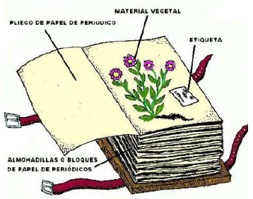
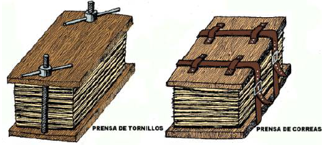
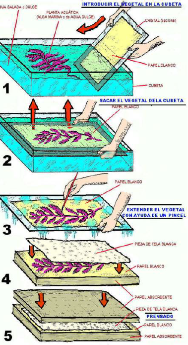
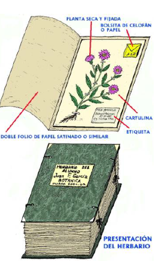

Siendo la finalidad principal de un herbario la de servir para estudio de las
plantas secas que lo componen, es fundamental que las mismas se hayan
preparado y se conserven en el mejor estado posible. Para esto, conviene
conocer y seguir unas pautas básicas que intentamos reflejar en las siguientes
líneas. 

## RECOGIDA DE LOS MATERIALES PARA EL HERBARIO

El primer paso condicionante de unos buenos resultados es la correcta
recolección del material en el campo.

Las plantas deben ser recogidas tan completas como sea posible, si bien
conviene tener en cuenta que arrancarlas totalmente supone la pérdida
irrecuperable de los correspondientes ejemplares, por lo que es más
aconsejable cortarlos. Debemos, pues, ir al campo provistos de algún
instrumento (tijeras, navaja, azadilla, etc.) que facilite ese objetivo, junto con
una serie de bolsas en las que se guardarán los materiales colectados hasta su
preparación para el secado, labor que no debe demorarse nunca más allá del
día siguiente a la recogida, y mientras deben ser conservados en lugar fresco
(heladera de ser posible)La bolsa de plástico no es recomendable cuando se
trate de hongos (setas), dada su fragilidad, en cuyo caso lo más adecuado es
una cesta de mimbre.

No hay que olvidar llevar siempre al campo un cuaderno o papel para notas y
lápiz (mejor que cualquier instrumento de tinta, bolígrafo o similar, inservible
en caso de lluvia), para anotar la localidad, altitud, hábitat, fecha, etc. de
recogida de los especímenes. Es necesario etiquetar adecuadamente cada
muestra con todos aquellos datos que luego nos permitan identificarla, conocer
su procedencia y cuándo presentaba tal estado de su ciclo vital.

## SECADO DEL MATERIAL

El proceso de secado, y en su caso prensado de las muestras para
eliminar todo el agua de ellas, es seguramente la parte más delicada en la
confección de un herbario y que condicionará su longevidad así como la
calidad del mismo, ya que es el primer paso para evitar su descomposición y
destrucción por parte de agentes infectivos (insectos, mohos, bacterias).

La preparación de los materiales con este fin va a diferir, dependiendo
del grupo de vegetales (plantas vasculares, briófitos, líquenes, hongos,
algas) al que pertenezcan.

### Plantas vasculares (helechos y plantas con semillas)

Este tipo de vegetales se somete a un secado por presión.

Los ejemplares, con su etiqueta de reconocimiento, se colocan en un
pliego de papel de filtro o de periódico y los distintos pliegos se van poniendo
unos sobre otros de forma ordenada, introduciendo entre ellos almohadillas
secantes o varios papeles de periódico que faciliten la extracción de la
humedad. Es muy importante cuidar la correcta disposición de la muestra
sobre el papel, ya que de ello dependerá el aspecto que tenga después de seca.

Una vez que hayamos formado una pila (que no debe sobrepasar el medio
metro de altura) de pliegos y papel secante, la misma debe ser prensada. A tal
efecto, se utilizan habitualmente unas prensas formadas por dos fuertes
planchas de madera, entre las que se colocan los pliegos apilados, y que se
aprietan, bien por medio de dos ejes-tornillos con tuercas, bien por medio de
unas correas. Cuando no es posible disponer de una de estas prensas, pueden
colocarse encima de las pilas objetos pesados de superficie plana como, por
ejemplo, libros.

El papel de los pliegos así como las almohadillas o papeles absorbentes
deben ser cambiados al día siguiente, y en días sucesivos, tantas veces como sea
necesario, hasta comprobar que las plantas estén totalmente secas.

Este método general puede ir acompañado de algún tratamiento especial
en el caso de determinados tipos de plantas, como pueden ser las carnosas,
bulbosas, etc., o en el supuesto de algunas con flores delicadas
(escrofulariáceas, crucíferas, orquidáceas) cuyos colores se ven alterados
durante el proceso de secado habitual. Cuando se trata de plantas vasculares
acuáticas es recomendable seguir las mismas indicaciones que damos para las
algas.
 

### Briófitos, líquenes, hongos

Para los briófitos (musgos y hepáticas) y los líquenes se sigue el mismo
protocolo de preparación en pliegos de papel de filtro o periódico, pero luego
no necesitan ser prensados.

El secado de los hongos se lleva a cabo mediante una estufa de aire caliente o
un desecador de frutas y verduras.

### Algas y plantas vasculares acuáticas

En la preparación de algas y plantas vasculares acuáticas se utilizan
cubetas o bandejas de plástico (o si no se dispone de ellas puede servir un
lavabo o pileta cualquiera) que se llenan de agua salada, o dulce si se trata de
plantas dulceacuícolas o algas de aguas dulces. Se pone la muestra en el agua
hasta que adquiera su forma normal. Sobre una lámina de cristal o plástico
rígido, o bien directamente, se sumerge un folio de papel blanco por debajo de
la muestra y a continuación aquél se levanta lentamente portando encima la
planta, que se va extendiendo cuidadosamente con ayuda de un pincel. El folio
blanco con la muestra se coloca en un pliego de papel absorbente, poniendo
directamente encima de aquélla un trozo de tela fina que la cubra, para evitar
que la solapa del pliego se adhiera a ella. Como se indica en el caso de las
plantas vasculares, se forma una pila de pliegos con sus correspondientes
almohadillas o periódicos secantes y se prensan. Después de secas, las muestras
permanecen habitualmente adheridas al folio.

## MONTAJE Y CONSERVACIÓN DEL MATERIAL

Para su adecuada conservación, el material, una vez que está
completamente seco, debe ser montado en cartulinas u hojas de papel de buena
calidad, a las que se fija con tira adhesiva (esparadrapo, por ejemplo, no cinta
plástica) o un pegamento especial (por ejemplo, acetato de polivinilo) que
siendo permanente permita desmontar el material en caso necesario. Es
conveniente pegar a la cartulina un pequeño sobre o bolsita, preferentemente
de papel blanco o celofán, en el que se puedan poner semillas, frutos o algunos
fragmentos que pudieran desprenderse de la muestra.

Cada cartulina con la muestra montada y etiquetada debe ser incluida en
un pliego de papel blanco, satinado, a ser posible.

Una vez determinado el material, la etiqueta definitiva, que suele ir
pegada en la esquina inferior derecha de la cartulina, debe llevar al menos los
siguientes datos:

- Nombre científico del taxon, incluida la autoría del mismo.
- Localidad donde se ha efectuado la recolección, siendo conveniente precisar,
por este orden: región, provincia, municipio, lugar o población más próxima.
Actualmente se recomienda también la referencia al sistema de coordenadas
U. T. M. (Universal Transversor Mercator).
- Hábitat, especificando, en la medida de lo posible, las características del
sustrato, tipo de suelo, altitud, orientación, comunidad vegetal donde se
desarrolla el taxon y especies con las que convive.
- Fecha de la recolección.
- Nombre de la persona que llevó a cabo la recolección, que se indica precedido
de la abreviatura Leg. (=Legitimavit).
- Nombre de la persona que ha determinado o identificado el taxón, precedido
de la abreviatura Det. (=Determinavit).

En los herbarios escolares o personales se acostumbra a apuntar también
el nombre de la familia a la que pertenece el taxon. Cuando se trata de
herbarios institucionales, y asimismo en algunos particulares, las etiquetas
suelen llevar impresos el nombre del Herbario y las siglas con que se conoce
internacionalmente.

Los líquenes y briófitos se guardan en sobres de papel que, convenientemente
etiquetados, se pegan sobre cartulinas, las cuales, a su vez, se protegen en los
pliegos blancos normales. También los hongos desecados se conservan en
sobres o bolsas de papel o de polietileno con agujeros para mantener cierta
aireación. Determinados materiales, como bulbos, rizomas, frutos, fragmentos
de madera, etc., que, por su naturaleza o dimensiones, no pueden ser
guardados en los pliegos de herbario normalizados, se conservan en frascos o
tubos. Por otro lado, algunas plantas y hongos de naturaleza carnosa, así como
ciertos materiales delicados (por ejemplo, flores de ciertas orquidáceas) son
mantenidos en mezclas alcohólicas, como líquido de Carnoy o alcohol
desnaturalizado, entre otras. En todos los casos es necesario cuidar el correcto
etiquetado de los frascos.

Los pliegos conteniendo las cartulinas con el material montado y
etiquetado se agrupan por especies, que se ordenan alfabéticamente por
géneros y éstos, a su vez, por familias y, o bien se guardan en
cajas generalmente de cartón rí-gido, o bien, si se trata de un herbario escolar,
el conjunto de pliegos se em-paqueta entre dos láminas de cartón resistente
que se atarán con cintas.

En los herbarios de instituciones oficiales las cajas se almacenan en
ar-marios de estantes, estando actualmente imponiéndose el uso de armarios
compac-tos, con varios cuerpos que se desplazan sobre raíles y permiten el
aprovechamiento al máximo del espacio y, por tanto, de la capacidad de
almace-naje.

Para conservar un herbario en óptimas condiciones, es importante
ubicarlo en un lugar con humedad y temperatura bajas, con el fin de evitar el
desarrollo de insectos, mohos y bacterias que dañen el material almacenado.

