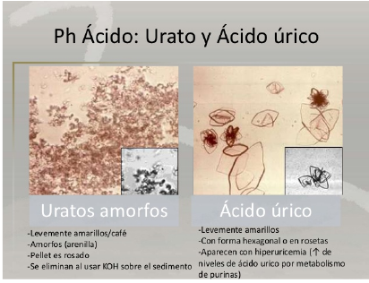

# Hiperuricemia
## INTRODUCCIÓN
El ácido úrico, en el ser humano, es el producto final del metabolismo de las
purinas, que forman parte de los nucleótidos: adenosina y guanosina y ácidos
nucleicos. El ácido úrico endógeno se forma en el hígado, el músculo y el
intestino, y se metaboliza por una enzima llamada xantina oxidasa. La
asociación entre ácido úrico y enfermedad renal es muy estrecha, ya que el
ácido úrico se elimina en sus dos terceras partes por el riñón, por lo que,
cuando cae el filtrado glomerular (FG), los niveles de ácido úrico aumentan.  

La hiperuricemia puede dar lugar a un espectro clínico variable: artritis gotosa
aguda debida a la precipitación de cristales de urato monosódico a nivel de
articulaciones; gota tofácea debida a la precipitación de los cristales en piel y
tejido celular subcutáneo; nefrolitiasis úrica; nefropatía aguda por ácido úrico
debida a precipitación de cristales intratubulares (frecuente en procesos
linfoproliferativos tras tratamientos quimioterápicos, asociada al síndrome de
lisis o destrucción tumoral).  

La asociación entre enfermedad renal e hiperuricemia se conoce desde hace
décadas. Antes de la disponibilidad de tratamientos hipouricemiantes eficaces,
el 40% de los pacientes con gota presentaban algún grado de insuficiencia
renal, siendo ésta la causa de muerte en aproximadamente una cuarta parte de
los pacientes. Desde entonces, un gran número de estudios epidemiológicos se
han centrado en la relación entre hiperuricemia asintomática e hipertensión
arterial, síndrome metabólico y diabetes, aumento del riesgo cardiovasculardesarrollo de enfermedad renal sin depósito de cristales de urato.

## GOTA EN LA ENFERMEDAD RENAL CRÓNICA
La gota es una afección artrítica inflamatoria que aparece cuando los cristales
de urato se acumulan en las articulaciones y otros tejidos. El urato es poco
soluble, estando el nivel normal de concentración de uratos en suero cerca del
límite de solubilidad. Cuando este nivel supera el umbral de solubilidad (6,8
mg/dl a 37 oC), es más probable que se formen cristales, aunque dos tercioslos sujetos con hiperuricemia no tienen gota y permanecen asintomáticos.  

La prevalencia de gota en el mundo es variable según los países, pero afectaun 1-2% de las personas adultas del mundo industrializado; aumenta con la
edad y, según datos recogidos en Reino Unido, es superior al 7% en hombres
y alcanza casi el 3% en mujeres mayores de 75 años. A pesar de que la gotamenos común en mujeres, su incidencia y prevalencia aumentan después demenopausia, al perderse el efecto uricosúrico de los estrógenos.  

## Por qué se eleva el ácido úrico en sangre
El ácido úrico puede estar alto debido a factores endógenos (el propio cuerpo
lo fabrica) y exógenos (a través de la alimentación). Para entender cómo
funciona el metabolismo del ácido úrico vamos a explicarlo con la ayuda de
este esquema:  

El ácido úrico recordemos es una sustancia que se forma a partir de las
purinas (las dos principales responsables de ello son la Xantina y la
Hipoxantina). Las purinas pueden aparecer por que el mismo organismo las
fabrica, pero mayoritariamente lo hacen a través de los alimentos que las
contienen. El cuerpo es capaz de regenerarse constantemente (regeneración
celular), por esto existe una vía de recuperación donde las purinas son
“recicladas” por el propio organismo. Lo normal es que una parte de las
purinas se utilice para renegar las células del organismo y que la otra parte se
elimine por la orina en forma de ácido úrico.  

El problema es que la vía de eliminación natural de ácido úrico a través de la
orina es muy pobre. Es por esta razón que un exceso de ácido úrico en vez de
ser eliminado se queda en la sangre provocando la hiperuricemia. La cantidad
de ácido úrico que puede quedar circulando en sangre es limitada. Aquí es
cuando pueden aparecer dos problemas muy comunes:
- La cristalización del ácido úrico en la orina formando “ litos en el
riñón”.
- La deposición del ácido úrico en las articulaciones en forma de Tofos,
que podrá desencadenar un ataque de gota.

## Eliminar el ácido úrico del organismo
Para bajar el ácido úrico hay que tener en cuenta muchos factores en la
alimentación que están relacionados con estos mecanismos. Habrá que actuar
teniendo en cuenta todos los factores que influyen en la formación de ácido
úrico, pero también en su eliminación del organismo.  

## Para incrementar la eliminación del ácido úrico por la orina:
- El pH de la orina: según la alimentación que se lleva a cabo o incluso
medicamentos que se tomen, puede variar el pH de la orina. ¿Cómo
influye el pH para reducir el ácido úrico? Si el pH es ácido se elimina
poca cantidad (15mg/dl) y hay peligro de formación de piedras de riñón
y de aumento de los niveles de ácido úrico en sangre. Sin embargo, en
un pH básico o neutro la capacidad de solubilizar el ácido úrico para ser
eliminado por la orina puede llegar a multiplicarse por diez (hasta 150-
200mg/dl). La manera habitual de alimentarse de la sociedad actual
hace que la orina sea muy ácida. La solución a este problema es un
cambio de hábitos a través de una mejora en los alimentos y las
cantidades que se comen de cada uno de ellos.
- Control de las Kcal. ingeridas: se debe hacer una dieta suficiente en
proteínas y en energía. Si se realiza una dieta de adelgazamiento hay
que llevar un control muy exhaustivo porque puede incrementar los
niveles de ácido úrico de la persona. ¿Cómo? Al perder peso el
organismo produce cuerpos cetónicos. Éstos acidifican el pH de la
orina y además compiten con el ácido úrico por ser eliminados a través
de la orina. Por lo tanto, si se sufre de hiperuricemia es peligroso hacer
ayunos, estar demasiadas horas sin comer o hacer una dieta de
adelgazamiento que no esté controlada por un profesional de la
nutrición humana y la dietética.

## Para reducir los niveles de ácido úrico en sangre y evitar ataques de gota:
- La ingesta de purinas: La manera más eficaz para controlar los niveles
de ácido úrico en sangre es eliminando de la dieta los alimentos que
contienen más cantidad de purinas, como las vísceras. Por lo general la
mayoría de alimentos que contienen colesterol también contienen
purinas. No realizar la dieta, incluso en un momento muy puntual, ya es
suficiente para que pueda desencadenarse un ataque de gota.

## Dieta para el ácido úrico alto
La dieta para la persona que quiere disminuir los niveles de ácido úrico en
sangre es complicada y puede resultar contradictoria. Por un lado, interesa
alcalinizar el organismo para favorecer la eliminación del ácido úrico por la
orina y por otro lado evitar los alimentos ricos en purinas. A la práctica esto
se complica ya que algunos alimentos que serían beneficiosos para una de
estas funciones, no estarían indicados para la otra.
- Alimentos acidificantes (por lo tanto a disminuir): todos los cereales y
derivados (pasta, arroz, pan, harinas, maíz), las carnes (tanto rojas
como blancas), el pescado (blanco y azul) y los huevos.
Alimentos alcalinizantes (por lo tanto a potenciar): frutas, verduras,
hortalizas, legumbres, tubérculos.  

## Cantidad de purinas de los alimentos
Debemos de evitar los que contienen más cantidad:
- Entre 800-150mg/100g. de alimento: vísceras, patés, embutidos,
pescado azul de tamaño pequeño (se come entero), marisco (en las
vísceras, cabezas...).  
- Entre 150-70 mg/100g. de alimento: carnes rojas y de caza, habas,
lentejas, pescado azul de gran tamaño.  
- Entre 70-50 mg/100g. de alimento: carnes blancas (la que menos
purinas contiene es el conejo), el resto de legumbres no nombradas
anteriormente (garbanzos, judías blancas, soja, guisantes), coliflor,
espárragos, espinacas y setas.  
- Entre 50-0 mg/100g. de alimento: lácteos, el resto de verduras no
nombradas anteriormente, tubérculos, raíces, cereales refinados (sin
germen), frutas.  

## Recomendaciones nutricionales para la hiperuricemia
- En el caso de las frutas no se debe realizar un abuso (tomar máximo 1
pieza al día) ya que el azúcar que contiene, la fructosa, se transforma en
xantina (una purina) al ser metabolizado por el cuerpo.
También es importante la cocción y la preparación de los alimentos.
Las purinas son solubles en agua. ¿Esto qué significa? Qué se puede
reducir el contenido de purinas de los alimentos si se cortan pequeños
se dejan en remojo y se hierven con mucha agua. Por el contrario, hay
que evitar tomar caldos elaborados con pescado o carne, ya que las
purinas habrán pasado al agua.  
- Se debe aumentar la ingesta de agua y líquidos de la dieta a 2-2,5
litros/día. Tomar infusiones y aguas carbonatadas naturales son buenas
opciones que pueden ayudar a llegar a estas cantidades.
Mantenerse en un peso correcto y evitar la obesidad también es de gran
ayuda, ya que cuanto más pequeño es el cuerpo menos ácido úrico
fabrica de manera endógena (el propio cuerpo).
Se deben evitar los ayunos, repartir bien las comidas a lo largo del día y
hacer un mínimo de 3 comidas principales.  
- Consumir algas y frutos secos de manera habitual es muy
recomendable en las personas que sufren de hiperuricemia.
Se debe procurar hacer una alimentación rica en calcio (mínimo
1000mg/día) para evitar la formación de piedras en el riñón de ácido
úrico.  
- Moderar el consumo de sal de la alimentación o incluso eliminarla por
completo para aumentar la diuresis.  
- Es imprescindible eliminar el alcohol de la dieta.

## Tratamiento fitoterapéutico de la hiperuricemia
### APIO

Nombre científico: _Apium graveolens L_  
La planta alcanza una altura de 30 a 100 cm. La raíz de la variedad silvestre
es fusiforme, de unos 5 a 7 mm de espesor, ramificada y se convierte leñosa
en el segundo año. La raíz de la variedad cultivada es carnosa, tuberosa y
alcanza un diámetro de más de 15 cm. El tallo es erecto, con ranuras, a
menudo hueco y ramificado. Las hojas son de color verde brillante. Las hojas
inferiores son largas y pecioladas mientras que las superiores son a veces
opuestas. Las partes utilizadas son los frutos, eventualmente las raíces y las
partes aéreas.  
Contenido y principios activos del Apio
Toda la planta contiene los mismos principios activos pero la mayor
concentración se encuentra en el fruto el cual presenta la siguiente
composición.  
#### Fruto
Aceite esencial (2-3%): componente principal limoneno, (60%),
Furanocumarina y otros heterósidos cumarínicos,
Flavonoides
Aceite graso

#### Propiedades y usos medicinales del Apio
La planta es un buen aperitivo, eupéptico, carminativo, remineralizante,
vitamínico y diurético.  
En uso externo tiene efecto cicatrizante y es un débil bactericida y fungicida.
Se indica en estados en los que se requiera un aumento de la diuresis tales
como afecciones genitourinarias, hiperazotemia, hiperuricemia, gota,
hipertensión arterial y edemas.  
También se recomienda su uso en inapetencia, meteorismo y dispepsias
hiposecretoras.  
En uso tópico: heridas, quemaduras y eczemas.  

#### Advertencias sobre su uso
No debe usarse durante el embarazo y no utilizar cuando exista infección o
insuficiencia renal.  
Debe tenerse cuidado en utilizar el vegetal almacenado por mucho tiempo
pues aumenta del contenido de furanocumarinas que puede conducir a un
efecto fototóxico.  

### CARDO
#### Identificación y procedencia del Cardo
Nombre científico: Cynara cardunculus  
El Cardo es el nombre común de varias plantas de la familia de las
Asteráceas o Compuestas, con más de un millar de géneros y más de 20.000
especies de las que muy pocas son cultivadas.  
Las partes de consumo son las pencas o peciolos, una porción de la nervadura
central de las hojas y los tallos tiernos. Las pencas son huecas, estriadas y
alargadas y terminan en unas grandes hojas verdosas, más pequeñas y
blanquecinas en el interior. Tiene numerosas espinas a lo largo del tallo que
dificultan su limpieza. Adquiere un gran tamaño y puede alcanzar los 2
metros de altura.  
Son originarias de regiones templadas.  
El crecimiento y desarrollo del Cardo está adaptado a zonas de temperaturas
moderadas. Esta planta crece de forma espontánea en los países de Europa
mediterránea y del norte de África, donde se viene utilizando desde tiempos
muy antiguos.  
#### Propiedades medicinales atribuidas al Cardo
Amargo salino, con una acción aperitiva, colerética, colagoga,
hepatoprotectora y diurética.  
Se indica en Hepatitis, disquinesias hepatobiliares, inapetencia. Estados en
los que se requiera un aumento de la diuresis: afecciones genitourinarias
(cistitis, ureteritis, uretritis, pielonefritis, oliguria, urolitiasis), hiperazotemia,
hiperuricemia, gota, hipertensión arterial, edemas, sobrepeso acompañado
de retención de líquidos.  
La inulina presente en el Cardo se metaboliza dando lugar a unidades de
fructuosa, azúcar asimilable por los diabéticos sin necesidad de insulina. La
cinarina tiene acción hipoglicemiante y es la responsable de la diuresis,
beneficiosa en los casos de cálculos renales y de hipertensión arterial,
retención de líquidos y oliguria.  
#### Contenido y principios activos del Cardo
Entre las principales sustancias contenidas en el Cardo se encuentran:  
Flavonoides, ácido clorogénico , cinarina, sales de potasio, inulina.  

### GROSELLERO NEGRO
#### Identificación y procedencia del Grosellero negro
Grosella o zarzaparrilla negra
Nombre científico: Ribes nigrum  
Arbusto perenne que puede crecer hasta 2 m, de ramas gruesas y brillantes de
color pardo amarillento.  
Los brotes son alternos, inicialmente pubescentes, ovales, cubierto de escamas
con glándulas de resina amarillenta.  
Flores agrupadas en racimos colgantes que nacen en la axila de las hojas, el
cáliz tiene aspecto de corola y se divide en cinco lóbulos extendidos, de color
verde amarillento.  
Las partes utilizadas son las hojas recolectadas después de la estación de
floración y secadas, y el fruto maduro (grosella negra o zarzaparrilla negra).
La planta es indígena de los bosques de Eurasia.  
#### Contenido y principios activos del Grosellero negro
##### Hojas
Flavonoides: astralgina, isoquercitrina, rutina.  
Proantocianidinas oligoméricas.  
Aceite volátil: beta-pineno, alfa-sabineno, alfa-cariofileno, d-cadineno.  
Taninos.  
##### Fruto
Vitamina C (ácido ascórbico)  
Antocianidósidos  
Ácidos orgánicos: cítrico, málico.  
Flavonoides: isoquercitrina, glucósidos de mirecitina, rutina.  
Azúcar invertido.  
Pectinas.  
Aceite graso con un alto contenido de ácido gamma linolénico.  
#### Propiedades y usos medicinales del Grosellero negro
##### Hojas del grosellero negro
Las hojas tienen propiedades diuréticas, facilitan la eliminación de cloruros,
urea y ácido úrico.  
Son astringentes, hemostáticas provocando vasoconstricción local y
antiinflamatorias.  
Existen estudios que demuestran que son hipotensoras y que inhiben el efecto
de la liberación de la prostaglandina.  
También se reporta su uso por vía interna para la artritis, reumatismo,
diarreas, cólicos y para tratar trastornos hepáticos.  
Por vía externa ha sido usado para tratar las picadas de insectos.  
Los frutos son vitamínicos por el alto contenido de Vitamina C,
vasoprotectores, aumentan la resistencia capilar y reducen su permeabilidad.  
Mejoran el funcionamiento de la retina y la agudeza visual.  
Consumidos a primera hora del día son un buen aperitivo, diuréticos y tienen
una importante acción antiinflamatoria gastrointestinal.  
El zumo de los frutos (grosellas negras) se utiliza para bajar la fiebre. Son
diaforéticos.  
Las hojas se indican en diarreas, en afecciones genitourinarias, hiperazotemia,
hiperuricemia, gota, hipertensión arterial, edemas, sobrepeso por retención
de líquidos.  
En uso tópico en heridas y ulceraciones dérmicas.  
Los frutos se indican para combatir la fragilidad capilar, varices,
hemorroides,
 flebitis,
 retinitis
 pigmentaria,
 miopía
 progresiva,
arteriosclerosis.  
El extracto fluido ha sido efectivo en las alergias estacionales.  
##### Advertencias sobre su uso
Usar con precaución en casos de gastritis y úlcera gastroduodenal.  

### ORTIGA
#### Identificación de la Ortiga Mayor
Nombre científico: Urtica dioica.  
También se conoce como Ortiga a la Urtica urens (ortiga menor).  
La ortiga es una planta arbustiva perenne, dioica, de aspecto tosco y que
puede alcanzar hasta 1,5 m de altura.  
Posee un tallo rojizo o amarillento, erguido, cuadrangular, ramificado y
ahuecado en los entrenudos. Está dotado en todos los nudos de parejas de
hojas, y recubiertas de pelos urticantes.  
Las hojas son de figura ovalada, rugosas, aserradas, puntiagudas, y de hasta
15 cm. Son color verde oscuras y con pétalos de color amarillo suave. Se
encuentran opuestas y también están provistas, al igual que el tallo de los
pelos que la caracterizan.  
Las flores son verde amarillosas con estambres amarillos, reunidas en
panículas pendulares, asilares y terminales. Normalmente son unisexuales,
pequeñas y dispuestas en racimos colgantes de hasta 10 cm. Las femeninas se
encuentran en largos amentos colgantes y las masculinas en inflorescencias
más cortas.  
La ortiga menor (Urtica urens) suele crecer al lado de la ortiga mayor
(Urtica dioica), tiene unos 60 centímetros y produce mayor irritación que la
anterior, pero posee menos virtudes terapéuticas.  
Las partes utilizadas son las hojas y las raíces secas o recién cortadas.  
#### Procedencia de la Ortiga
Esta planta existe prácticamente en todos los continentes y es conocida desde
la antigüedad.  
La Ortiga mayor es cosmopolita, crece en regiones altas, y va desde el Japón
hasta los Andes. En la península Ibérica es muy abundante, en el Norte
Atlántico y los Pirineos, aunque se puede encontrar por toda la península.
La podemos buscar en cualquier lugar donde habite el hombre o el ganado,
(se dice que va detrás de él).  
Se cría en suelos ricos en nitrógeno y húmedos, en corrales, en huertos, a lo
largo de caminos, de muros de piedra, en el campo, en la montaña, etc.  
#### Principios activos de la Ortiga Mayor
##### Hojas de Ortiga, planta fresca
- Clorofila a y b (2,5-3%), carotenoides (beta-caroteno).
- Flavonoides derivados del quercetol, kenferol y ramnetol.
- Sales minerales (hierro, calcio, sílice, azufre, potasio, manganeso).
- Acidos
orgánicos
(caféico,
clorogénico,
gálico,
fórmico,
acético), provitamina A.
- Mucílagos. Escopoletósido. Sitosterol.
##### Tricomas de la Ortiga (pelos urticantes):
- Los neurotrasmisores acetilcolina, histamina, serotonina.
- Acido fórmico. Ácido salicílco (1-4%)
- Aceites volátiles cetónicos y algo de metilheptano.
- Nitratos.
##### Raíces de la Ortiga
- Taninos.
- Fitosteroles: beta-sitosterol(0,03%-0,06%).
- Ceramidas.
- Fenilpropanos.
- Lignanas :(secoisolariciresinol glucósido, neo-olivil-glucósido).
- Polifenoles.
- Monoterpendioles.
- Aglutinina de la urtica dióica (lectina).
- Polisacáridos: glucanas, glucogalacturonanas, arabinogalactana.
- Escopoletósido. Beta-D-glucósido (0,003%)
##### Semillas de la Ortiga
- Mucílagos, proteínas, aceite (30%), con un elevado contenido en ácido
linoléico. Tocoferoles.  
#### Propiedades medicinales atribuidas a la Ortiga
La Ortiga Mayor es una de las plantas que más aplicaciones medicinales
posee.  
- Hojas de Ortiga, planta fresca:
    - Reconstituyente, remineralizante, diurética (favorece la eliminación de cloruros, ácido úrico y urea), colagoga, hemostática, ligeramente hipotensora e hipoglucemiante.  
    - En uso externo es rubefaciente, analgésica, empleándose además, por su poder astringente, en afecciones cutáneas y mucosas.  
    - Las hojas frescas en aplicación tópica son altamente rubefacientes.  
- Raíces de la Ortiga: Hipouriceminate Antiinflamatorio, con una acción antiadenomatosa (inhibe la 5-alfa-reductasa) , posee un efecto diurético, por la escopolatina y el beta-sitosterol. Son astringentes. Este efecto diurético permite incrementar el volumen de orina al máximo y disminuir el residual.  Estudios del extracto acuoso han sido aceptados para el tratamiento de la hiperplasia benigna de próstata. El extracto inhibe el enlace de la hormona sexual y su receptor en las membranas prostáticas.  Se han comprobado efectos inhibidores sobre determinados virus que incluyen la influenza A y otros microorganismos. En otros estudios presentó protección al desarrollo de los signos clínicos del lupus y la nefritis.  
- Semillas de la Ortiga: Usadas popularmente como galactagogo, astringente y, el aceite, como emoliente.  

### FRESNO
#### Identificación y procedencia del Fresno.
##### Yemas del Fresno
Nombre científico: Fraxinus excelsior.  
Otros nombres: Fresno norteño , fresno común o fresno grande  
Es un árbol caducifolio de unos 15 a 30 m de alto que se distingue de las
demás especies porque sus yemas son negras y no color marrón como en
otras, el tronco tiene una coloración grisácea.  
Las hojas son enteras, opuestas, pinnadas impares y aparecen posterior a la
floración. Los capítulos son sésiles de unos 5 a 11 cm de largo por 1 a 3 de
ancho, ovalados o lanceolados, lampiños y de un color mas blanquecino en el
envés.  
Florece antes de la aparición de las nuevas hojas, en primavera. Las flores son
masculinas en una época y femenina en otra, no tienen cáliz ni corola.
El fruto es muy pequeño de unos 50 mm máximo y entre 7 y 10 mm de ancho,
color marrón con una semilla envainada.  
Las partes utilizadas son las hojas y la corteza.  
La planta está distribuida en la mayor parte de Europa excepto en el noreste
de Escandinavia, región de Noruega y el sudeste de Europa Mediterránea  
#### Contenido y principios activos del Fresno
##### Hojas
- Flavonoides: incluye rutina (0,1 – 0,9%)
- Taninos.
- Mucílagos (10 – 20%)
- Manitol (16 – 28%)
- Inositol
- Triterpenos: fitosteroles.
- Monoterpenos iridoides: siringóxido, desoxsiringoxidina.
##### Corteza
- Hidroxicumarinas: fraxinol. Fraxósido, fraxidósido, esculósido.
- Taninos
- Glucósidos iridoides.
- Manitol.
#### Propiedades y usos medicinales del Fresno
##### Corteza y hojas del Fresno
El principal efecto de las hojas es laxante y diurético y de la corteza
antipirético, antihelmíntico y astringente.  
El principio activo más importante de la corteza son las cumarinas. Las
preparaciones de corteza fresca presentan una acción analgésica, antioxidante
y antiflogística. Es antidiabético por la acción de los glucósidos iridoides.
Las hojas poseen acción diurética por la presencia de flavonoides y
cumarinas. El manitol le transfiere propiedades como laxante por volumen.  
En menor intensidad posee propiedades antirreumática, antiinflamatoria,
venotónica, vasoprotectora y vulneraria.  
Se indica cuando se requiera un aumento de la orina para tratar trastornos
genitourinarios, hiperazotemia, hiperuricemia, gota, hipertensión arterial,
edemas, sobrepreso por retención de líquido, várices, hemorroides, gripe y
resfriados.  
La corteza se utiliza como cicatrizante en el tratamiento de heridas.  
#### Advertencias sobre su uso
En pacientes con hipertensión o cardiopatías consumir esta planta bajo control
médico para evitar descompensación tensional o una potenciación de los
cardiotónicos.  

