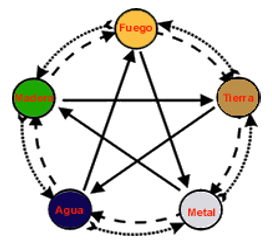
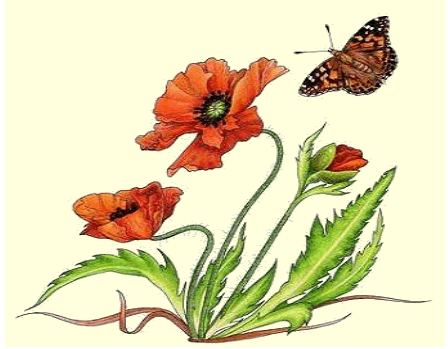
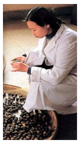
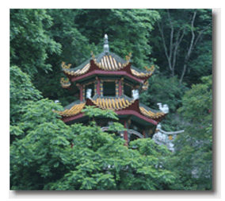

#  Introducción al uso de las Plantas Occidentales en Medicina China

>" La acupuntura representa el yang, y la farmacoterapia el yin."
>   (Aforismo  Médico Antiguo) 
  
 La botánica y la medicina estuvieron ligadas mano a mano en Occidente hasta el siglo XVII; entonces ambos sistemas devinieron científicos, sus caminos se separaron y no hubo nuevas alianzas médico-herbológicas. 
 
 Los libros de botánica ignoraban las propiedades médicas de las plantas, y los libros de medicina no contenían entradas botánicas en sus terapéuticas. Desde los tiempos de Dioscórides (siglo I D C.) hasta Parkinson (siglo XVII) la tradición herbológica se mantuvo firme e inquebrantable. La fitoterapia occidental debe su origen a los conocimientos guardados en Egipto. 

  Los grandes  médicos griegos fueron a perfeccionarse allí, Hipócrates " el padre de la medicina" lo hizo en el siglo V AC y más tarde lo hicieron Teofrasto, Dioscórides y Galeno. Como manifiestan sus textos éste último consultó los papiros de Menphis en el Templo de Imhotep donde siete siglos antes había estudiado Hipócrates. 
  
Una de las más grandes lumbreras médicas inspiradas en el saber egipcio fue Dioscórides, médico Romano de los ejércitos de Nerón.  De joven carecía de recursos pero deseaba fervientemente viajar por el mundo para poder conocer las hierbas medicinales de los más extensos territorios y secretos médicos de otras regiones, se enroló por eso en la milicia para satisfacer sus inquietudes y poder viajar de manera extensa. Como resultado escribió el tratado titulado " Materia Médica" que comprende remedios con alrededor de 600 especies de plantas, y de todas ellas se indican  las virtudes que se le atribuyen y la manera de administrarlas. Fue una de las obras más leídas del Medioevo, solamente aventajada por la Biblia. 

Paralelamente , en la medicina china, en el siglo II D C, hace su aparición Chang-ChungChing, " *El Hipócrates de Oriente* ". Su trabajo más importante se llamó " *Sobre las enfermedades causadas por el frío*".

El recopila más de 100 hierbas mezcladas por la doctrina de las siete recetas. Chang no creó la doctrina, él se la atribuyó al emperador Shen Nung, pero amplió el sistema y creó un modelo de prescripción en el cual las plantas se ubican por orden de prioridad según sus funciones en cuatro categorías: emperador, ministro , consejero y embajador. 

- El  **Emperador** es  la planta que contiene el componente básico para la curación.
-  El **Ministro** es una ayuda a la droga básica.   
-  El **Consejero** contiene ingredientes correctivos y pone a los principios activos de las otras plantas en movimiento
- El **Embajador** representa el vehículo de las demás plantas 

La mayoría de los remedios herbológicos chinos tiene estos ingredientes en variadas proporciones. 

##### Las siete recetas son: 

1. **Chi-Fang** o Recetas Impares:  estas prescripciones contienen un número impar de ingredientes, tales como dos hierbas emperador y tres hierbas ministro. En todas las prescripciones un embajador y un consejero son agregados. Esta prescripción aumenta la actividad yang. Se utiliza solamente en enfermedades yin, donde el yang necesita ser fortalecido. 
2.   **Go-Fang**  o Receta por un numero par de emperador y hierbas ministro; son remedios yin usados cuando el yang es muy activo. 
3. **Ta-Fang** o Gran Receta, cuando la enfermedad es seria, con muchos síntomas , el terapeuta prescribirá  to fang; hay muy pocas de estas recetas y son muy poderosas , a veces contienen pequeñas cantidades de hierbas venenosas. 
4. **Hsao-Fang**  o pequeña receta, para una enfermedad simple, se recomienda cuando el paciente presenta un solo síntoma, solo contiene dos o tres ingredientes. 
5. **Huang-Fang** o receta lenta, éstos son remedios suaves. Se la emplea cuando la condición del paciente es muy frágil y no puede soportar cambios rápidos. 
6.  **Chi-Fang** o recetas de emergencia; el efecto de éstas es inmediato, se le da a  pacientes cercanos a la muerte para aumentar la actividad del Chi en el cuerpo. 
7. **Chung-Fang** o receta repetida. En enfermedades complejas a veces se requieren prescripciones que  actúen sobre un número de órganos al mismo tiempo.

Todos estos remedios contienen muchas hierbas y se toman muchas veces. 

Los principios de Anatomía y de Fisiología chinas son los mismos en Acupuntura y en Medicina Herbológica. Como dice un aforismo antiguo: " La Acupuntura representa el yang y la farmacoterapia el yin". El Dr. Van Nghi recomienda como más efectivo usar la Acupuntura en climas tropicales, la moxa en climas fríos y la fitoterapia en climas húmedos

La doctrina de las siete recetas simplificaba el trabajo del médico pero solamente cuando se ha localizado el lugar (órgano -víscera- meridiano) donde la desarmonía yin-yang está ocurriendo. 

El mayor esfuerzo del terapeuta debe situarse en descubrir el modelo de desarmonía causante de los signos y síntomas presentes en el paciente y no dar  prescripciones de manera sintomática. La eficacia del Método Tradicional Chino puede ser ilustrada por un estudio reciente llevado a cabo en un hospital de China donde, siguiendo estudios de medicina convencional, usando rayos equis y endoscopias en seis pacientes con dolores de estómago se les diagnosticó úlcera péptica; desde el punto de vista del especialista que estudió los casos todos padecían la misma enfermedad. 

Al ser evaluados por un especialista en medicina china que seguía el método tradicional, luego de un interrogatorio y palpación, éste observó que el primer paciente refiere que el masaje y el calor le alivian el dolor, que se mejora el comer, dice temer al frío, tiene la tez pálida, transpira todo el día; su orina es clara y frecuente, su lengua es húmeda y pálida, su pulso es "empapado”. Se le diagnostica como un cuadro de desarmonía por insuficiencia del yang del Bazo. 

El otro paciente tiene un dolor punzante en el estómago que a veces viaja a la columna, se agrava al comer y al ser tocado, vomita sangre a veces. El es muy delgado y tiene complexión oscura. Su lengua es púrpura oscura con erupciones en los lados, el pulso es "resquebradizo", y se describe su cuadro como sangre congelada en el estómago. Y así consecutivamente el especialista chino va generando un diagnóstico diferencial en cada uno de los pacientes revisados con anterioridad por el médico alópata y en lugar de usar un remedio idéntico para todos como lo hizo el alópata les prescribe una receta de hierbas en cada caso diferente según el diagnóstico energético que realiza, haciendo un tratamiento a medida en cada caso. 

#### Las plantas:  sus densidades y energías 

La clasificación de plantas en la fitoterapia se hace según el elemento al que correspondan y de acuerdo a su densidad o energía. De  esta manera podemos tener una planta que sea ascendente de fuego o fría de madera o con varias combinaciones a fin de que se equilibren los trastornos energéticos del paciente una vez que se determina el diagnóstico según la Medicina Tradicional China se busca la plata que ajuste el cuadro.

Las densidades son: 
- el frío
- el calor
- la tibieza
- lo refrescante. 

##### Frío
Se consideran plantas frías a las que tratan el calor extremo, si una persona padece plenitud de calor atacando el hígado con signos como  hemicránea, irascibilidad, nauseas, fotofobia, síndrome vertiginoso usaremos una planta fría de madera como la Cynara Scolimus (alcachofa). 

##### Calor:i  
Son plantas calientes las que se oponen al frío se usan en plenitud de frío como cuando las personas padecen frío corporal y se sienten sin energía ni vitalidad alguna. Si hubiese frío en el bazo y se padece de diarreas crónicas se usa el Quercus Robur  ( roble) a fin de sacar el frío que ingresó al cuerpo.

##### Tibieza:  
Las  plantas tibias corrigen las insuficiencias de yang,  el yang representa la bioelectricidad que permite a los órganos funcionar de manera adecuada si falta yang en el agua (riñón) la dieuresis será difícil y aparecerá el edema una planta adecuada será el Equisetum Arvense (Cola de caballo). 

##### Refrescante: 
Son las plantas que corrigen la insuficiencia de yin, el yin representa a las sustancias corporales, cada órgano produce sustancias ( Jin Je ) el hígado por ejemplo produce bilis, si se necesita fortalecer la acción yin del hígado a nivel de la producción de bilis usaremos Taraxacum Dens de Lion (Diente de león).  

Las energías son:
- descenso
- ascenso
- inmergencia
- emergencia

#####  Descenso
Orientación de la energía hacia abajo (yin) se utiliza cuando se necesita promover la energía de descenso por ejemplo si hay estancamiento de comidas en el estómago se usará una planta del elemento tierra que promueva la energía de descenso por ejemplo la Fumaria Officinalis. 

##### Ascenso
Orientación de la energía hacia arriba (yang). Cuando la energía no asciende de manera eficiente en el cuerpo como cuando hay una insuficiencia de irrigación cerebral y la memoria se apaga, se usan hierbas ascendentes en este caso de fuego como el Ginko Bilova. 

##### Inmergencia
Orientación centrípeta de la energía corporal en el sentido de inhibición y hacia el centro (yin). La idea en de la inmergencia se corresponde con el fortalecimiento de los tejidos, la recuperación del chi perdido y de la sangre. Por ejemplo la recuperación de una persona tras una cirugía o una convalecencia de una enfermedad aguda. Idealmente si tras una cirugía por ejemplo aparece debilidad por la pérdida de sangre se puede usar angélica anchargélica como planta hematotónica y tratar así la anemia. 

##### Emergencia
Orientación centrífuga, la energía viaja hacia fuera ( yang), se usan principalmente plantas emergentes en casos de invasión de factores patógenos del exterior con la intención de promover la diaforesis( transpiración) como en el caso de haber tomado mucho frío y tener la sensación de decaimiento típicas de la gripe se utilizarían plantas emergentes del metal como la borraja que moverán al factor patógeno , frío moverse hacia el exterior a través de su efecto diaforético.

Así  conociendo claramente la patología que presenta el paciente de acuerdo a las ocho  reglas del diagnóstico podemos buscar la planta adecuada para su tratamiento; pues en la evolución sabremos si el caso es yin-yang, alto-bajo, frió-calor. 

Por ejemplo, si estamos tratando una hernia hiatal que es básicamente  una pérdida de función del estómago de hacer descender la energía con una inversión de la misma. En nueve de cada diez casos la hernia hiatal es un cuadro de plenitud-calor. De esta manera tenemos que el cuadro es: interno-calor-yang-alto. Para corregirlo debemos lograr que la energía de estómago descienda, así vemos que entre otras está indicada la  Melisa, ya que tiene características refrescantes y un tropismo descendiente actuando sobre el elemento tierra. 

No debemos pensar que la clasificación de las plantas en los cinco elementos corresponde al sabor percibido al degustarlas; como se suele decir: "lo amargo tonifica al Corazón " o que "si uno come muchos alimentos amargos habrá problemas cardíacos". No es tan sencillo, primero debemos evaluar si aparte de amargo es frío o caliente, es decir si la planta tiene tropismo yin o yang. La clasificación por elementos se hará de acuerdo a los beneficios obtenidos de la misma estudiados de manera empírica. Por ejemplo la Genciana es una planta amarga; tiene la propiedad de tonificar el Bazo, para la medicina occidental posee las propiedades de aumentar los glóbulos blancos, tratar la anemia, la falta de apetito; podemos decir que es una planta que actúa en el sentido de tonificar un vacío de yang, un vacío de sangre, o un vacío  de Bazo. 
  
Así en este caso, como en muchos otros, el gusto y la actividad específica no concuerdan; si concordasen, el efecto sería aún mayor, por ejemplo: sabor dulce-caliente. 

A continuación se presenta una breve lista de las  plantas que corrigen la plenitud yang o yin de cada elemento; éstas lo hacen sedando el exceso o tonificando la insuficiencia de cada aspecto del elemento, según el caso. 

Las plantas mas usadas para corregir los **excesos de madera yang** son: 
 * anémona pulsatilla,
 * limón,
 * fumaria,
 * hamamelis,
 * castaño de la India,
 * melisa. 

Para **excesos de Madera yin** se usan: 
* angélica,
* anémona hepática,
* enula campana,
* cardo mariano. 

Para **Fuego yang** se emplea
* borraja,
* fresno,
* agnocasto,
* valeriana,
* tilo 

Para **Fuego yin** se usa
* lavanda,
* romero,
* quinina. 

Para **Tierra yang** se usa
* árnica,
* bardana,
* dulcamara,
* galega,
* moral negro. 

Para **Tierra yin** se usa
* anís verde,
* bistorta,
* belladona,
* canela de Ceilán,
* centaura,
* regaliz 

Para el **Metal yang** se emplea
* agrimonia,
* marrubio blanco,
* opio,
* sen,
* pulmonaria. 

Para el **metal Yin** se usa
* avena,
* drosera,
* eucaliptus,
* jengibre,
* hisopo,
* malva 

Para el **agua Yang** se usa
* bolsa del pastor,
* maíz,
* mirtillo,
* pasiflora 

Para el **agua yin** se emplea 
* grosellero negro,
* frambuesa,
* Ginseng,
* clavo de olor,
* ortiga picante,
* cola de caballo. 

 La administración de las plantas es variada, y depende de la edad del paciente y de la existencia de laboratorios para hacer los preparados. Las formas  más comunes son la infusión, el cocimiento, la tintura madre, las cápsulas, los aceites esenciales y los extractos fluidos. 