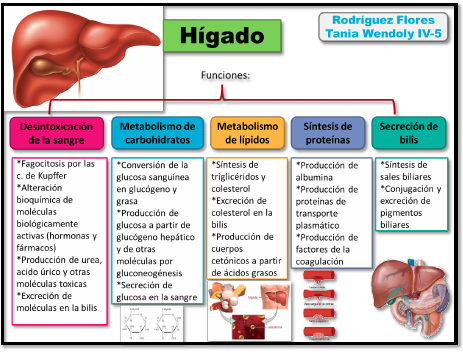
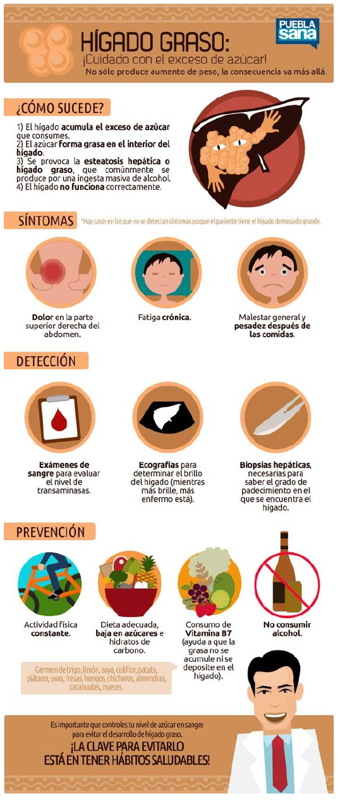
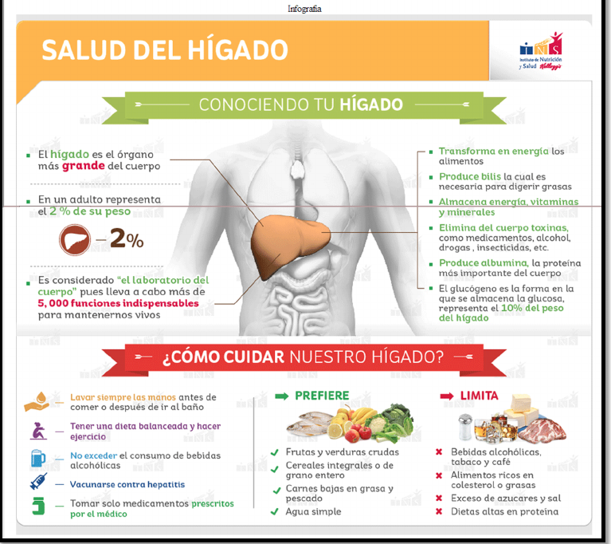
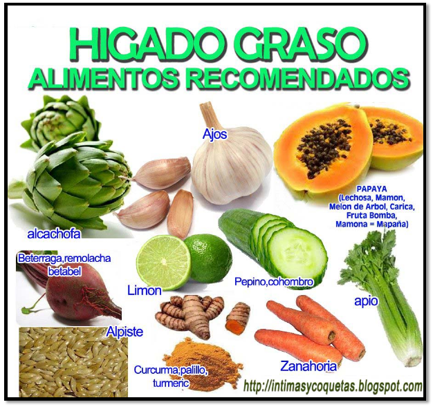

# Hígado graso
El hígado graso, comúnmente conocido en el ámbito sanitario como
esteatosis hepática, es una enfermedad generalmente benigna del hígado
que se caracteriza por la acumulación de ácidos grasos y de triglicéridos
en las células hepática.  

## Funciones del hígado

Los síntomas del hígado graso por regla general suelen ser dolor en la
parte superior derecha del abdomen, malestar general, fatiga crónica, y
sensación de pesadez, en especial después de las comidas.  
Aunque también es cierto que existen pacientes que no tienen síntomas,
cuestión peligrosa hasta cierto punto dado que la enfermedad puede
evolucionar de manera silenciosa a estadios más graves.  
Hace algunos años el hígado graso se relacionaba con el consumo de
alcohol en grandes cantidades, aunque en la actualidad cada vez son más
los especialistas que relacionan el aumento de personas con esta
patología con los altos niveles de obesidad, de colesterol y triglicéridos  
## Síntomas del hígado graso
Son diversos los síntomas del hígado graso, aunque también es cierto que
no todos los pacientes presentan síntomas. Por regla general, los más
habituales tienden a ser los siguientes:  
- Dolor en la parte superior derecha del abdomen.
- Malestar general.
- Cansancio.
- Fatiga crónica.
- Pérdida de peso.
- Sensación de pesadez.
- En algunas ocasiones, ictericia.

En casos graves, en los que el grado de afectación del hígado graso es
bastante más peligrosa, es posible observar algunos síntomas como dolor
intenso en la zona superior del abdomen y posibilidad de que se
desarrolle una insuficiencia de hígado aguda.  
No obstante, no tener síntomas asociados no significa que no se pueda
estar sufriendo de hígado graso. De hecho, se estima que alrededor de un
30% de los pacientes con esta enfermedad no presentan prácticamente
ningún síntoma.  
De esta forma, al ser una afección asintomática, es común que el hígado
graso se descubra de manera casual, por ejemplo tras la realización de
una ecografía abdominal, o por una exploración del abdomen si el médico
es capaz de palpar que el hígado ha aumentado de tamaño.  

## Evolución del hígado graso

Generalmente el hígado graso es una patología benigna que tiende a no
evolucionar a estadios más graves de la enfermedad.  
Una vez se detecta la aparición de hígado graso (a través de ecografía
abdominal), se deben tomar las medidas necesarias para eliminar esa
grasa en el hígado, y evitar con ello que el hígado graso evolucione a
esteatohepatitis (hígado inflamado, aumentado de tamaño, en este caso
causado por acumulación de grasa abundante y en exceso), y de ahí a una
posible cirrosis y/o cáncer.  
De hecho, cuando el hígado graso no se trata es posible que pueda cursar
con cirrosis y aumentar por tanto el riesgo de cáncer de hígado.  

## Tratamiento del hígado graso
Si bien no existe un tratamiento definitivo para el hígado graso, las
recomendaciones básicas que se dan al respecto pasan por una reducción
de peso corporal y seguir una alimentación sana y saludable, rica en frutas
y verduras.  
El hígado graso es una condición por lo general fácilmente tratable y en la
mayoría de los casos benigna. De hecho, es común que controlando las
causas que hayan provocado la aparición de grasa en el hígado excesiva
basta con su curación.  
La práctica de ejercicio es adecuada en todos los casos, dado que
ayudamos a nuestro organismo a que elimine la grasa sobrante del
cuerpo.  
Una buena opción es acudir a un nutricionista naturopático que nos
aporte una dieta adecuada para el hígado graso, y que controle el peso
que vayamos perdiendo, puesto que una pérdida rápida de peso está
asociada a un mayor daño al hígado.  
Evita el consumo de alcohol  
No hay duda que el consumo de bebidas alcohólicas influye de forma
directa en la acumulación de grasa en el hígado, además de afectarle de
forma muy negativa al causar daño en sus células.  
Por tanto, es fundamental e imprescindible eliminar prácticamente por
completo el consumo de cualquier bebida alcohólica, incluso aquellas
que sean de baja graduación como por ejemplo podría ser el caso de la
cerveza o el vino.  
En la mayoría de los casos, cuando el hígado graso es debido a consumo
de alcohol, el pronóstico de la enfermedad es muy bueno cuando se
reduce y/o se elimina por completo.  

*Haz ejercicio físico*  
La práctica de ejercicio físico no solo es imprescindible a la hora de
mantener una buena salud; es especialmente adecuado a la hora
de reducir la grasa en el hígado y curarlo, ya que al mantenernos activos
reducimos la grasa de nuestro cuerpo (en especial en este órgano, al
movilizarse).  
Además, es tremendamente útil para bajar de peso, evitar el
sedentarismo, y reducir el exceso de peso que podamos tener. En muchos
casos basta con practicar cada día al menos 40 minutos de ejercicio físico
aeróbico.  
Hay ejercicios específicos de Qi Gong ( Chi Kung) tales como el
estiramiento del meridiano del higado, el de la vesícula biliar “ sacar la
furia por los ojos del sistema de Ba Duan Jín, los ejercicios del sistema de
los 5 animales asociados al tigre que resulta de gran utilidad en el
mejormiento del hígado graso al igual que la práctica regular del Tai Chi
Chuan.  

Sigue una dieta adecuada  
La alimentación también influye en la aparición del hígado graso no
alcohólico, sobre todo cuando tiendes a consumir alimentos ricos en
azúcares y grasas. Por tanto, una buena opción es seguir una dieta
equilibrada y saludable, y evitar alimentos refinados y procesados.  

## Volviendo al principio: ¿es posible prevenir el higado graso?
Teniendo en cuenta que, en la actualidad, la mayoría de casos que se
diagnostican de hígado graso son causados por los hábitos y por el estilo
de vida que seguimos a día de hoy, es evidente que el higado graso o
esteatosis hepática se puede prevenir. Incluso no solo podemos decir que
se puede prevenir, sino que en caso de ser detectado y estar ya presente,
se puede curar.  
Por tanto, para prevenirlo es importantísimo seguir un estilo de vida
saludable, basado en el seguimiento de una dieta variada y equilibrada,
rica en alimentos frescos y saludables, y baja en grasas.  
Dado que el alcohol es otro de los enemigos para la salud de nuestro
hígado, y que interviene de forma decisiva en la acumulación de grasa en
este órgano, es fundamental eliminar por completo el alcohol de nuestra
dieta.  
No obstante, existe cierta controversia sobre cómo actuarían
determinadas bebidas alcohólicas “más saludables” sobre el hígado, como
es el caso del vino, ya que algunos estudios constataron en su momento
que consumir una copa de vino al día ayudaba a prevenir el hígado graso y
a evitar que la grasa se acumulara en él. En cualquier caso, dado que no
existe acuerdo por parte de la comunidad científica, la recomendación
básica es simple: evitar o reducir casi al completo el consumo de
cualquier tipo de bebida alcohólica.  
Como indicábamos, el sobrepeso y la obesidad influyen en la aparición de
grasa en el hígado, de la misma forma que también lo hace la diabetes
(que, dicho sea de paso, puede aparecer a su vez por tener exceso de
peso). Por ello, es importantísimo reducir nuestro peso poco a poco con
ayuda de un nutricionista naturopático, mediante una dieta personalizada
y adecuada a nuestras condiciones y circunstancias personales. Muchos
estudios científicos han constatado que con una reducción moderada del
peso se consigue revertir e incluso eliminar la presencia de grasa en el
hígado.  
Por otra parte, cuando practicamos ejercicio físico con regularidad
aumentamos nuestro metabolismo y quemamos grasas. Es una actividad
que ayuda de forma muy positiva en caso de tener hígado graso,
especialmente si practicamos algún tipo de ejercicio aeróbico, como por
ejemplo correr o caminar. Basta con practicarlo con cierta regularidad, a
ser posible cada día y durante al menos 30 minutos cada vez.  
Teniendo en cuenta que niveles altos de colesterol y de triglicéridos
pueden igualmente influir en su aparición, es conveniente reducir los
niveles altos de grasas en la sangre. En este caso, los consejos preventivos
indicados anteriormente son igualmente útiles y recomendados. Las
plantas medicinales descriptas más abajo colaboran también en reducir el
peso y bajar los índices de triglicéridos y colesterol, pero una dieta
adecuada garantizará que el problema no reaparezca.  
También existen trucos y consejos que permiten depurar el hígado, y que
ayudan ante cualquier patología relacionada con este importante órgano.  

## Cómo curar el hígado graso

### Plantas que nos ayudan a combatir el hígado graso

Lo sabemos, el hígado actúa como un auténtico y sofisticado laboratorio
químico, esencial para limpiar y desintoxicar nuestro organismo. Además
de ello, sintetiza la grasa, el hierro, las vitaminas, produce la bilis y ante
todo, filtra toda clase de tóxicos de nuestra sangre. Pero cuando existe
una acumulación de grasa en él, muchas de estas funciones dejan de
realizarse con la misma eficacia. Estas plantas medicinales pueden
ayudarte.  

#### Diente de león

Es un excelente mediador para la digestión y para resolver muchos tipos
de trastornos digestivos. El diente de león se ha utilizado desde la
antigüedad como facilitador de la secreción de bilis, así como para
mediar la función de hígados perezosos.  
Uso medicinal: disquinesia biliar, litiasis biliar, estreñimiento, reumatismo
crónico, insuficiencia renal, litiasis urinaria úrica, acné, eczema de
sensibilización, herpes, depurativo, varices, hiperuricemia, gota,
hipercolesterolemia, celulitis, obesidad.  
- Nombre latino: Taraxacum dens Leonis
- Nombre común: Diente de León
- Familia: compuestas
- Habitat: ribazos, bordes de caminos, prados
- Parte usada: raíz
- Componentes: en las raíces se han identificado inulina, una resina ácida (taraxenina), derivados triterpénicos, pentacíclicos (taraxerol, taraxasterol), éstos últimos como componentes del látex. Flavonoides (luteolóxido y cosmorióxido). Carotenoides (taraxantina). Acido 3-4 dioxicinámico, acido cítrico y fenoxiacético, Vit.B2, citosterol, cumestrol, Vit.C y A, potasio, hierro, fósforo, magnesio, selenio, manganeso, enzimas, ácido fólico, ácidos grasos, taninos.

#### Cardo mariano

Seguro que has oído hablar de las bondades del cardo mariano. Es sin
lugar a dudas la planta medicinal más apropiada para tratar el hígado
graso. ¿Por qué? te preguntarás. El cardo mariano dispone de un
principio activo denominado silimarina, se trata de un excelente
hepatoprotector que no solo nos ayuda a proteger las células hepáticas,
sino que las regenera y las desintoxica. Es decir, combate todo elemento
nocivo, como es el caso de la grasa, alzándose pues como una de las
mejores sustancias hepatoprotectoras  
- Nombre latino: Cardus Marianus
- Nombre común: Cardo Mariano
- Familia: compuestas
- Habitat: Europa Central, Meridional y Argentina.
- Parte usada: planta. Sabor: amargo
- Componentes: flavonoides, silimarina (substancia antihepatotóxica). Por la sibylina tiene acción directa de regeneración sobre estimulación de la síntesis protéica. Aminas, tiramina e histamina. Una sustancia amarga.  Todos ellos contribuyen a su acción febrífuga y antihemorrágica.
- Uso medicinal: metrorragia, hematurias, hemorragias nasales, hepatitis tóxica, enfermedad hepática, hipotensión, síncope, melancolía, alteraciones de la memoria, psicastenia.

Tonifica los meridianos del hígado y de la vesícula biliar (madera):
hipotensión, lipotimia, síncope, menorragia, hepatomegalia, cirrosis,
hígado cardíaco, hepatitis tóxica, problemas de memoria, psicastenia.  

### Fumaria

Puede que no sea tan conocida. Pero esta planta es muy adecuada por
ejemplo para paliar los efectos del higado graso: reduce las náuseas, el
dolor de cabeza, mejora las digestiones, nos evita tener cálculos biliares
y, poco a poco va curando nuestro hígado. Para realizar su infusión
necesitas una cucharada de sus plantas secas, con esto tendrás bastante
para preparar una taza. Puedes tomarla cada vez que te sientas mal.  

- Nombre latino: Fumaria Officinalis 
- Nombre común: Fumaria
- Familia fumariáceas
- Habitat: lugares incultos, bordes de caminos
- Parte usada: partes aéreas floridas, 
- sabor: amargo, salado, ácido 
- Componentes: acción antitóxica que se debe a la presencia de ácido alifático, fumárico, cítrico, glicólito, láctico, málico, y succínico. Sales de potasio de acción diurética y depurativa. Flavonoides a los que se atribuyen propiedades antiespasmódicas del esfinter de Oddi y acción reguladora por tanto, del flujo biliar. Por sus alcaloides derivados de isoquinolina y en particular por la protopina o fumaria (0,13%), es un antiasmático, antihistamínico, antiinflamatorio y antagonista de la serotonina.
- Uso medicinal: tónico, depurativo, acción positiva sobre el páncreas, congestión hepática, disquinesia biliar, colangitis, diurético, estreñimiento, obesidad, dermatosis, herpes, trastornos cutáneos como eczema, etc., hiperviscosidad de la sangre, se emplea en ictericia, digestiones difíciles, exceso de serotonina, excitación psíquica, insomnio, hipertensión, hiperuricemia, hipercolesterolemia, inflamaciones.

Dispersa y regulariza los meridianos del bazo-páncreas y del estómago
(tierra): obesidad, estados pletóricos, estreñimiento, hipertensión,
excitación psíquica, insomnio, acné, aerofagia, agitaciones, anorexia,
bronquitis, dermatosis, eczema, hipercolesterolemia.  

### Boldo
- Nombre latino: Peumus Boldus
- Nombre común: Boldo
- Familia: monimiáceas.
- Habitat: regiones cálidas de Africa del Norte, Italia, Chile (Los Andes). Crece espontáneamente en regiones secas sobre laderas soleadas. Se reproduce por semillas. En nuestro país se cultiva escasamente.
- Parte usada: hoja. Son opuestas, aovadas u oblongas, sésiles o cortamente pecioladas, enteras, coriáceas, aromáticas, densamente glandulosas, dejan ver por transparencia el limbo acribillado de glándulas oleíferas, de 2,5-6 cm., de largo, con abundantes tricomas fascilulares, áspera en la cara superior. Olor aromático, canfóreo y pungente que aumenta cuando se tritura entre los dedos, de flores acampanadas de unos 5mm de diámetro, blanquecino-verdosas, dispuestas en cimas terminales, laxas de 5-12 flores. Fruto: drupas negruzcas generalmente reunidas en número de 2-5, raramente solitarias.
- Componentes: alrededor de 20 alcaloides de núcleo aporfínico, boldina (30%) de acción sedante, flavonoides, boldoglucina, con acciones estomacal y carminativa, estimulante de la secreción de la bilis por la célula hepática y favorecedora del funcionamiento de la vesícula biliar, esencia rica en eucaliptol y ascaridol (antihelmíntico). Las cortezas mucho más ricas en alcaloides que las hojas, se emplean para la extracción de boldina (deriva del núcleo aporfina)
- Uso medicinal: dispepsia, insuficiencia hepática, hepatitis vírica, colecistits crónica, litiasis biliar, estreñimiento hepatobiliar, insomnio, dermatosis, asma con insuficiencia hepática, paludismo hepático, tranquilizante por exceso de fatiga. Es estimulante de la digestión, colagogo, y colerético, también tiene propiedades sedantes sobre el SNC y es algo hipnótico y diurético. La boldina en altas dosis es convulsivante. Es utilizado ampliamente por la medicina popular bajo la forma de infusiones que favorecen la función digestiva y hepática.  Dispersa los meridianos del hígado y de la vesícula biliar (madera): insuficiencia hepática, estreñimiento de los hepático biliares, litiasis biliar colecistitis crónica, hígado palúdico, hepatitis viral, asma y dermatosis relacionadas a una insuficiencia hepática, dispepsia, insomnio de sujetos coléricos y nerviosos, bronquitis, dermatosis.
- Contraindicaciones: degeneración avanzada de la célula hepática.

### AGRIMONIA
- Nombre latino: Agrimonia Eupatoria 
- Nombre común: Agrimonia-
- Hierba de San Guillermo Familia: rosáceas
- Habitat: en lugares no cultivados, setos, ribazos, sumidades floridas y hojas.
- Parte usada: taninos: acción astringente, antiinflamatoria, sabor ácido.
- Componentes: flavonoides: acción beneficiosa en trastornos circulatorios y reumáticos por el quercetol-3-galactósico.
- Uso medicinal: antidiarreico suave, asma, combatir el reumatismo, contusiones, trastornos de la vesícula, afecciones de garganta, boca, y heridas en general: anginas, faringitis, aftas. cataratas, hemoptisis, micosis intestinal, estomatitis, obesidad, diabetes, gota.  cefalea. 
- Efectos adversos: se ha experimentado recientemente en animales y tiene efecto hipotensor, antihistamínico y coronario- constrictor a dosis elevadas. Dispersa los meridianos del bazo- páncreas y del estómago (tierra): obesidad, diabetes, diarreas, micosis intestinales, asma, gota, cefalea, cataratas, anginas, estomatitis, faringitis, aftas, heridas infectadas, contusiones, neuritis, acné, seborrea.
