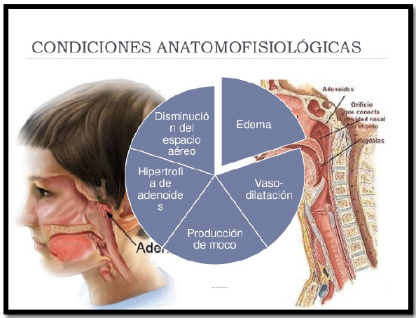

# Fundación Naturopática Argentina
# Fitoterapia Módulo ORL
## elemento metal
> textos de Mario Schwarz
## ALGUNAS NOCIONES SOBRE LOS GRANDES PRINCIPIOS DE TRATAMIENTO
Localizar el elemento y el/ los órgano-s afectado-s y su función , así como la intensidad de esta alteración. Determinar si es el órgano primariamente afectado o no.  
Modoficar el régimen alimentario cada vez que sea necesario. Rectificar una dieta rica en glúcidos, los niños habitualmente están saturados de golosionaso de féculas, solo con suprimirlas el páncreas mejorará su función, disminuyendo las secresiones de insulina.  
Remineralizar al paciente, en general las infecciones sobrevienen en personas ectremadamente Yin que se encuentran habitualmente desmineralizados.  
Idealmente complementar el tratamiento con hierbas con ejercicios respiratorios de Qi gong o Yoga.  

## RINOFARINGITIS
Es una patología que se debe observar con atención para evitar un estado de degradación crónica.  
Su etiología puede ser de origen infeccioso o alérgico y puede derivar si no es tratada a tiempo en anginas, otitis o sinusutis.  
Los cuatro síntomas básicos son:
- Fiebre
- dolor de cabeza
- malestar general 
- síntomas respiratorios
siendo muy característico un comienzo brusco.  
Otros síntomas pueden ser, tos seca , dolor de garganta, secreción o congestión nasal, dolores musculares y también pueden presentarse síntomas digestivos tales como nauseas, vómitos y diarrea.

### Tratamiento local y locorregional
Este tratamiento es de máxima importancia, y debe ser el primer paso del tratamiento.  
Desinfección y limpieza de la nariz con plasma de Quinton ( agua de mar) 2-3 veces por día.  
También se puede usar plata coloidal u oro coloidal de manera local.  
Gargarismo con tintura madre de althea officinalis (malvavisco).  
La preparación se realiza con 1 cucharada de te de la tintura madre por medio vaso de agua tibia.  
O también:  
Cortar en pequeñas rodajas la raíz de jengibre fresca colocarlas en una taza de agua caliente y beberla a una temperatura que resulte agradable, se puede añadir limón y miel hacer gárgaras antes de tragar.

Por vía oral:
Se pueden elegir entre éstas tinturas madres :
- Urtica Urens( ortiga)
- Ribes nigrum (grosellero negro)
- Drosera ( Drosera officinalis)
- Borraja (Borrago officinalis)
- En caso de haber fiebre se pueden usar plantas febrífugas:
- Quina (Cinchona officinalis)
- Genciana (Gentiana lutea)
- Roble (Quercus Robur)

Medidas higiénico dietéticas:
Se deben suprimir los glúcidos, y las grasas durante la fase aguda, Se usarán caldos de verduras o jugos especialmente de rábano negro o blanco, o  zumos de frutas (limón, frambuesas), así como infusiones de las plantas medicinales mencionadas anteriormente.

Sindromes chinos asociados a esta patologia:

- Invasion de viento-frio afectando al pulmon
- Invasion de viento-calor afectando al pulmon