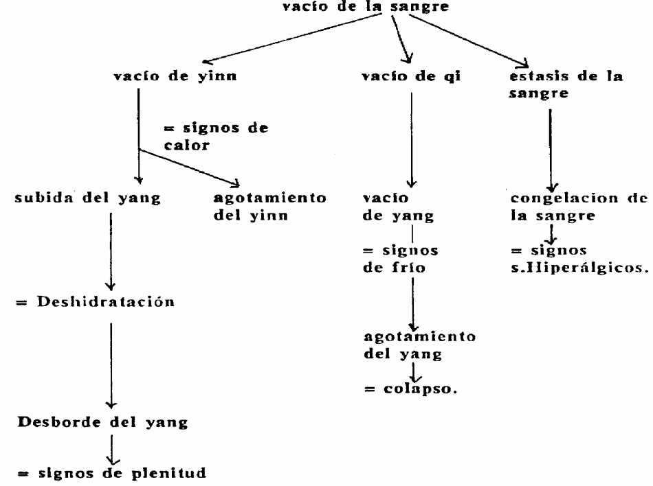

# LAS OCHO REGLAS DEL DIAGNÓSTICO CHINO

- Interior – Exterior
- Frío - Calor
- Vacío – Plenitud
- Yin - Yang

## INTERIOR- EXTERIOR
Relacionados con:
- La profundidad de la enfermedad
- La dirección de su desarrollo.
- Enfermedades externas se relacionan con:
    - Las capas superficiales del cuerpo:
        - piel
        - músculos
        - Meridianos 
        - vías respiratorias superiores
    - **Tienden hacia su interior - AGRAVANDOSE**
- Enfermedades internas se relacionan con:
    - El interior del cuerpo:
        - Vísceras 
        - huesos 
        - médulas 
        - vasos
    - **Tienden hacia el exterior - MEJORIA**
### SINDROME DE SUPERFICIE (externos)
- Etiología:
    - Seis factores patógenos externos
        - (Las principales reacciones son producto de la lucha entre la energía defensiva y el agente patógeno)
- Síntomas:
    - Fiebre con temor al frío o al viento
    - cefaleas
    - agujetas
    - rinorrea
    - nariz taponada
    - tos
    - lengua con saburra delgada o blanca
    - pulso flotante,
    - dolor en el cuerpo
- Características:
    - Agudo
    - abrupto
    - nuevo
    - no cambia la saburra
    - lengua roja en el borde y en la punta
### SINDROME DE PROFUNDIDAD
- Etiología
    - Penetración progresiva de un agente patógeno externo
    - Penetración directa de una gente patógeno externo
    - Del desarrollo de un agente patógeno interno
        - (perturbaciones emocionales, por el agotamiento, una alimentación desequilibrada, excesos sexuales, o cualquier otra causa que afecte el equilibrio interno del cuerpo)
- Síntomas
    - Son infinitos, hay que considerar que todo lo que no pertenece a un síndrome de superficie, pertenece a un síndrome de profundidad.
- Características:
    - Crónico
    - largo
    - saburra con cambios
    - pulso hundido

### SINDROMES COMPLEJOS
- Evolución de la Superficie a la profundidad.
    - Es un signo de agravacion
    - Cuando la energia patogena es poderosa
    - Cuandop la energia defensiva o sana son debiles
    - Tratamiento inadecuado (por ejemplo tonificando una plenitud)
- Evolución de la profundidad a la superficie
    - signo de mejoría
    - Cuando la energía patógena se agota
    - Cuando la energía defensiva, la energía sana son reforzadas
    - Por tratamiento adecuado
- Concomitancia de un síndrome de superficie y uno de profundidad
    - Afección simultánea de la superficie y de la profundidad al principio de una enfermedad.
    - Progresión de una enfermedad de la superficie hacia la profundidad, sin que el síndrome de la superficie haya terminado.
    - Afección aguda de la superficie de un paciente que padece de forma crónica una enfermedad de la profundidad.

## FRÍO - CALOR

Permite Determinar la naturaleza de la enfermedad.
- Frío:
    - Frío/plenitud ó Frío/vacío
- Calor:
    - Calor/Plenitud o Calor/Vacío

### SINDROME DE FRÍO

#### Etiología
- Afección del organismo por un frío externo
- Disminución del yang (enfermedad crónica, agotamiento)

#### Síntomas:
- Ausencia de sed, temor al frío, derrames claros y fluidos (expectoraciones, rinorrea, orinas), lengua pálida con saburra blanca y húmeda y pulso lento o apretado.

### SINDROMES MIXTOS

#### Calor en la superficie - frío en lo profundo
- Afección externa por el calor (Viento- Calor) en quienes padecen un frío interno crónico (generalmente debido a un vacío de yang).
- Síntomas:
    - fiebre, temor al viento, cefaleas, garganta inflamada y dolorosa (calor en la superficie).
    - Miembros fríos, heces blandas o diarreas, orinas claras y abundantes y ausencia de sed. (Frío en la profundidad)
#### Frío en la superficie - calor en la profundidad.
- El frío externo se transforma en calor interno, sin desaparecer de la superficie, o cuando un paciente que padece calor crónico es alcanzado por un frío externo.
- Síntomas:
    - Fiebre, aversión al frío, escalofríos, ausencia de transpiración, agujetas (frío en la superficie)
    - Agitación, sed, irritabilidad, oliguria (calor interno).
#### Calor en la parte superior y frío en la parte inferior
- El desequilibrio Yin / Yang acarrea la concentración de Yin en la parte inferior del cuerpo y la elevación del yang hacia la parte superior.
- Síntomas:
    - Opresión del pecho, agitación, angustia, (calor en la parte superior)
    - Dolores abdominales, que mejoran con el calor, diarrea líquida, pies fríos (frío en la parte inferior).

### SINDROME DE CALOR

#### Etiología
- Canícula
- Calor patógeno de origen externo
- Estancamiento de Qi   (debido a una congestión de las emociones, exceso de remedios o alimentos de naturaleza caliente)
- Vacío de Yin

#### Síntomas
- Fiebre o estado febril (subjetivo u objetivo), sed, agitación, enrojecimiento (del rostro, de los ojos, de las mejillas), mejoría por el frescor, concentración de los líquidos orgánicos (heces secas, oliguria) lengua roja (si hay saburra es amarilla) pulso rápido.

### SINDROMES DERIVADOS DE LA EVOLUCION DE UNO EN OTRO

#### De frío a calor
- De la penetración y de la transformación de un frío patógeno externo en Calor interno.
- Síntomas:
    - Fiebre con temor al frío, cefaleas, ausencia de transpiración, ausencia de sed, agujetas, lengua normal con saburra blanca, pulso flotante y apretado.
    - En el curso de la evolución la fiebre se agrava, el temor al frío da lugar a una búsqueda de frescor y aparecen signos de calor como agitación, sed, lengua roja con saburra amarilla y pulso rápido
- La evolución de frío hacia calor habla de abundancia de energía sana con simultaneidad de plenitud de energía patógena.
#### De calor a frío
- Fiebre acompañada o seguida de transpiración abundante, que produce una desaparición progresiva del yang y la aparición de un frío interno.
- Síntomas:
    - Tez pálida, miembros fríos, agotamiento, pulso profundo y lento.

### SINDROMES ENGAÑOSOS
>Una parte se los signos expresa lo contrario a la realidad de la patología
#### FRÍO APARENTE VERDADERO CALOR
- El calor está concentrado en el interior, el yang no puede extenderse hasta las extremidades y rechaza el Yin a la periferia.
- Síntomas:
    - Extremidades fríos, fiebres con temor al calor, agitación, sed con deseo de beber bebidas frescas, delirio verbal, oliguria, estreñimiento o disentería que quema, lengua roja con saburra amarilla y seca, pulso profundo y rápido.
#### CALOR APARENTE VERDADERO FRÍO
- Acumulación interna de yin y de frío que rechaza el Yang hacia el exterior.
- Síntomas:
    - fiebre, deseo de ser tapado, tez roja, sed de bebidas calientes, lengua rosa y blanda, con saburra gris o negruzca y húmeda, pulso grande, pero sin fuerza.

### VACÍO - PLENITUD
- Se refiere a la cantidad de energía sana y la cantidad de energía patógena que se encuentra en el cuerpo.
- Vacío = insuficiencia de defensas
- Plenitud = exceso de energía patógena.

### SINDROME DE VACÍO
- Del Qi, la sangre, los líquidos orgánicos y al yinyang
- Etiología:
    - Vacío congénito
    - Defecto de producción
    - Pérdidas diversas
- Síntomas:
    - Además de los específicos:
    - Astenia, disnea, transpiración espontánea, agravación general con el esfuerzo y el movimiento, mejoría con la presión (especialmente por los dolores), tez pálida sin brillo, lengua amarilla, tierna, poca saburra o ausencia de ella, pulso vacío, fino ó débil.

### SINDROME DE PLENITUD
- Depende de la energía patógena en exceso y de su localización
- Etiología
- Penetración de una energía patógena externa. Perturbación de la actividad funcional de una víscera.
- Síntomas:
    - Fiebre, sensación de opresión, de distensión y de plenitud, agitación mental, locuacidad o delirio verbal, respiración ruidosa, estreñimiento, dolor que se agrava con la presión, lengua con saburra espesa, pulso pleno, deslizante, fuerte.

### SINDROMES COMPLEJOS
- Superposición del Vacío y la Plenitud
- Cuando se encuentran ambos, hay que discernir cual es el preponderante.

#### Evolución de la Plenitud hacia el Vacío
- De agudo a crónico.
#### Evolución de Vacío hacia Plenitud
- Cuando el paciente debilitado sufre el ataque de una energía patógena externa virulenta.
- Cuando el Vacío crónico disminuye la actividad funcional de una o de varias vísceras, el metabolismo es perturbado y se forman fácilmente producciones patógenas (mucosidad por ejemplo)

### SINDROMES ENGAÑOSOS
#### Vacío Aparente, verdadera plenitud
- En Gran Plenitud, aparecen síntomas de vacío, por ejemplo, estancamiento de alimentos en el estómago provocan inapetencia, cansancio general, pero se percibe el verdadero estado por intolerancia a la presión, plenitud epigástrica, mal aliento, etc.
#### Plenitud aparente Verdadero Vacío
- En caso de vacío, la disminución de la velocidad de la actividad funcional del organismo puede producir acumulaciones y estancamientos que presentan signos de plenitud, por ejemplo si la función de transporte del Bazo queda debilitada, el paciente tiene el abdomen inflado y doloroso, edemas y sensación de distensión epigástrica, pero debajo de eso hay alivio con la presión, debajo de la tensión abdominal hay relajación, y la persona tiene heces blandas.

### YIN – YANG
- Es la base de todo método de diagnostico
- Los modelos yin se subdividen en:
    - INTERNO
    - FRÍO 
    - VACÍO
- Los modelos YANG se subdividen en:
    - PLENITUD 
    – EXTERNO 
    - CALOR

### SINDROME YIN
- Etiología
    - Es una síntesis de vacío, frío, interno
- Síntomas:
    - Astenia, letargia, postración, voz débil, tez y mirada sin brillo, cuerpo frío y aversión por el frío, búsqueda del calor, ausencia de sed, orinas claras y abundantes, heces blandas, lengua pálida, amplia, blanda,on saburra blanca y deslizante, pulso profundo.

### ESCAPE DEL YIN
- Síntomas
    - Respiración jadeante, agitación, transpiración caliente y pegajosa, aversión al calor, sed, tez parcialmente roja de forma esporádica, lengua escarlata y seca, pulso fino y rápido, vivo, sin fuerza.
### VACÍO DE YIN
- Etiología
    - Insuficiencia del Yin auténtico o con solución del yin y de los líquidos orgánicos.
- Síntomas:
    - Adelgazamiento, sequedad de la boca y de la garganta, insomnio, vértigos, oliguria, heces secas, lengua sin saburra (o con poca saburra), pulso fino.
- El vacío de Yin puede acarrear su incapacidad para controlar el yang:
    - Bocanadas de Calor, estado febril que se agrava por la tarde. Calor de los “cinco centros”, ansiedad, transpiración nocturna, sensación de cocción de los huesos, lengua roja, sin saburra, pulso fino y rápido.
### PLENITUD DE YIN
- Lengua hinchada, grande, saburra blanca y gruesa, frío en todo el cuerpo, se abriga en exceso, mucho agotamiento, retención de líquidos importantes, necesita dormir muchas horas, hipotermias, no orina por muchas horas, y es clara y transparente.

### SINDROME YANG
- Etiología
    - Síntesis de Calor, Plenitud y externo
- Síntomas
    - Fiebre, sed de bebidas frías,
    - agitación, voz fuerte, delirio verbal,
    - estreñimiento,
    - orinas concentradas y rojizas,
    - respiración ruidosa,
    - lengua roja, saburra seca,
    - pulso vasto, rápido, deslizante.
### VACÍO DE YANG
- Etiología
    - Insuficiencia congénita del yang o agravamiento progresivo del qi y del Yang 
- Síntomas
    - Astenia física y mental, agotamiento, postración, dificultad para hablar, bajo funcionamiento general e inercia frente a las solicitaciones, impotencia, lengua pálida, pulso débil.
- El Vacío del Yang puede producir su incapacidad para controlar al Yin y para calentar al organismo: Cuerpo frío, aversión al frío, que mejora con el Calor, tez, boca y labios pálidos, orinas claras y abundantes ( a veces edemas y oliguria(, heces blandas o diarreas, lengua pálida y húmeda, a veces inflada, pulso tenue.
### ESCAPE DE YANG
- Etiología
    - Fase crítica de desaparición del Yang
- Síntomas
    - Cuerpo frío, extremidades heladas, transpiración abundante, frío con gotas gruesas, postración, colapso, respiración débil, tez descolorida, lengua pálida y húmeda, pulso tenue o disperso.
### PLENITUD YANG
- Fiebre, febrícula alta, sed, lengua roja, saburra amarilla y espesa, grietas en la lengua, pulso lleno, cara roja, infección, orina poca pero oscura y condensada

## Caso Clinico Nro 1
- Resolver por 8 reglas:
- Yin/yang – vacio/plenitud – Int/ext – frío/calor
- hombre 60 años:
    - dolor de cintura
    - frío en manos y pies
    - orina profusa y clara
    - debilidad en las rodillas

## Caso clinico nro. 2
- Resolver por 8 reglas:
- Yin/yang – vacio/plenitud – Int/ext – frío/calor
- caso clínico
- Mujer 50 años
    - Dolor de garganta
    - Garganta roja
    - Fiebre 38.5 grados
    - Moco espeso y amarillo

