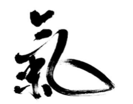

# Qi:  Definición y Funciones

Explicar o definir el Qi y demás conceptos relacionados con la Filosofía y la Medicina China para los occidentales es algo complejo, pues forma parte del pensamiento chino ancestral. Porlo que tomará tiempo familiarizarse con estos conceptos que luego de ser leídos y explicados muchas veces comenzarán a tomar sentido, por lo que la paciencia y la perseverancia son esenciales al adentrarse en una cultura tan ajena a la nuestra. En este texto se trataran de simplificar los conceptos para una mejor comprensión para los que se adentran por primera vez en esta magnífica y milenaria cultura, que tan vigente sigue en nuestros días. Prueba de ello es el último Premio Nobel de Medicina otorgado a la Medicina China, una pequeña muestra de todos los tesoros que quedan para redescubrir para el beneficio de la humanidad.

En la Filosofía china se suele mayormente llamar Qi a una única red, sustancia, energía que abarca a todo el universo. Todo está originado y compuesto por Qi. Para poder interpretarlo se lo  divide, primeramente, en dos grandes aspectos, el Gran Qi, y el Pequeño Qi. Esta diferenciación se traza para una mejor comprensión, pero en sí, no existe tal límite, sino que en cada porción del universo puede reflejarse la totalidad. Este concepto indica que el universo entero puede ser experimentado en cada individuo, siendo éste una imagen a escala del mismo. A esto se lo llama Microcosmos y Macrocosmos.

El Gran Qi es la sustancia que engloba Todo, una única energía original que luego toma diversas formas y manifestaciones donde se diferencia, pero que nada de lo que existe es ajeno a ésta. Esa energía original, indiferenciada en un principio, es comouna célula madre, que luego puede cobrar cualquier forma y función. Es anterior inclusoa la gran diferenciación Yin y Yang, anterior al BigBang.

Por su parte, el Yin Yang, es la siguiente subdivisión, pero igualmente sigue siendo una forma muy general para interpretar el universo. Ésta es de carácter relativo, binario. Debe tomarse siempre en relación, por lo que siempre está susceptible a cambios, si varía la relación a la que se lo somete. Por ejemplo, un edificio es más alto que una casa, pero más bajo que una montaña. Entonces, el mismo objeto, es alto y bajo, y los dos enunciados son verdaderos. Esto muestra la potencialidad de un aspecto de convertirse en Yin o Yang, pues tiene en su interior la semilla, una pequeña porción de su opuesto que puede mutar según las condiciones. En la siguiente tabla mostraremos estos aspectos generales, opuestos y complementarios del Yin y del Yang:

|Yin|Yang|
|---|---|
|Noche|Día|
|Oscuridad|Luz|
|Tierra|Cielo||
|Frío|Calor|
|Agua|Fuego|
|Húmeda|Seco|
|Luna|Sol|
|Sur|Oeste|
|Norte|Este|
|Discontinuo|Continuo|
|Curvo|Recto|
|Vacío|LLeno|
|Adapta|Impone|
|Contracción|Expansión|
|Pasivo|Activo|
|Receptivo|Agresivo|
|Denso|Volátil|
|Pesado|Ligero|
|Reposo|Movimiento|
|Lento|Rápido|
|Material|Función|
|Femenino|Masculino|
|Polaridad Negativa|Polaridad Positiva|
|Descenso|Ascenso|
|Otoño|Invierno|
|Primavera|Verano|
|Fuerza Centrípeta|Fuerza Centrífuga|

El Pequeño Qi se refiere a la forma y función que toma el Gran Qi en un Ser. Dentro de este Ser selo puede categorizar en cuatro grandes áreas,el Jing Qi o Esencia Prenatal y Posnatal, el *Qing Qio* Qi del Cielo, *Zhong Qio* Qi Recto, el *Yuan Qio* Qi Original, el *Ying Qio* Qi Cereal, y el *Wei Qio* Qi Defensivo.

Cada una de estas diferenciaciones, que están muy relacionadas con la medicina, lleva un desarrollo más profundo, por lo que primeramente, describiremos las funciones generales del Qi. Éstas son las de Propulsión, Calentamiento, Defensa, Consolidación, Nutrición, y Funcionamiento.

***

### Propulsión
Pone en movimiento. Todo en el universo está en constante movimiento y cambio. El Qi es responsable de todo movimiento, voluntario, involuntario, acción mental.

### Calentamiento
En sí, el Qi regula la temperatura, pero al ser por naturaleza móvil, tiende a calentar.El Qi siempre calienta o regula, por lo tanto no se siente frío si hay un correcto flujo de Qi. Si se siente frío o las extremidades tienen una temperatura más baja hay una cantidad o una circulación deficiente de Qi.

### Defensa
El Qi nos protege de energías patógenas para el organismo, o sea que previene que éstas ingresen al mismo. Estas energías son rechazadas por el Qi defensivo, y en el caso de que hayan ingresado saca lo que no es propio o no es compatible para el organismo. 

### Consolidación
Define, consolida forma y función de todo para que cada porción del organismo pueda interactuar correctamente para un bien común. Un hueso, un órgano, una célula, requiere una forma y función correcta y precisa para que pueda ser funcional a una organización mayor. Un glóbulo rojo o un órgano más grande de lo que debe no es mejor, si no que más torpe e ineficiente, por dar un ejemplo.

### Nutrición

El Qi se encarga de transformar las diferentes sustancias y distribuirlas eficientemente a todo el organismo para asegurar su supervivencia y bienestar. Refina la materia prima purificándola al máximo posible. Luego la distribuirá según una escala de importancia asegurando primero la supervivencia, y luego regiones secundarias. En el caso en que haya abundancia el Qi se ocupa de que todo el organismo se encuentre nutrido.

### Funcionamiento
El correcto funcionamiento eso trade sus responsabilidades. Esta inteligencia es la que interviene para que un organismo realice incontables procesos en todo momento. El hígado,por nombrar un órgano, realiza más de 500 funciones, y el individuo no es consciente de ninguna de estas funciones.

## Cielo, Tierra, Hombre

Otra de las relaciones esenciales observadas por los chinos es la del Cielo, la Tierra,y el Hombre. Estas interacciones son esenciales para que se produzca la vida. Primero, antes que el hombre, existe el Cielo y la Tierra, padre y madre, Yang y Yin. Al producirse un diálogo, una unión, deriva en la existencia de toda vida. Es decir, al subir la tierra (el Agua se evapora y forma las nubes y luego la lluvia), y al bajar el cielo (el Fuego baja, el Sol calienta y ofrece su energía), se produce un resultado,y ese es la vida de todo lo que queda en el medio. O sea toda vida, y el Hombre en particular,puede considerarse hijo del Cielo y de la Tierra.

Este concepto de Cielo, Tierra, Hombre es central para la formación de los trigramas que luego formarán los 64 hexagramas de *I Ching*, obra que explica el origen del universo,pero que aún no será útil para el estudio de la **Medicina China** en este período inicial.

Lo que es útil en este momento es poder observar la íntima unión del Hombre con el Cielo y la Tierra, porque nos muestra como puede el Hombre verse afectado por el medio ambiente, el Cielo, y por la Alimentación, la Tierra. Como el Macrocosmos afecta al Microcosmos, el Hombre. Como también, al estar todo unido el Hombre afecta al universo también. Nada está separado e independiente del resto, como lo explicamos anteriormente. Asimismo, para el estudio de **Medicina China** necesitamos definir los distintos tipos de Qi presentes en el Hombre. Éstos son:

### Yang y Yin Qi
Simplemente nos servirá para reconocer de manera general la característica y la dirección del Qi, siendo el Yang Qi el que tiene un tropismo hacia Arriba y Afuera, y el Yin Qi hacia Abajo y Adentro.

### Jing Qi
Este tipo de Qi se divide en dos, el Prenatal y el Posnatal. El Prenatal es el Qi heredado que fue otorgado en el momento de la concepción, y no puede ser renovado. Es la carga genética dada por nuestros padres. Los chinos observaron los árboles genealógicos de las familias y descubrían predisposiciones genéticas hacia ciertas enfermedades. El Jing Posnatal es el adquirido por los alimentos e influenciado por el estilo de vida, que puede hacer que malgastemos o agotemos prematuramente nuestro Jing Ancestral, o lo cuidemos. De esta manera podemos expresar lo mejor o lo peor de nuestra genética, pues está en nuestras manos ayudar o interferir con nuestro organismo *(para mayor información sobre la mejor o peor expresión genética pueden informarse sobre una rama reciente de la genética, la Epigenética, quetrabajacon personasque comparten la misma carga genética como mellizos y que expresan diferentes aspectos de su genética según sus estilos de vida, lo que demuestra como el medio influye sobre nuestra genética)*.

### Qing Qi

Es el Qi del Cielo, o el Qi Puro, lo más valioso. Es el aire que respiramos y que penetra en nuestro organismo, para luego combinarse y formar otro tipo de Qi, el *Zhong Qi*.

### Zhong Qi
También llamado Qi Central, se encuentra en el centro del pecho, en la zona cardiorespiratoria. Esta formado por el *Qing Qi* tomado por los pulmones y el *Jing Qi* adquirido. Su función es la de Regular la Respiración y los Latidos del Corazón armoniosamente. La voz y la correcta circulación de la sangre dependen del *Zhong Qi*.

### Yuan Qi
Se refiere a la *Energía Original*, que está formada por el *Jing Prenatal* y el *Posnatal* o *Adquirido* de la nutrición luego del nacimiento. Todo el organismo requiere de este Qi que se distribuye por la compleja red de meridianos y canales del cuerpo.

### YingQi
El Qi nutricio,proveniente de la alimentación, transformado por el Bazopáncreas y el Estómago. Circula, al igual que la sangre, por los vasos sanguíneos manteniendo un vínculo estrecho con ésta. El Ying Qi recorre el organismo por los meridianos en un movimiento de 24 hs, residiendo dos horas en cada meridiano y siguiendo este orden y horario específico:

|Horario|Meridiano|
|---|---|
|3 a 5|Pulmón|
|5 a 7|IntestinoGrueso|
|7 a 9|Estómago|
|9 a 11|Bazopáncreas|
|11 a 13|Corazón|
|13 a 15|Intestino Delgado|
|15 a 17|Vejiga|
|17 a 19|Riñón|
|19 a 21|Pericardio|
|21 a 23|Triple Recalentador|
|23 a 1|Vesícula Biliar|
|1 a 3|Hígado|

Durante esos horarios el meridiano se encuentra en plenitud, mientras que a las doce horas opuestas, se encuentra en su mínimo energético.

### Wei Qi
También conocido como *Qi Defensivo* o *Guardián*, el *Wei Qi* depende del Pulmón,y se encuentra en la superficie, por los meridianos Tendino-musculares y la piel. Su función es la de proteger al organismo de factores patógenos tanto etiológicos como gérmenes. Tratan de que no penetren estos factores, y en el caso de que logren ingresar al cuerpo batalla para expulsarlos. Asimismo controla la apertura de los poros,regula la temperatura del cuerpo y de los órganos, y da brillo a la piel y los bellos.